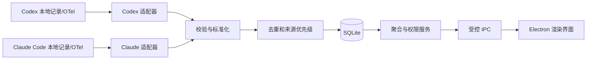

# Token 产品与技术设计

状态：M0–M6 本机代码已落地；M5/M6 自动测试有分项通过证据，完整验收边界见逐项用例；TC-072 目标 Mac 文件权限、签名、公证和外部分发仍待验证
更新日期：2026-10-03

## 1. 目标与边界

Token 是一款 macOS 本机桌面应用，帮助用户查看当前电脑上 Codex 和 Claude Code 的 Token 消耗。第一版交付三个能力：

1. 本地用户登录、角色与数据归属管理。
2. Codex、Claude Code 的历史导入和持续用量采集。
3. 按日、周、月、年统计，并按用户、工具、模型筛选。

统计对象是**本机可观察到的 Token 消耗**，不是服务商账单、订阅剩余额度或跨设备总用量。没有采集到的数据应显示为“未知/未覆盖”，不能按零处理。第一版不采集提示词、回复正文、源码或凭证，也不把用量上传到自有服务器。

### 1.1 第一版范围

- 支持当前 macOS 登录用户可访问的 Codex 与 Claude Code 本地数据。
- 支持首次启动创建管理员、创建/禁用普通用户、修改密码、来源归属映射。
- 支持历史导入、后续增量采集、采集状态与错误提示。
- 支持概览、趋势、模型明细、CSV 导出。
- 支持本机离线使用和数据库备份/恢复。

### 1.2 暂不实现

- 跨设备同步、远程登录或组织级云端后台。
- 把本机应用账户直接用作 OpenAI 或 Anthropic 登录。
- 订阅余额、官方计费金额或准确费用结算。
- 读取其他 macOS 账户无权访问的文件。
- 自动修改已有的组织级遥测设置。

## 2. 产品使用流程

1. 首次启动：创建管理员，选择统计时区，查看本机工具检测结果。
2. 连接来源：选择只读本地记录导入；若工具版本支持且用户愿意，可选择启用官方遥测到本机接收器。
3. 查看采集状态：展示“正常、等待新数据、权限不足、格式不支持、采集间断”等状态，以及每个来源的最后成功时间。
4. 处理归属：管理员把工具来源标识绑定到应用用户；无法确定的历史记录保持“未归属”。
5. 查看报表：选择日/周/月/年、日期范围、用户、工具和模型，进入明细核对汇总，导出 CSV。

主界面包含：登录页、概览页、报表页、数据来源页、用户管理页、设置页。普通用户不显示用户管理入口，只能读取授权范围内的统计。

## 3. 总体架构

| 层 | 选型 | 职责 |
| --- | --- | --- |
| 桌面壳与主进程 | Electron + TypeScript | 窗口、后台采集、账户、数据库、导出 |
| 界面 | React + Vite + TypeScript | 登录、仪表盘、报表、设置 |
| 持久化 | SQLite | 用量事实、来源、游标、账户、映射、迁移版本 |
| 数据校验 | 运行时 schema 校验 | 限制 IPC 输入和外部数据格式 |
| 测试 | 单元/集成测试 + Playwright Electron | 计数规则、采集恢复、打包后主流程 |

目录建议：`src/main`、`src/preload`、`src/renderer`、`src/shared`、`src/collectors/codex`、`src/collectors/claude`、`tests/fixtures`、`tests/e2e`。实际依赖版本在实现阶段锁定，不在设计文档里指定浮动版本。

### 3.1 进程边界与 IPC

渲染进程启用沙箱和上下文隔离，关闭 Node 集成。`preload` 只暴露明确定义的方法，如 `auth.login`、`usage.query`、`sources.rescan` 和 `reports.exportCsv`；不暴露通用 `ipcRenderer`、文件读取或 SQL 执行。主进程对每个请求验证发送方、登录态、角色和参数范围，查询结果再按权限过滤。

例如 `usage.query({ granularity, from, to, userIds, providers, models, timeZone })`：主进程验证时间范围和筛选项；普通用户的 `userIds` 由登录态限定，不能通过传参扩大。

这遵循 Electron 对上下文隔离、沙箱和逐项暴露 IPC 方法的建议。[Electron Context Isolation](https://www.electronjs.org/docs/latest/tutorial/context-isolation)、[Electron Process Sandboxing](https://www.electronjs.org/docs/latest/tutorial/sandbox)

## 4. 数据采集设计

### 4.1 两种路径

| 路径 | 用途 | 特性 |
| --- | --- | --- |
| 只读本地记录 | 导入可访问的历史，并在新记录落盘后增量读取 | 无须更改工具配置；格式与保留期依赖工具版本 |
| 官方遥测 | 工具启用之后的持续采集 | 字段较明确；需要用户配置，无法补回启用前未保留的记录 |

Codex 官方文档说明可选择启用 OpenTelemetry 日志导出，`codex.sse_event` 的 `response.completed` 事件带 Token 数和模型元数据。[OpenAI Docs：Advanced Configuration](https://learn.chatgpt.com/docs/config-file/config-advanced)

Claude Code 官方文档提供 `claude_code.token.usage` 指标，带 `model` 和 `type`（`input`、`output`、`cacheRead`、`cacheCreation`）；本地会话转录记录也可用于版本验证后的历史导入。[Claude Code Monitoring](https://code.claude.com/docs/en/monitoring-usage)

Codex App Server 的 `thread/tokenUsage/updated` 可作为连接到该服务的活动线程的数据源，但它不作为覆盖所有独立 Codex 客户端的全机采集方案。[OpenAI Docs：Codex App Server](https://learn.chatgpt.com/docs/app-server)

### 4.2 适配器接口

每个工具适配器至少提供：`detect()`、`capabilities()`、`importHistory()`、`watch()`、`health()`。适配器输出统一的 `UsageObservation`，并附带原始工具版本、来源类型、解析器版本及可追溯标识。未知字段保留在受限的诊断元数据中，不保存会话正文。

开发先用真实但脱敏的本机样本验证本地记录格式。解析器根据格式版本显式分支；不识别格式时停止该来源并给出原因，不能静默按旧字段计算。

### 4.3 计量与去重

- 标准化事实包含：提供方、模型原始名、会话标识、请求/事件标识、发生时间 UTC、输入、输出、缓存读取、缓存写入、来源、所属系统用户与应用用户、采集状态。
- 原始 Token 分类保留。统一总量由提供方专属规则计算：Codex 缓存输入可能已经包含在输入总量中；Claude Code 的四类指标分别记录。未经确认不把缓存再加一次。
- 同一来源内优先用稳定请求或消息 ID 去重；文件偏移、时间戳和内容摘要只作为缺少稳定 ID 时的后备方案。
- 本地记录与遥测先按已授权用户范围筛选；只有共同的稳定事件标识等证据能证明重复时，才按主来源计一次。当前 Codex/Claude 两路没有通用事件 ID，仅同会话、同模型、同时间或 Token 接近都不足以证明同一事件或本地覆盖遥测全部用量。不同用户或明确不同会话的事实保留；疑似同会话重叠与身份不明的事实标为冲突，不静默相加或按提供方整日排除。已确认独立事实组成“已确认小计”；冲突候选单列来源和条数，页面/CSV/上报显示“总量不可确认”，不得把小计标成总 Token，也不得把被排除的部分当成零。旧实现按 `provider+UTC 日期` 排除当天所有遥测，已在隔离 SQLite 复现跨用户误删；修复前缺陷已由 `8157e2d` 的 REQ-048/DEV-057/TC-092–094 自动子范围覆盖；剩余边界见第 20.5 节。
- 增量采集保存文件身份、偏移和遥测游标。启动后先补扫，再进入监听；处理文件截断、替换、轮转和未写完的末行。
- 遥测指标接收端明确处理 delta/cumulative temporality；重复批次按流标识和时间区间幂等写入。
- 模型切换按每次请求的实际模型归档；无法确定模型时归为“未知模型”，不强行归到会话初始模型。

### 4.4 Codex fallback 跨扫描归并（REQ-006；2026-10-03 规划记录）

Codex 会话先写出 `event_msg:token_count`、后续增量才写出 `token_usage_record` 时，前者可暂作 `codex:fallback` 用量；正式记录到来后，同一会话的 fallback 必须退出有效事实集，报表和导出只按正式记录计量。若正式记录尚未出现，fallback 仍应可见。此规则沿用 REQ-006 的增量幂等要求，不改变 Codex Token 分类、Claude Code 解析规则、本地与遥测优先级或其他会话的归属。

当前 `scanFile` 在没有正式记录的扫描批次会写入 fallback，后续批次将 `hasUsageRecords` 设为 true，却只停止写入新的 fallback；已持久化的旧 fallback 尚无清理步骤，可能重复计数。修复需把同一 Codex 会话的正式事实写入、对应 fallback 回收和游标提交作为一致的处理结果；仅清理可确认属于该会话的 `codex:fallback` 事实，不触碰其他会话、Claude/遥测来源、来源身份或项目归属。旧库若已同时保存两类事实，启动时应在报表使用前幂等修复；失败时不得留下只删除了 fallback、尚未保存正式事实的半成品。文件重扫、应用重启及重复执行旧库修复后，事实数和总量仍稳定。实现与旧库恢复策略由 DEV-047 落地，TC-073 用独立临时数据库验证这些不变量；TC-010 的历史通过不覆盖此跨扫描场景。

### 4.5 Codex fallback 修复实现与边界（2026-10-03）

上节是 `200e1a0` 的修复前规划。代码 `aa6d91b` 在 `UsageScanner` 入库事务中先写同会话正式事实，再删除该 Codex 会话的 `codex:fallback` 事实及其 `fact_projects` 关联，最后提交游标；任一步失败则整笔回滚。扫描器构造时对旧库中正式事实与 fallback 并存的会话做同范围的幂等清理，并更新 Codex `source_status.fact_count`。`src/main/database.ts` 本次未修改；现有正式事实、其他 Codex 会话、Claude 事实、来源身份和其他项目关联应保持原值。正式记录尚未出现的会话继续使用 fallback；跨文件后到 fallback 不得重新累计。TC-073 在合成临时库覆盖这些条件及注入失败回滚，实际断言见[逐项验收](test-case-acceptance.md#tc-073-当前实现与验收2026-10-03)。本机未签名 0.3.0 DMG 仍是修复前制品，打包应用和生产库迁移未在本次复验。

### 4.6 大会话启动修复性能（0.3.4；REQ-006、DEV-047、TC-073）

`aa6d91b` 的旧库启动修复从每条 Codex 正式事实出发，用相关子查询寻找同会话 fallback。若一个大会话有大量正式事实而没有 fallback，启动仍会对同一会话反复检查。开发会话在生产库的只读隔离副本上观测到 25542 条事实、最大 Codex 会话 11541 条且无 fallback 时，0.3.3 打包应用启动 180 秒超时、主进程持续约 100% CPU；这是该副本上的复现，不把它写成所有用户环境的普遍耗时。

`7abd640` 将候选集合改为实际存在 `codex:fallback` 的会话，再按会话检查有无正式事实；没有 fallback 的大会话不再逐条触发相关扫描。旧库清理的事务范围、其他来源与项目保留规则沿用第 4.5 节。TC-073 增加独立 6000 条无 fallback 合成事实的启动回归，断言构造过程低于 5 秒且事实数保持；此阈值只证明该环境下的规模样本通过，不等同形式化复杂度证明。开发会话在同生产库副本上测得扫描器构造约 110 ms。`test:production-copy` 用 SQLite 备份将传入数据库复制到临时目录，禁用真实来源扫描并启动打包应用，核对隔离路径、数据库完整性及账户、事实、来源身份、游标数量；它不在原生产库上运行迁移，也不代表生产账户界面安装验收。详细证据见[验收记录](validation.md)。

## 5. 数据库与统计

核心表建议如下：

| 表 | 关键字段 |
| --- | --- |
| `users` | id、用户名、密码哈希、角色、状态、创建时间 |
| `source_identities` | 工具、系统用户、工具账户标识、设备标识、映射的应用用户 |
| `usage_facts` | 稳定去重键、来源、会话/请求标识、模型、UTC 时间、各类 Token、解析版本、归属状态 |
| `source_cursors` | 来源、文件身份/偏移或遥测游标、最近成功时间、状态 |
| `model_aliases` | 原始模型名、显示分组、有效时间 |
| `audit_events` | 账户与归属变更、导入/导出动作及时间；不记录敏感内容 |

索引以 `usage_facts(occurred_at_utc, provider, model, owner_user_id)` 和去重键唯一约束为主。报表起初直接从事实表聚合；数据量增长后增加可重建的日汇总表，事实表仍作为核对依据。

所有事件时间以 UTC 保存。报表按用户选择的 IANA 时区生成日、月、年边界；周采用 ISO 周（周一开始、ISO 周年）。界面显示“覆盖时间”和“最后采集时间”，避免把没有记录误读成零消耗。CSV 与页面使用相同的筛选和统计口径。

## 6. 用户与安全设计

- 首次启动创建本地管理员；普通用户由管理员创建或禁用。
- 密码使用带独立盐的强密码哈希，登录失败限速；会话只存在于应用进程中，退出后失效。
- 应用用户与工具来源做显式绑定；未知来源保持未归属，管理员可追溯地调整映射。仅凭当前登录用户不回填历史归属。
- 数据库位于应用用户数据目录，只授予当前 macOS 用户访问。读取来源文件时使用最小可行权限，不提权扫描其他账户。
- 不保存或导出提示词、回复、源码、API Key；诊断日志隐藏路径中的用户名及任何凭证。数据库导出需用户主动触发。
- CSV 导出对可能被表格软件识别为公式的文本字段做转义。
- 遥测配置向导先检查已有设置，不覆盖已配置的 OTLP 目标或组织管理设置；配置更改前展示差异并可恢复。

本地账户主要控制应用界面和 IPC 访问。**共用同一个 macOS 账户的人仍可能在应用之外读取该账户可访问的本地文件**；因此本地账户不提供操作系统级的数据隔离。若需要对多人提供强隔离，应使用各自的 macOS 账户，或在后续版本设计独立服务、身份认证与加密存储。跨 Mac 集中管理和完整人员归属也属于后续阶段。

## 7. 发布与测试边界

开发和端到端测试使用 Node/npm、Electron 自带 Chromium 与 macOS 图形会话。Playwright 的 Electron API 可直接指定打包应用的可执行文件并控制窗口。[Playwright Electron](https://playwright.dev/docs/api/class-electron)

测试目标 Mac 不需要完整 Xcode。面向其他用户分发的签名与公证是独立发布步骤，应在具备 Apple 开发者证书及所需开发工具的构建环境完成；不能把“测试无需 Xcode”推广为“签名发布无需 Xcode”。[Electron Code Signing](https://www.electronjs.org/docs/latest/tutorial/code-signing)

**外部分发构建方案（REQ-018 / DEV-018 / TC-075、TC-028；2026-10-03 实施前）**：新增显式 `npm run pack:signed`，与现有本机未签名 `npm run pack:dmg` 分开。签名入口须在执行构建前检查 macOS、可用的 Developer ID Application 签名身份及完整公证凭据；身份缺失、身份类型错误、凭据缺项或互相冲突时安全失败，不留下可误认为外部分发版的新制品。使用当前 electron-builder v26 的 `forceCodeSigning: true` 防止静默产出未签名 App，以 `mac.notarize: true` 启用内置公证；公证凭据只从环境或钥匙串读取，接受完整的 API Key（`APPLE_API_KEY`、`APPLE_API_KEY_ID`、`APPLE_API_ISSUER`）、Apple ID（`APPLE_ID`、`APPLE_APP_SPECIFIC_PASSWORD`、`APPLE_TEAM_ID`）或钥匙串配置（`APPLE_KEYCHAIN`、`APPLE_KEYCHAIN_PROFILE`）之一。需按 v26 核对 hardened runtime 与实际 entitlements，不能照搬其他主版本的配置字段。签名材料、私钥、口令及原始环境变量值不得入库或写日志。[electron-builder v26 macOS 签名](https://www.electron.build/v26/docs/features/code-signing/code-signing-mac/)；[v26 配置与公证凭据](https://www.electron.build/v26/docs/api/app-builder-lib.interface.macconfiguration/)

构建完成后对**同一候选**的 App 执行 `codesign --verify --deep --strict`、`spctl --assess --type execute`、`xcrun stapler validate`，对 DMG 执行 `hdiutil verify` 并计算大小和 SHA-256；记录版本、架构、代码提交、脱敏证书身份、核验命令、退出码及制品路径。任一步失败都不能发布该制品，且不得把既有未签名 0.3.4 DMG 当作签名产物。TC-075 将用模拟身份与命令执行器验证无凭据预检、错误条件和命令构造，测试本身不调用 Apple 公证、不使用真实私钥。真正的签名、公证、票据和另一台 Mac 的安装、启动、登录、采集仍由 TC-028 人工验收；TC-075 自动通过不改变 TC-028 的待验证状态。[electron-builder v26 公证指南](https://www.electron.build/v26/docs/notarization/)

**签名发布脚本实施（代码 `dc37b8b`）**：`package.json` 现有 `pack:signed` 调用独立的 `scripts/package-signed-dmg.mjs`，原 `pack:dmg` 和 `scripts/package-dmg.mjs` 未改。脚本先检查 macOS、Developer ID Application 钥匙串身份或本地/base64 p12、完整且唯一的一组公证凭据、所需工具、支持的架构及干净的 Git 工作区；失败时停止，不进入构建。electron-builder 26.15.3 的参数使用 `mac.forceCodeSigning`、`mac.notarize`、`mac.hardenedRuntime` 和 `build/entitlements.mac.plist` 的 JIT 权限；与[v26 MacConfiguration](https://www.electron.build/v26/docs/api/app-builder-lib.interface.macconfiguration/)字段一致。脚本在 `release/token-signed-*` 临时目录构建 App/DMG，依次核验 `codesign`、`spctl`、`stapler`、`hdiutil`，计算 DMG 大小与 SHA-256；仅核验全部成功才原子移入 `release/signed`，并写不含密钥的 `release-evidence.json`。失败清理临时目录；不把先前的未签名 DMG 当成本次制品。

`dc37b8b` 的 TC-075 单元函数已注册，覆盖缺失/不完整/冲突凭据、错误或多重身份、三种凭据选项、合成 p12 本地路径和 base64 解析、builder 参数与核验命令序列、无凭据运行构建前失败且没有新增发布目录。该函数未模拟每一项**构建后**核验失败，也未调用真实 Apple 公证服务；自动通过只属于上述子范围。当前 Mac 没有有效发布身份或公证凭据，真实签名、公证、票据、Gatekeeper 与另一台 Mac 验收仍须在 TC-028 留证，不能因脚本存在或 TC-075 1/1 通过宣称外部分发完成。

**核验失败与清理回归（代码 `2f43b00`）**：发布主流程改为复用可注入的 `verifySignedCandidate` 和 `withTemporaryReleaseDirectory`。TC-075 在同一自动函数中分别令 `codesign --verify`、`spctl --assess`、`xcrun stapler validate`、`hdiutil verify` 与后续 Developer ID `Authority` 身份核对失败；每次都应停止进入发布分支、删除 `release/token-signed-*` 临时构建目录，且不创建 `release/signed` 候选。测试使用合成文件和注入执行器，验证的是失败控制流与清理；没有完成真实签名、公证、Gatekeeper 系统评估或 DMG 原子发布，TC-028 仍待目标环境验收。

## 8. 待在验证阶段定案的事项

1. 当前 Codex 和 Claude Code 安装版本的本地记录路径、字段及历史保留时间。
2. Codex 不同运行入口（CLI、桌面端、IDE）在本机的覆盖差异。
3. 已有组织遥测配置是否阻止本机接收器接入。
4. 本地数据是否需要加密静态数据库，以及可接受的解锁方式。
5. 第一版目标是开发者自用安装包，还是立即面向外部分发并签名公证。

这些问题不阻止工程骨架开发，但采集完整率和发布时间必须在真实样本验证后确定。

## 9. M5 范围与验收边界

下表的“此前状态”指 M0–M4 已验收版本，不代表 M5 当前代码。M5 已有实现和按编号执行的自动测试；[逐项验收](test-case-acceptance.md#m5-用例绑定与覆盖tc-030tc-049)列出其实际断言与尚未覆盖的目标场景。对应编号和状态以[追溯工作簿](../outputs/20261002-token-docs/Token-需求开发测试追溯.xlsx)为准。

| 能力 | 需求 | 此前状态 | M5 验收边界 |
| --- | --- | --- | --- |
| 信任此设备 | REQ-019–020 | 退出应用即失去登录态 | 用户主动勾选后可自动登录；手动退出立即撤销，禁用账户或重置密码也撤销 |
| 独立更新服务和客户端 | REQ-021–023 | 无独立更新服务 | 服务监听与 App 连接地址均可配置、默认 `127.0.0.1`；新版目标为应用内校验、自动安装并重启，失败保留旧版；旧版手动交接证据单列 |
| 十分钟扫描与聚合上报 | REQ-024–026 | 定时扫描约 30 秒；无上报 | 启动、每 10 分钟和手动扫描；每次完整扫描后向同一服务上报聚合快照 |
| 数字显示和分析界面 | REQ-027–029 | 原始整数展示及基础报表 | 1024 进位紧凑显示、精确原值、比较趋势、排行及覆盖状态 |
| 趋势图布局与日期 | REQ-030 | 当前柱顶数值可能与横轴日期重叠 | 窗口缩放自适应；周/月横轴使用明确日期格式 |

M5 仍以本机可观察的用量为统计口径。独立服务与 App 默认通过 `127.0.0.1` 连接，也可显式配置其他地址；这不引入远程登录或跨设备同步承诺。下述各节是验收目标；代码落地不代表真实非回环部署、安装或目标 Mac 已通过。

## 10. 登录与受信设备（REQ-019–020）

登录页增加默认未勾选的“信任此设备”。只有用户勾选且密码登录成功，主进程才签发不可预测的设备凭证，通过 Electron `safeStorage` 加密后存入当前 macOS 账户的应用数据目录；应用数据库只存凭证摘要、所属应用用户和撤销所需元数据。不得存密码明文或可逆密码。下次启动由主进程验证摘要和用户仍启用，然后恢复该用户会话；渲染进程不直接读取凭证。未勾选时沿用进程内会话。

受信状态**无固定到期时间**，保持自动登录直到用户手动退出登录。手动退出必须在返回登录页之前立即撤销本设备凭证；管理员停用账户或重置密码必须撤销该账户全部受信凭证。凭证缺失、损坏、被撤销、用户停用或安全存储不可用时回到登录页并给出可理解提示，不绕过现有 IPC 身份和角色检查。更换 macOS 账户不得复用凭证。共用同一 macOS 账户的系统级数据边界仍按第 6 节说明。

## 11. 独立本地服务与更新（REQ-021–023）

服务作为与 Electron 应用独立启动和停止的进程，默认监听 `127.0.0.1:47839`；`TOKEN_SERVER_HOST`、`TOKEN_SERVER_PORT` 和 `TOKEN_SERVER_DATA_DIR` 可配置监听地址、端口和数据目录，须与现有 OTLP 接收器 `127.0.0.1:43188` 区分。`npm run server` 可独立启动。App 默认连接 `http://127.0.0.1:47839`，也可显式配置其他服务地址及访问密钥；地址应与服务实际监听地址匹配。非回环地址必须使用 HTTPS；服务端非回环监听需配置 `TOKEN_SERVER_TLS_CERT`、`TOKEN_SERVER_TLS_KEY`。最低接口为版本清单、安装包下载、聚合上报和健康状态。清单包括版本、目标 macOS 架构、包大小、SHA-256、下载路径及发布时间；服务只发布管理员明确放入发布目录的包，阻止路径穿越与任意文件读取。更新清单和安装包继续使用全局 bearer；0.3.2 的聚合上报按第 12.2 节改用独立设备令牌。鉴权失败不返回受保护制品或写入聚合数据。地址默认值不能替代鉴权。服务停止时本机采集和报表继续可用。

**可信 CA 连接补证原计划（REQ-021 / DEV-022–023 / TC-032、TC-047）**：原有非回环 HTTPS 自动测试使用临时自签证书，但客户端关闭了证书校验；因此它只证明 TLS 监听与在该连接上的接口行为，不证明可信证书链和配置地址的主机名校验。TC-032 计划在一次性目录生成测试 CA 与服务端证书，证书 SAN 包含实际用于连接的本机测试地址；客户端只信任该测试 CA，保持严格 TLS 校验，核对配置地址的 HTTPS 健康检查成功，并分别用不受信 CA 和不匹配主机名验证连接失败。TC-047 计划复用同一严格 TLS 客户端，在受保护的清单、包、管理和上报接口核对缺失、错误及合法凭据的鉴权。测试只使用合成服务库和临时证书，不修改 macOS 系统信任设置、不使用生产证书；即使本机补证通过，异机连接与真实部署证书仍须单独验收。实施前口径与当前结果分别见[逐项验收](test-case-acceptance.md)和[追溯工作簿](../outputs/20261002-token-docs/Token-需求开发测试追溯.xlsx)。

**补证实施（测试提交 `57fd884`）**：上述计划现由 `tests/next-server.test.ts` 的独立函数实现并绑定原 TC-032、TC-047。测试用 OpenSSL 在一次性目录生成 CA 和带本机非回环 IPv4 SAN 的服务端证书；`https.request` 指定测试 CA 且启用 `rejectUnauthorized`，TC-032 验证健康检查 200、无 CA 的证书拒绝、`127.0.0.1` 与证书 SAN 不匹配的拒绝，并在子进程通过 `NODE_EXTRA_CA_CERTS` 验证真实 `ServerConnection` 可连。TC-047 在严格 TLS 连接上核对更新清单/包、管理员设备登记与设备令牌上报的鉴权，并检查越权 owner 403 且聚合行保持。旧自签且关闭校验的测试继续保留为历史覆盖；本次只修改测试和绑定，产品代码及 0.3.4 DMG 未变。临时 CA 的本机通过不证明系统信任、生产证书或另一台 Mac 连接，结果见[验收记录](validation.md)。

发布安装包的命令为 `npm run publish:update -- <dmg> <version> <arch> <server-dir>`，其中 `<arch>` 为 `arm64` 或 `x64`，`<server-dir>` 应与服务的数据目录一致。命令复制包并生成带大小和 SHA-256 的 `releases/latest.json`；生成清单不代表包已签名、公证或在目标 Mac 验收。

客户端只接受用户或管理员明确配置的服务地址，默认 `127.0.0.1`；限制响应大小、下载目录和超时，避免把远程地址当作本机可信来源。比较语义版本与架构，只有较新且匹配的版本才提示。包先下载到临时文件，检查长度与清单 SHA-256，原子转为可打开文件；失败或中断清理临时文件并显示重试。哈希用于验证下载内容与清单一致；若后续面向外部分发，还需要独立可信的签名、公证与发布来源校验。

**历史实现与证据**：0.3.4 及更早未签名候选只下载、校验、打开 DMG；用户手动完成安装。`44a96e8`、`b224dde` 的 TC-036 证据属于这条旧流程，不能算自动安装通过。

**2026-10-03 新验收目标（REQ-022/023、DEV-024/025、TC-034–036/076）**：用户在应用内确认新版后，客户端完成版本/架构/包大小/SHA-256 校验，启动受约束的独立更新辅助进程；旧进程退出后自动挂载已校验 DMG、安装或替换应用、启动新版并检查版本与启动健康状态。正常成功路径不要求 Finder 拖拽。清单与 SHA-256 只证明从已配置服务取得的文件完整性，不等于代码签名或外部来源可信。下载、校验、安装、重启、回退和权限不足须分别显示进度与可恢复错误；取消只在安全边界生效，旧版及用户数据保持可用。

**安装与回退边界**：从可写安装位置运行时，在目标同一文件系统暂存新版 App，退出旧进程后备份旧版并替换；新版启动和健康确认失败时恢复旧版并清理暂存、挂载和辅助进程。用户数据库、受信凭证和设置位于 App 包之外，安装过程不得重建或删除；未签名包跨版本的 `safeStorage` 连续性必须以真实打包应用验证，失败时允许明确的重新登录流程，绝不绕过身份检查。从只读 DMG 运行时，辅助进程须明确告知目标位置：当前用户可写 `/Applications` 时自动复制到 `/Applications/Token.app` 并从那里重启，否则自动复制到用户可写的 `~/Applications/Token.app` 并重启；两条路径都不能要求 Finder 拖拽。已经安装在不可写系统路径时，不能静默改装到其他位置或提权，须明确授权边界或报错，旧版继续可用。低磁盘空间、挂载失败、替换失败、用户取消和重启失败均须清理或回滚，保留旧版可再次启动。Electron 官方 [autoUpdater 文档](https://www.electronjs.org/docs/latest/api/auto-updater/)要求 macOS 应用签名；当前本机未签名通道需自建并限制辅助进程的安装路径，设计和测试不能把它写成已具备外部分发能力。真实签名、公证和异机验收继续由 TC-028 承担。

**0.3.5 实施与证据（代码 `86a4b5b`）**：`UpdateClient` 校验清单、下载大小/SHA-256 后交给 Node 模式辅助进程；辅助进程等待旧 PID 退出，再验证 DMG 与 App 身份、架构和版本，同卷暂存、备份、替换并启动新版，等待健康标记，失败时恢复旧版并尝试重开。只读 DMG 的 `/Applications`/`~/Applications` 选择及不可写已安装位置拒绝有 TC-036 合成单元断言。文档会话独立复跑 TC-034 1/1、TC-035 1/1、TC-036 2/2、TC-059 1/1、TC-076 1/1 和 76 编号检查，均退出码 0；TC-076 在临时用户数据和合成 1280 Token 中验证了自动退出、替换、重启、健康标记、受信登录与用量延续。**TC-076 的“旧版”是从同一 0.3.5 打包 App 复制并改版本元数据为 0.3.4，不是真实历史 0.3.4 二进制**；因此真实旧版首次过渡、只读 DMG 路径和打包版失败回滚仍待补证。原 0.3.0/0.3.4 按钮仍是手动打开 DMG，不能凭新版测试写成它们已具备一键升级。开发会话另报告：备份生产 userData 后，用 0.3.5 helper 对当前 Mac 原 `/Applications/Token.app` 0.3.0 做一次性人工接管，原位换为 0.3.5 并自动启动，数据库文件保留且 `PRAGMA integrity_check` 为 `ok`；这不是旧版 UI 一键升级，也未完成真实账号/报表逐项人工验收。0.3.5 未签名 x64 DMG SHA-256 `ae1b8e80ec69c43f76e93d1e2312694cb4faab3521115fdaeec9e304d6e697fd`，文档会话核对 `hdiutil verify` 为 VALID。TC-028 签名公证与目标 Mac 仍待验。

**0.3.6 真实旧包升级子范围（代码 `1e70412`）**：上述 0.3.5 “旧版改元数据”是当时历史证据。TC-076 脚本现可按给定 SHA-256 接收真实 0.3.5 DMG 和 0.3.6 候选 DMG；先只读挂载旧包、验证 `Token.app` 的 0.3.5 版本与 bundle ID，再复制到独立临时可写安装目录，以旧 UI 完成检查、下载并自动更新。文档会话在 macOS 15.7.4 x86_64 独立复跑成功：旧进程退出、替换并启动 0.3.6，受信登录与合成 1280 Token 报表延续；两包 SHA-256 与 `hdiutil verify` 均已核。这里验证的是**从只读 DMG 复制出来的真实旧 App**，不是从只读 DMG 直接启动，也不是实际 `/Applications` 或 `~/Applications` 安装。候选包未签名、未推生产服务；打包态故障回滚、生产用户数据、Developer ID 签名公证及其他 Mac 待独立验收。

**0.3.6 健康路径别名与故障验证（代码 `80e7f10`，2026-10-04）**：隔离安装目录可能同时以 `/var/...` 与 `/private/var/...` 表示，逐字比较健康标记中的 App 路径会把已启动新版误判为超时。安装器现要求候选路径为绝对路径、叶子 App 非符号链接，再比较其与目标的真实路径；TC-036 合成单元加入父目录别名断言。真实 0.3.5/0.3.6 DMG 驱动的新 TC-076 故障脚本在隔离可写路径直接调用生产 installer 模块，以 hooks 注入挂载、ENOSPC、替换、启动和健康超时，逐项核旧版恢复、受信登录/1280 Token、挂载/备份/下载副本清理及再次重试。该脚本不通过打包 update-helper 进程或 UI 注入故障；只读 DMG 直接启动仅核旧版初始界面，未从该卷触发更新。“未确认安装”只表示尚未点击更新，不代表下载后或安装中取消。独立验收结果和当前卡点见[验收记录](validation.md)。

**后续脚本竞态修正（`0eac84b`）**：`last-install.json` 是界面可读取并消费的一次性结果，独立脚本先前在重试后强制读取该文件造成退出码 1。新脚本在文件仍存在时核对状态，主判据仍是 installer 的拒绝/完成、真实旧/新版与进程、无残留备份/挂载/下载副本和受信登录/1280 Token。文档会话在固定新提交完整复跑 TC-076 退出码 0；不扩大前述环境边界。

**`1961de3` 打包 helper 隔离故障补证（2026-10-04）**：TC-076 新增 `scripts/verify-packaged-helper-faults.mjs` 和隔离进程预加载 `scripts/tc076-helper-fault.cjs`。脚本从真实 0.3.5 DMG 复制旧 App 到专用临时可写安装目录，经旧 UI 下载真实 0.3.6 DMG；故障注入只在该目录中的实际打包 `update-helper.cjs` 生效。mount、space、replace、launch、health 五种注入各核 helper 命中、旧版自动回退、受信登录/合成 1280 Token、挂载/备份/下载残留清理；随后旧 UI 重试成功到新版。文档会话在固定代码与两包已知 SHA-256 下独立运行完整 `npm run test:case -- TC-076`，三段集成脚本和最后重试均完成、退出码 0；`npm run test:case -- TC-036` 两项单元退出码 0。此结果提升隔离打包 helper/UI 故障子范围；故障是预加载模拟，未制造真实满盘、进程崩溃或系统目录安装，也未执行安装中取消、生产库或签名公证异机验收。REQ-023/DEV-025/TC-076 整项继续按剩余边界待验。

**REQ-023/DEV-025/TC-076 安装中取消决议（2026-10-04；待实现）**：详见[安装中取消设计](install-cancellation-decision.md)。旧 App 在启动 Node 模式 helper 后退出，现行 `update:download` 没有退出后可见的取消通道；不点击确认不算安装中取消。最小方案需独立控制窗口、按请求 ID/一次性能力授权的取消协议、helper 耐久阶段 journal 与安全检查点。下载/校验可立即取消；挂载/暂存需等当前阻塞步骤结束；旧版移动后至成功持久提交前为“取消并恢复旧版”；成功提交后迟到取消必须拒绝。当前新版在健康标记前打开真实 userData，因此替换后取消须先加隔离健康探测或可证备份/恢复，不能直接宣称回滚无数据风险。TC-076 须从打包版 UI 真点取消、核旧版/受信登录/1280 Token/userData/清理、竞态与崩溃恢复；真实断电、系统目录及 TC-028 签名异机另验。`1961de3` 已通过的成功和五故障子范围保留，取消目标仍待开发/验收。

## 12. 扫描触发与聚合上报（REQ-024–026）

应用启动后补扫，之后以**10 分钟**为间隔定时扫描；手动扫描不重置定时间隔。扫描请求串行化，避免同一批次并发计数。每次完整扫描结束后生成并上报一个聚合快照，包括启动、定时、手动扫描；扫描失败或覆盖不完整时保留真实状态，不发送伪装完整的零用量。若仅部分来源成功，快照逐来源携带覆盖状态和最后成功时间，接收端不能把未知当作零。

上报只取本机已归属的聚合结果：稳定设备标识、应用用户归属标识、UTC 统计区间、提供方、模型、Token 分类与总量、记录数、覆盖状态、数据修订号。**字段白名单**禁止会话正文、提示词、回复、源码、API Key、原始文件路径、原始事件和账户密码进入请求、服务数据库或日志。聚合口径沿用第 4–5 节的提供方规则和时区边界；服务端不得另算缓存 Token。普通用户只能上传其授权范围；管理员的多用户快照仍逐用户分区。

客户端为每个待传快照保存稳定键、内容摘要、尝试次数和状态。键由设备、归属用户、统计区间、提供方、模型及数据修订构成；服务以键做 upsert，同一快照重复发送不累加，后续修订替换旧快照。服务不可用时本机持久化待传队列，以有上限的退避重试；展示最近成功、最近失败和积压数量。恢复后补传，发送成功才移除待传项。队列设容量上限和压缩规则；超限时明确告警，不静默丢弃可追溯用量。服务端须隔离不同设备与用户，不能接受无凭证覆盖。

### 12.1 聚合上报归属授权修复前缺口与目标边界（2026-10-03；REQ-021 / DEV-048 / TC-074）

**修复前缺陷**：本机独立服务的 `/v1/usage` 只把请求头与一个全局 bearer 密钥比较，`deviceId`、`ownerUserId` 和修订号来自请求体。服务以 `device_id` 查旧修订；较高修订到来时，按 `device_id/provider` 删除旧聚合后写入请求体中的用户行，没有核对该凭据能否代表此设备和用户。开发会话在一次性 `/tmp` 服务库以人工快照复现：同一 bearer 先报同设备 owner A、revision 1、12 Token，后报 owner B、revision 2、99 Token，两次均返回 200，后一次为 `accepted=true, duplicate=false`。当时 TC-047 只覆盖错误凭证、字段白名单、Origin 与 HTTPS 配置，不证明跨用户授权；修复证据另见第 12.3 节。

**要求行为**：服务须从服务端可信的凭据或授权记录确定上传主体，并在改动数据库前核对其允许的 `deviceId` 与每个 `ownerUserId`；请求体自报字段不构成授权。无权上传其他设备或用户快照时返回 403，原聚合、设备修订号及来源覆盖记录保持原样。合法主体对自身范围的较高修订可以替换旧快照，同修订重传仍幂等；管理员多用户快照须有可核查的显式授权范围，结果仍逐用户分区。凭据无效或撤销按 401 拒绝；缺少可信绑定时拒绝写入，不以全局 bearer 默认授予所有设备和用户。服务停机或拒绝上报不得影响本机采集与报表，未知覆盖不改写为零。

SOP-001 沿用 REQ-021，新增修复任务 DEV-048 和独立用例 TC-074，原 DEV-023 / TC-047 的历史自动结果保留为部分覆盖。下节保留 SOP-002 选定协议，实际实现及边界见第 12.3 节。远程登录、跨设备同步、实际非回环部署及外部分发不属于本缺陷的本机候选验收范围。隔离复现与测试入口见[验收记录](validation.md)及[TC-074 逐项验收](test-case-acceptance.md)。

### 12.2 可信设备上报凭据方案（SOP-002 原设计）

**选择**：保留既有全局 `server.secret` 供更新、反馈等原有接口使用，不再允许它单独写 `/v1/usage`。服务管理操作继续同时要求全局 bearer 与独立 `server-admin.secret`；新增由管理凭据授权的设备登记、授权范围调整、令牌轮换和撤销接口。服务签发随机设备上报令牌，只在服务数据库保存令牌哈希、设备 ID、允许的 `ownerUserId` 集合和启停状态；明文仅在签发或轮换时返回主进程，并以 `safeStorage` 加密存于本机用户数据目录。普通渲染进程不得取得全局、管理或设备上报密钥。仅在请求体中增加设备/用户字段，仍由全局 bearer 授权的方案无法防止自报身份，故不采用。

**登记与写入顺序**：主进程从本机数据库读取其管理的设备 ID 和有效用户 ID，向管理接口登记或显式调整授权集合；远端服务须由管理员配置管理密钥，缺少密钥、`safeStorage` 不可用或登记失败时保留待传队列并显示可恢复错误，不退回全局 bearer 上报。`/v1/usage` 只接受有效、未撤销的设备令牌；先用令牌哈希查服务端登记的设备与用户范围，再核对快照 `deviceId`、每条 `ownerUserId` 和管理员显式授予的多用户范围，最后才检查修订并开启删除/写入事务。全局 bearer 单独上报返回 401；设备令牌有效但设备或用户越权返回 403，数据库三表均不变化，也不泄露当前修订。授权内同修订重传仍幂等，较高修订仍按既有规则替换；管理员多用户快照保持逐用户隔离。

**既有数据与回退**：新增授权表时保留 `aggregates`、`device_revisions`、`source_coverage` 和客户端待传队列，不自动清空或改写旧聚合，也不从旧行反推可信授权。管理凭据须按既有 `deviceId` 显式确认首批授权集合；历史行若归属无法确认，需提示人工核对并保持原值，不静默转给新用户。授权集合缩减、撤销或令牌轮换须由管理操作明确执行并留最小审计信息，撤销状态不得被本机自动登记绕过。换服务地址或服务身份后，主进程不得把旧设备令牌发往新服务，需重新登记；旧服务保持原数据。已有较高 revision 时，合法设备在完成登记后按当前冲突恢复规则推进待传快照，不用清库解决冲突。必要时可回退客户端上报并保留待传；不能回退到全局 bearer 无范围写入。

**实施与验证顺序**：先在一次性服务库写出 TC-074 的失败复现，再实现服务端授权表/管理接口和写入前校验，随后调整 `ServerConnection`、`UsageSync` 的登记、加密持久化与排队错误；同步把 TC-047 的合法上报路径改为设备令牌，保留其错误全局凭据等既有断言。验证未登记、撤销、跨设备、跨用户、授权内修订/重传、显式管理员多用户、旧修订保留、服务切换和远端缺少管理密钥；核对拒绝前后聚合、修订和覆盖记录，最后运行两个单编号入口及门禁。本段为实施前方案，当前证据见下节。

### 12.3 0.3.2 本机实现与剩余边界（代码 `ca0f37f`）

服务端新增设备登记与撤销接口，管理操作同时检查全局密钥和独立管理密钥；登记为设备签发随机上报令牌，只保存哈希、允许的用户 ID 集合、启停状态和不含令牌的最小审计。`/v1/usage` 拒绝全局 bearer 单独写入；设备令牌通过后，先核对快照设备 ID 与每一行用户 ID，再检查修订和修改数据库。越权返回 403，原聚合、`device_revisions` 与 `source_coverage` 不变；合法重传幂等，较高修订替换只删除授权用户的旧聚合，因此合成旧库中其他归属仍保留。撤销后该令牌失效，自动登记不能解除撤销；须由管理员显式保存连接触发重新授权。

主进程通过 `safeStorage` 接口加密保存设备令牌，换服务地址清除旧全局/管理密钥及设备令牌；`UsageSync` 用设备令牌上传，登记或上报失败时保留待传队列，管理员保存连接后立即重试。设置页提示远端首次登记需要管理密钥。TC-074 在该阶段的三个隔离单元/集成函数和 TC-047 的两项函数已注册并通过；后者以本机 `0.0.0.0` 自签 HTTPS 监听核对清单、包、登记及上报鉴权，但测试关闭证书校验。该阶段客户端令牌缓存按服务 URL、设备 ID 和用户范围匹配；**同一 URL 下服务身份更换的令牌处理尚无独立验证**。真实生产库迁移、可信证书、异机 HTTPS、实际生产账户 App 安装及外部分发仍待验证；本节不把本机候选包视为这些门槛已通过。详细证据见[验收记录](validation.md)。

### 12.4 0.3.3 服务连接切换竞态修复（代码 `3d60b5e`）

`ServerConnection` 在保存配置时推进配置代次。登记设备令牌前记住 URL 与代次，在等待登记响应、解析响应之后再次核对；上报前也核对 URL 与代次。如果期间切换地址或重新保存同一地址，旧请求抛出可重试错误，不写入旧令牌，也不把它用于新连接的 `/v1/usage`。这修复了 0.3.2 的异步登记响应竞态；本节不声称检测同一 URL 背后服务实例在没有配置保存时被替换。TC-074 新增独立临时目录中的竞态测试，使当前单编号共有四项绑定。开发会话报告 `3d60b5e` 的门禁 74 个编号入口、47 个单元、18 个 Electron 用例及目录包 18/18；文档会话独立复跑 TC-074 四项通过。0.3.3 未签名本机包与隔离升级证据见[验收记录](validation.md)。可信证书、异机 HTTPS、实际生产账户/库及外部分发仍待验证。

## 13. 数值和分析界面（REQ-027–029）

Token 只在显示层按项目自定义的 **K→M→P** 逐级 1024 进位：`1024 Token = 1 K`、`1024 K = 1 M`、`1024 M = 1 P`，所以 `1 P = 1024³ Token`。不引入 G/T 单位；`1023` 仍显示整数。统一小数与舍入规则，避免卡片、趋势和排行各自取值。计算、存储、CSV 使用精确原始 Token 整数；卡片与明细单元格通过悬浮 `title` 提供精确原值，CSV 直接导出原始整数。未知数据不显示为 `0`；超过安全整数范围时使用精确整数表示或明确报错，不能悄然损失精度。

概览按当前权限、日期和来源筛选展示总 Token、请求数、相对上一等长区间的变化、趋势、模型排行和来源覆盖。趋势按第 5 节时区边界分桶，点击数据点带原筛选下钻；模型按 Token 降序，未知模型保留独立行，同值排序稳定。比较基期缺失时显示“未知”，不用无穷百分比。来源卡片展示最后成功时间及正常、等待、权限不足、格式不支持、未覆盖等状态；**已覆盖且无记录**才显示真实零用量。

界面参考 [Plausible 的单页概览、时间筛选与下钻](https://plausible.io/docs/guided-tour)和[区间比较](https://plausible.io/docs/compare-stats)的信息组织方式；这些是交互借鉴。Token 的指标和覆盖含义以上述本机用量口径为准，不引入访客数等网站分析指标。

趋势图布局修复（REQ-030）的目标是：绘图区随应用窗口和容器宽度变化，按可用宽度调整柱宽、间距及标签密度；柱顶数值与横轴日期不得相交或被裁切，窄窗口可减少可见刻度但保留可访问的完整值。周粒度的横轴标签使用所选时区对应 **ISO 周周一 `YYYY-MM-DD`**，包括跨年周；月粒度显示 **`YYYY-MM`**。标签、悬浮提示和点击下钻必须指向同一时间桶，不能仅更换文本而保持错误区间。当前自动化已覆盖 1180/860 两种窗口宽度与跨年周示例，其他窗口和时区仍需验证。

## 14. M6 范围与状态

本节至第 19 节对应 **REQ-031–039 的产品规则及 v0.3.0 本机实现**。唯一编号及 DEV-034–046、TC-050–072 的对应关系见追溯工作簿。最终实现提交为 `6223c30`；TC-050–071 有该提交的逐编号自动结果，TC-072 仅注册人工清单而未执行目标 Mac 验收。沿用 M5 的本机可观察口径、来源归属、主进程授权和聚合白名单。各项自动断言和未覆盖场景见[逐项验收](test-case-acceptance.md)。

## 15. 项目归属与项目模型分析（REQ-031–032）

Codex 与 Claude 的适配器从会话元数据中的工作目录提取项目建议；读取失败、空值、非绝对路径或无法确定归属时标记“未知项目”，绝不按最近项目猜测。子代理只在能证明继承关系时沿用父会话归属。以本机规范化的路径形成稳定本机项目标识；两个目录即使末级名称相同也必须分开，界面用父级提示或本机别名消歧。历史事实没有可靠目录时保持未知，迁移不得按同名批量回填。目录只用作元数据，不因此读取项目内容。

当前实现只在解析时使用工作目录，不持久化完整原始路径；事实关联表保存截短 SHA-256 项目键与展示名。主进程通过最小 IPC 返回当前用户有权看到的展示名和本机项目标识；不把完整路径交给服务端。M5 聚合上报、M6 反馈及任何诊断外发均不得包含完整路径、项目标识、别名或由它们直接派生的值。日志与 CSV 默认也不输出完整路径。若未来需要跨设备项目报表，应先另定经用户确认的非路径身份协议。

分析查询按登录用户授权范围、项目、模型、提供方、时区和时间区间筛选；总量、输入/输出/缓存分类、请求数、日周月趋势与排行都从同一去重事实集计算。未知项目作为单独分组可见，不能合并到零。项目×模型排行点击后继承全部筛选进入明细，CSV 与页面使用同一查询和精确原值，文本字段仍防公式注入。服务端当前只接收不含项目信息的聚合快照，因此项目报表是本机能力。

## 16. 应用外壳、更新与设置（REQ-033–035）

侧栏固定在应用视口，右侧主内容是独立滚动容器。窄窗口须保留导航入口、主操作和焦点可见性；面包屑来自当前页面与下钻状态，点击上级恢复对应筛选。检查更新从概览深处移到清晰可见的导航或集中设置入口，普通授权用户能找到。新目标状态区分检查中、已是最新、发现新版、下载中、校验中、等待退出、安装中、重启中、已回退、权限不足和失败可重试；失败不能遗留坏包或阻断本机报表。现有“可打开安装包”只描述旧版实际界面，待新流程落地后更新文案与断言。

集中设置展示服务连接、采集来源、更新和本机文件权限。每项设置的读取与修改在主进程再次校验登录态和角色，隐藏按钮不能代替 IPC 鉴权。来源不可读时展示具体来源、可操作的 macOS 文件访问授权指引和重试扫描入口；不得自动提权、改写系统权限或跨 macOS 账户读取文件。真实系统授权须在目标 Mac 人工验证，模拟权限异常只能证明错误路径。

## 17. 采集诊断与反馈（REQ-036–037）

诊断按来源呈现检测结果、解析错误、增量游标、最近覆盖区间、最后成功与失败、未归属原因和下一步建议。扫描成功且无事实才是零；缺失、权限拒绝、格式未知、游标停滞及未归属分别显示。仅授权用户可查看相应来源；日志和外发摘要必须脱敏，原始路径只允许在本机授权界面显示。

反馈由用户显式填写、预览并确认发送。当前上传字段为反馈编号、应用用户名、类别、标题、说明、应用版本、平台和可选的脱敏诊断摘要；没有自动附加项目路径、项目键、提示词、回复、源码或凭证。界面在确认前显示实际应用用户名和预生成反馈编号，以及填写内容、版本、平台与可选诊断摘要；主进程使用同一编号提交，TC-064/066 已覆盖编号一致。反馈文字提示用户避免输入秘密；客户端及服务端均拒绝已知路径/密钥样式，但此规则不构成任意敏感文字的完整识别。服务端鉴权、限制大小、按反馈编号幂等保存；停服和超时保留本机待发送状态，重试不会生成两条反馈。服务日志也应执行同一字段边界，系统级日志审计仍待补。

## 18. 管理视图与固定超管（REQ-038–039）

管理员与超管可在授权范围内查看反馈清单、账号角色与启停状态、采集来源最近成功和错误；普通查看者不能调用管理 IPC。当前反馈服务额外支持简单的待处理/已处理状态修改，管理读取及修改除一般 bearer 密钥外还需独立管理密钥；指派、回复用户和完整处理闭环仍属候选。账号操作继续遵守现有管理员权限，固定账号的保护由主进程执行。

全新数据库的首个账号用户名固定为精确的 `admin`。为兼容现有 SQLite 角色约束，数据库仍只存 `admin`/`viewer`；**仅用户名恰为 `admin` 且库内角色为 `admin`** 的账号对外显示 `superadmin`。既有库满足此条件的账号自动呈现超管，不重写账号 ID 或密码哈希；无该用户名的旧库保留原管理员，允许其按旧权限创建固定 `admin` 后成为超管。普通管理员仍可创建 `admin` 或 `viewer` 角色的其他账号，保留原有管理能力，但不能停用、重置或降级固定 `admin`。超管可创建普通管理员与查看者。用户名为 `admin` 但库角色为 `viewer` 属冲突，迁移会报告占用，原管理员须显式为冲突账号改名后创建固定账号；失败改名由事务回滚，不静默升权。受信设备恢复时从数据库重新派生角色，不信任缓存中的角色。正式旧库升级前仍应备份；**自动备份及真实生产库迁移恢复演练尚无本轮证据**。完整管理员审计功能仍属候选。

## 19. M6 异常和验收门槛

工作目录缺失或同名冲突、无权限来源、反馈服务停机、更新包损坏、旧库 `admin` 角色冲突必须有可解释且可重试的状态。TC-050–071 已在 `scripts/test-cases.mjs` 注册独立入口，用专用临时数据库/用户数据运行；`6223c30` 的逐编号摘要记录 22/22 退出码 0。TC-072 是已注册但尚无目标 Mac 证据的人工入口，不得标为通过。自动断言只覆盖列出的场景，真实文件权限授予/撤销、真实更新安装、签名公证及外部分发不能借用模拟测试结果。覆盖判定和更新回滚已分别进入后续 REQ-040、REQ-023 的新目标，旧版 M6 结果不覆盖它们；预算提醒、项目别名合并、诊断包、完整反馈闭环和完整管理员审计仍属未编号候选。

## 20. 下一轮三批产品打磨（REQ-040–047；2026-10-03 计划）

本节是 SOP-001/002 的实施前设计，不表示代码或测试已完成。权威关联见[追溯工作簿](../outputs/20261002-token-docs/Token-需求开发测试追溯.xlsx)，每项独立用例见[逐项验收](test-case-acceptance.md#tc-077tc-091-下一轮产品打磨计划)。现有 REQ-010/011/013/014/021/026/028/029/033/035/036 的已验证结果只证明旧断言；新增条件不得借用旧提交标为通过。三批均保持本机可观察、最小权限和无会话正文的边界。

### 20.1 覆盖、比较与同一查询（REQ-040–041）

覆盖按**当前授权用户、所选提供方、IANA 时区和查询区间**计算。来源须有可证明的扫描/留存起止、解析结果和权限状态，才可把所选区间判为完整；`SourceStatus=ready` 或一次当前扫描成功不证明更早历史完整。任一选中来源有可证子区间且存在缺口为“部分覆盖”；来源未检测、留存起点未知、权限不足或格式未知导致边界不可证明时显示“未知/未覆盖”及原因。只有所选范围全部完整且事实为空才显示“已确认零”；筛选无匹配须说明“当前筛选无记录”，不能推断数据来源完整。未选中的工具和用户不影响当前覆盖，也不能被拿来补全选中范围。当前与上一个区间只有在所选来源/用户/时区相同、两个时间段等长、相同 as-of 截止口径且双方相应窗口可证覆盖时才显示变化率；否则显示“不可比较”和缺口原因。未结束的今天和扫描滞后不得当作完整日。时间区间以查询 IANA 时区的日边界构造，存储与聚合仍使用 UTC，不改 Codex/Claude Token 计量和去重口径。

**管理员筛选范围补充（REQ-040/DEV-049/TC-077–078，待实现）**：管理员选择特定用户或“未归属”后，概览来源卡、最近扫描时间、报表 `coverage` 与用于决定真零/同比的授权 API 证据必须指向该用户范围以及当前工具、时区和区间；全局 `scanner.ready`、全局事实数或全局最近扫描时间只能作为另行标明“全局”的采集诊断，不能证明当前筛选范围完整，也不能把空结果变为已确认零。全局扫描成功但所选用户无事实、未归属范围无可证覆盖时仍显示未知或部分覆盖及原因。只有该范围的来源留存、权限、扫描和时间窗均可证完整且事实为空时才是真零；比较还需双方窗口同范围、等长及同 as-of。TC-077/078 用管理员双 owner 加未归属合成样本，经授权 API 与概览/报表 UI 对照验证。现有 `src/renderer/overview.tsx` 仅从全局 `sources` 判 `ready/no_records`，`src/main/report.ts` 的 `coverage` 直接取全局状态；这是静态审查，尚无动态复现或通过结果。DEV-057 的 viewer 隔离修复即使允许管理员取全局诊断，也不代表此项已完成。

**REQ-040 本轮部分范围决议（SOP-001；待实施）**：`source_status` 只记当前扫描状态及最近扫描/成功时间，`source_cursors` 只记现存文件的偏移/更新时间，事实表只证明已观察事件；这些都没有提供所选 owner、工具、时区与区间的历史留存起点或连续可采集证明。因此本轮先交付保守判定：主进程按授权筛选范围给“未知/未覆盖”或有可证子区间时的“部分覆盖”，概览/报表不借全局 `ready`、计数、时间补证；无事实不写“已确认零”，仅有待核对事实时可显示“已确认小计 0”，同时明确“完整总量未知/不可确认”，比较保持“不可比较”。TC-077/078 先验证这批反例及权限/界面/API 一致性。**完整窗口且空的真零正例、双方同 as-of 且完整的同比正例不在本轮可验范围**；需由需求会话决定可取得且可核验的留存与连续采集证据方案，再补设计、实现和独立验收。不得以最早事实、`ready` 或成功空扫描构造假的完整证据；REQ-040、DEV-049、TC-077/078 整项继续待验证。

**外部来源边界（2026-10-03 核对）**：[Codex 官方命令文档](https://learn.chatgpt.com/docs/developer-commands#codex-exec)说明 `codex exec --ephemeral` 不在磁盘持久化 session rollout 文件；据此推断，本项目仅扫描本地 rollout 文件时，不能以“未找到记录”证明该模式没有使用量。[Claude Code 官方监测文档](https://code.claude.com/docs/en/monitoring-usage)说明启用 OTel 要显式设置 `CLAUDE_CODE_ENABLE_TELEMETRY=1`，且指标/日志 exporter 可设为 `none`；因此未收到 OTel 事件本身也不能证明没有使用量。这两条是**缺失数据的反例依据**，并非已取得完整覆盖证据；不改变本轮未知/部分判定和正例待决状态。

**`ef7a3de` 保守子范围与 `c10bbf3` 语义修正后的独立复验**：`ReportService.scopedCoverage` 从授权且已按工具、模型、项目、IANA 时区和日期区间筛选的当前事实生成 `coverage`；有事实和无事实均标“覆盖未知”；有事实时保留本范围计数与最近已观察事件时间，并明确尚无可证连续子区间或历史留存起点。`ef7a3de` 曾将有事实误标“部分”，`c10bbf3` 已修正；单条事实**不证明连续子区间完整**。来源级 `lastScan` 与窗口 `asOf` 保持空值，不借全局 `ready`、计数或扫描时间补证。概览来源卡、报表覆盖条及空指标沿用该筛选结果；仅待核对冲突事实显示已确认小计 0 和完整总量不可确认，比较保持不可比较。TC-077/078 各绑定独立单元和 Electron 用例；文档会话在最终代码 `c10bbf3` 逐编号复跑及完整门禁通过，详见[验收记录](validation.md)。现行实现不输出 `partial` 或 `complete`；无事实分支的原因文案仍写“没有已归属记录”，在“未归属”筛选下尚有措辞歧义。未验证完整空窗真零、同 as-of 双完整窗口同比或真实工具所有输入路径；REQ-040/DEV-049 整项待验。前述“待实现”段落保留为实施前记录。

页面、明细与 CSV 共用经过主进程授权的查询定义及**可核对的数据库 revision/快照身份**，不能只复用筛选参数。筛选变化产生请求代次；迟到的旧响应不得覆盖当前页。加载期间不允许用上一查询导出，只有当前页与导出引用同一筛选、时区、授权范围和数据快照身份时才可导出；若查询完成后又扫描入库，须从原快照生成 CSV，或先刷新页面并取得新快照再允许导出。TC-079 应同时覆盖快速筛选切换和查询完成后再次扫描，逐事实集合核对屏显与 CSV。CSV 精确原值、列结构、公式转义和隐私白名单沿用 REQ-014。

**0.3.5 阶段实现（代码 `78b3a3b`）**：`ReportService` 对主进程授权后的查询和选中事实字段按稳定顺序生成 SHA-256 `snapshotId`；这是事实集合身份，尚非全库 revision。汇总响应携带该 ID，明细和 CSV 在调用时重算并核对；新扫描若改变该筛选内的事实，旧 ID 被拒绝并提示刷新，扫描只改变筛选外事实时 ID 可保持。React 使用筛选匹配与请求代次阻止迟到的 A 响应覆盖 B，加载期间禁用导出；导出 IPC 携带当前 B 筛选和 ID，界面显示日期、时区、工具、模型、项目和用户范围摘要。CSV 仍为原 10 列及原顺序。TC-079 的合成库单元与 Electron A→B 用例在该提交各 1/1 通过；TC-029 列结构与 TC-023 公式转义独立复跑通过。此证据仅覆盖 REQ-041 的异步查询/同事实集合导出子范围，不证明 REQ-040 的历史覆盖或其他三批需求已实现，也不验证打包安装。

**REQ-040/044 来源覆盖证据契约（2026-10-03 决议，尚未实现完整正例）**：覆盖判定对象是当前获授权的 owner（含“未归属”）+ provider + 时间窗，并受工具、模型、项目、IANA 时区等当前筛选约束。只有先明确所监测的来源与执行模式边界，再对该边界给出可核验的历史留存起点、覆盖整窗的连续采集或重放水位、无缺口/丢弃/权限或格式错误、可证的身份归属，以及所有所选筛选维度均能完整解析，才允许标 `source-complete`。任何条件缺失或不可判定均降级“覆盖未知”；仅有正向证据证明某个明确子窗连续无缺口，才可将该子窗标“部分”。本机现存 `source_status`、`source_cursors` 和事实表只能证明已观察；全局 `ready`、成功空扫描、最早事实和单次缓存目录盘点均不能推完整或真零。[Codex 官方文档](https://learn.chatgpt.com/docs/developer-commands?surface=cli)说明 `codex exec --ephemeral` 不持久化 session rollout；[Claude Code 官方监测文档](https://code.claude.com/docs/en/monitoring-usage)允许 `OTEL_LOGS_EXPORTER=none`，两者均构成当前本机输入可能缺失的反例。

窗口关闭且**同一授权范围、同一事实集**具备 `source-complete` 后，若该事实集为空，界面才可显示“已确认零（所选已监测来源）”；未受监测的执行模式须显式写“未知/范围外”，不能声称服务商账单或全设备为零。两期比较须两窗等长、同 owner/provider/筛选与来源范围、同 IANA 时区、同 as-of 截止口径且双方完整；今天未结束或扫描滞后时不可比较。受控合成正例可验证这些判定规则与文案，但不能代替真实 Codex/Claude 来源完整性机制及证据。该机制未落实前，REQ-040/044、DEV-049/053 与 TC-077/078/084 整项继续待验；此前保守子断言及验收记录仍有效。

**2026-10-04 可实施机制决议**：详见[来源完整性设计决议](coverage-evidence-decision.md)。产品入口为用户主动启用的“受管会话／受管来源”，先持久登记受管命令启动、结束、用量事件、服务连续心跳和确认水位，再按授权 owner/provider/模型/项目/IANA 时区/窗口封闭证明。必须在守护采集连续有效时封窗；停机、丢弃、权限或格式错误、身份与维度不可解析一律失效。固定文件快照仅可证明所选文件重放，不证明本机全部使用量；绕过受管入口的执行保持未知。受管范围有连续启动账本的关闭空窗才可显示“已确认零（所选受管来源）”，同时显示范围外未知。先交入口/账本，再交判定/UI、受控正例和真实 CLI 正例；当前代码和既有用例状态均未因设计决议改变。

### 20.2 下钻与首次使用（REQ-042–043）

概览的近 7/30/90 天按所选时区的连续日历日计算，包含今天；今天在结束前标为“进行中，截至最近成功采集时间（as-of）”，扫描延迟须可见，不能把今天当作完整日。同比仅在双方同一来源/用户/时区、等长且同截止口径的可证窗口给出百分比；若只能拿完整上期对比未结束或扫描滞后的本期，显示“不可比较”。趋势点和模型排行是可聚焦、可触发的下钻入口，传递用户、工具、模型、时区、整体区间及所点时间桶；明细和返回面包屑维持同一上下文，焦点返回原入口。同名模型的身份为“提供方 + 模型原名”，排行与明细不得把 Codex、Claude Code 的同名字串合并。

**REQ-042 阶段实现与证据（代码 `d18bb47`）**：概览按所选 IANA 时区计算含今天的 7/30/90 日历日；管理员可选择用户、工具和时区，viewer 限本人。趋势桶与模型排行是可聚焦按钮，下钻传递基础日期区间、工具、用户、时区、桶或提供方+模型；报表面包屑清除明细条件时保留基础筛选，返回概览保留原筛选并尝试将焦点归还来源控件。今日标“进行中”，每个来源分别显示最近采集时间；因历史覆盖与同截止证据尚不足，当前变化率显示“不可比较”，切换筛选期间显示加载而非零。TC-080 的隔离 Electron 用例在 UTC、当前日期合成事实中检查 90/30/7 日范围、管理员 viewer 归属、趋势桶、分页、两级面包屑、筛选保留及来源按钮回焦；TC-081 检查 Codex/Claude 同名模型选项与 Claude 下钻 30 Token、排行按钮回焦。文档会话在该提交独立复跑两项各 1/1，受影响 TC-054 1/1、TC-021 三个绑定全过，门禁 79 编号/53 单元/21 Electron 通过。此证据不覆盖夏令时边界、真实扫描延迟量化、全部键盘/VoiceOver 路径或目标 Mac；REQ-040 的历史覆盖与比较规则仍待独立验收，REQ-043–048 不据此通过。

首次使用引导四步为检测→扫描→归属→第一笔用量，各步只根据实际状态标记完成。可跳过并从固定入口重新打开；跳过不修改来源归属或扫描配置。引导进度按当前应用用户及本机用户数据保存，账户切换不串状态。管理员可执行归属，普通用户只能查看授权数据及请求管理员处理的指引；IPC 仍由主进程校验角色。首笔用量未出现时展示原因和下一步，不制造示例事实或已确认零。

**`3bbaf15` 首次引导实现与独立验收**：主进程 `onboarding:status` 按登录用户返回四步，管理员可看来源扫描，viewer 仅看本人已归属来源和已确认用量；来源级扫描不能归属到 viewer 时保持“待管理员确认”。成功空扫描可完成管理员扫描步，已有成功扫描进入重扫不倒退；零 Token 和同会话 local/OTel 待核对事实不算首笔，须有已确认正 Token。概览提示可跳过，侧栏固定入口可重开；跳过偏好按应用用户 ID 存于当前 Electron 用户数据的 localStorage，仅改提示显隐，不改归属或扫描。viewer 绑定且有正用量后不因无权确认扫描步而常驻提示，详情仍显示未知。状态只在登录、进入概览/引导、手动扫描/归属或手动刷新时重算；2500 条合成事实的单次响应有小于 2 秒断言。TC-082/083 在该提交的隔离单元与 Electron 子范围由文档会话独立复跑通过，见[验收记录](validation.md)；未用真实生产用户数据或打包 App 验收，REQ-043 按自动子范围登记。该提交另将 REQ-040 无事实原因改为“没有已观测记录”，TC-077 回归通过；前一节所记措辞歧义是修正前阶段事实。

### 20.3 空状态、重绑和服务状态（REQ-044–046）

真零、未扫描、权限不足、格式不支持、筛选无匹配、部分覆盖分别展示原因和对应操作：查看覆盖证据、启动/重试扫描、打开系统授权指引、查看格式诊断、清除/调整筛选或切换到已覆盖区间。诊断把检测、解析、游标、归属的失败原因连接到下一步；长扫描显示真实阶段、最近处理量或心跳与可取消/重试状态，无法计算总量时不显示伪百分比。错误解除后重新扫描并刷新覆盖，旧错误不能继续伪装当前结果。

**REQ-044/DEV-053 本轮范围决议（SOP-001/002；实施前）**：由于 REQ-040 尚无历史留存起点及连续采集证明，本轮无法安全构造完整空窗，TC-084 的“真零”正例暂不执行。DEV-053 先实现并用隔离合成样本验证未扫描、权限不足、格式不支持、筛选无匹配、覆盖未知，以及“有已观测记录但完整覆盖仍未知”的原因与可执行行动；观察到事实不等于“部分覆盖”，筛选无匹配也不等于真零。长扫描只显示真实阶段、已处理量或心跳，失败诊断和修复重试由 TC-085 验证。真零只保留未来**同一授权筛选范围 `coverage.complete` 且事实为空**的受控分支，须待 REQ-040 的证据方案、实现与独立正例验收后才可标通过；不能注入虚构 `complete` 来冒充本轮证据。TC-084/085 可先验证上述保守子范围，但 REQ-044、DEV-053、TC-084 整项继续待验。

**REQ-044/DEV-053 实施后核对（代码 `000372b`）**：`reportEmptyState` 已区分未扫描、权限不足、不可识别格式、模型/项目筛选无匹配与覆盖未知；viewer 只收到本人范围的保守提示。诊断页显示真实扫描阶段、已处理/发现文件数与最近进展时间，扫描完成清除进度，解析错误修复后重扫更新原因。TC-084/085 的单元与 Electron 绑定已通过，但这只证明相应断言。当前 `UsageScanner.scan()` 只串行复用当前 Promise，没有取消入口或取消状态；原设计“可取消/重试”中的取消仍待 DEV-053 补齐。取消建议采用可验的文件边界：请求取消后停止接收下一文件，当前文件的事实与游标在同一事务结束，已完成文件保留为已观测；本轮标“已取消/覆盖未知”，不更新为完整成功或完整上报，下一次扫描从游标续扫。界面应先示“正在取消”，结束后允许重试，重复点击不得启动并发扫描。若实现单文件立即中断，则该文件事实和游标都不得提交。TC-085 后续须用慢文件、重复点击、取消后续扫与断电/错误注入分别验证；真零仍待 REQ-040 的完整空窗证据。

**REQ-044/DEV-053 取消实施后核对（代码 `90338f4`）**：新增管理员专用取消 IPC 与诊断/来源页“取消扫描”入口；取消请求后进度显示“正在取消”，当前文件按事实/游标同一耐久提交完成，停止下一文件和下一工具，已完成事实仅算已观测，当前工具状态为“已取消 · 覆盖未知”。整轮取消不触发完整 `afterScan` 上报；重复扫描复用当前 Promise，取消按钮不造成并发。再次扫描从游标继续，落盘失败时当前文件事实/游标一起回滚并可重试。TC-085 的隔离自动用例已覆盖这些路径；真实生产历史库、打包应用与系统强制终止时机未验。取消实现不提供 REQ-040 的历史完整空窗证据，TC-084 真零与 REQ-044/DEV-053 整项仍待验。上段“没有取消入口”是 `000372b` 阶段事实。

来源重新绑定前，主进程在当前权限下计算受影响事实数、旧用户与目标用户可见范围并返回预览；用户确认时重新验证角色、来源版本和目标用户。成功的归属变更与最小审计在同一事务提交，事务失败保持原归属与报表；审计写入失败则整体拒绝变更。业务规则拒绝可另行记录最小失败结果；数据库不可写时只能返回错误并保留原归属，不能承诺持久审计成功。审计字段只含时间、操作者、持久随机不透明来源引用、旧/新应用用户 ID、受影响数量和结果码，不含原始来源身份、路径/正文。普通用户无权预览其他用户范围或提交绑定。

**REQ-045/DEV-054 实施前补充（SOP-001/002）**：当前 `src/renderer/index.tsx` 的归属下拉 `onChange` 立即调用 `bindSourceIdentity`；新交互选择候选后只保留本地草稿，不能改数据库。主进程授权预览返回来源标识、原/新归属、该来源全部受影响事实数、相同筛选条件下原/新用户的授权可见范围及待核对状态；`scanner.identities().factCount` 只是该来源全部 `usage_facts` 条数，不能代替筛选后可见事实集合或已确认总量。预览须带不可伪造的基线身份，覆盖来源归属、目标用户有效性和实际受影响事实集合；确认时主进程在同一事务重新核对操作者权限、来源/目标存在且有效、原归属和基线，重扫增删事实或角色/目标变化则拒绝过期预览并要求刷新。成功后归属更新与最小审计原子提交，再刷新来源列表和相关报表；取消/Escape 无数据库变更，失败恢复下拉原值并给可操作错误。viewer 的预览与确认 IPC 均须拒绝，不能靠隐藏按钮授权。

**REQ-045/DEV-054 实施后核对（代码 `01a7095`）**：新 `SourceBindingService` 用一次性预览 ID、五分钟有效期和来源/事实/用户基线，在耐久事务内重验管理员、目标及扫描状态；UI 选择只保留草稿，弹窗显示筛选条件、变更前后范围、待核对与服务可能待传。确认同时写归属、最小审计和版本 2 新快照，失败恢复旧归属；取消/Escape 无提交。隔离用例验证在线旧 owner 聚合清理、离线旧 outbox 由新 revision 覆盖；服务端只清理设备历史授权 owner 的相应 provider 聚合，历史未授权行保留。旧 `source.identity_bound` 的原始 target 在扫描器初始化时迁为不透明引用；本轮未在真实生产库演练迁移，也未测打包应用。TC-086/087 自动子范围通过；TC-089 的完整键盘顺序、背景隔离和目标 Mac VoiceOver 仍须单独验，不能由两次 Tab/Escape 的 TC-086 Electron 断言代替。

审计只保留时间、actor 应用用户 ID、随机生成并持久化的不透明来源审计引用、旧/新 owner 应用用户 ID、受影响事实数、结果码；不存原始来源 key、标签、路径、账号、会话/事实 ID、正文或凭证。现有 `scanner.bindIdentity()` 把原始 key 写入 `audit_events.target_id`，新流程不得沿用；既有审计行在任何展示/导出前须过滤或脱敏，不能因新增白名单而泄露历史原始 key。成功归属与成功审计必须同事务；业务规则拒绝可在数据库可写时另记最小失败结果，数据库不可写时仅返回错误且保留原状态，不声称审计已持久化。TC-086 验预览、取消/Escape、确认、重扫后基线失效与 UI/API 权限；TC-087 验业务拒绝、写入失败、不可写数据库、原子回滚和审计白名单。两项仍待注册/验证。来源重绑使本地报表授权范围立即变化；预览须提示“本地可见范围立即改变，服务同步可能待传”。当前 `sources:bind` 只调用 `bindIdentity()`，没有显式生成 `usage-sync` 快照；新确认流程须让归属变更产生持久的版本 2 同步义务/新 revision，立即刷新或排队替换旧 outbox，不得继续发送旧 owner 快照。成功同步后服务端旧 owner 对应聚合须替换或清除；离线时本地已变、服务待传和重试原因分开显示，不称服务已同步。TC-086 验在线重绑后的本地/服务可见范围与旧 owner 聚合清除，TC-087 验离线待传、旧队列失效和同步失败路径；TC-088 作为 REQ-046 的本地/服务分离交叉回归，DEV-057 版本 2 授权与冲突口径不得回退。

本机扫描/覆盖与可选服务上报分开呈现。未配置服务是“未配置”，服务离线是“待传/重试”，都不能把已成功的本机采集改成故障或零；本地报表仍可用。配置服务后才展示服务连接、授权、最近成功/失败和积压，上传按现有设备令牌、owner 范围和白名单执行；服务状态不参与本地历史覆盖判定。

**REQ-046/DEV-055 状态来源补充（实施前静态核对）**：`ServerConnection` 默认使用 `127.0.0.1:47839` 并自动启动内置本地服务，当前 `status()` 只有 URL、`online`、`error`、`hasToken`，不能从 `hasToken=false` 推出“远端未配置”，也不能把内置服务在线说成用户已配置远端。主进程须明确持久化配置来源/服务种类，并向 UI 提供内置本地服务、未配置远端、已配置远端在线、离线、授权失败、协议不兼容及积压/待核对等正交状态；本地扫描与报表状态独立。设置页目前把各种离线/未配置合写“未连接”，页头又用“本机运行”遮蔽远端故障；TC-088 用内置服务默认、未配置远端、远端断网/拒权/旧协议和恢复补传的隔离样本逐项核对，不能仅按 URL 或令牌存在猜状态。该补充仅定义目标，未改产品代码或登记通过。

**REQ-046/DEV-055 状态组合复核（基线 `4b3ff02`）**：把服务类型/显式远端配置、连接/认证/协议、最新本地 revision 的待传/已确认、待核对聚合、本地扫描/历史覆盖作为不同维度，不能以单个 `online`、`pending` 或最近成功时间覆盖其他维度。当前 `ServerStatus` 仅 URL、在线、错误、令牌；`UploadStatus.pending` 是 outbox 批数、`uncertainRows` 是待核对聚合数，最近成功可能属于旧 revision。概览优先显示协议错误、待传、待核对、最近成功之一，容易隐去并存状态。TC-088 须交叉验证在线+待核对、离线+待传+待核对、拒权/旧协议+待传、恢复后当前 revision 已确认但待核对仍在；只有当前 revision 被服务确认才称“已同步”。本地覆盖未知与上述状态并列显示；服务在线不能补足历史覆盖，扫描失败也不能被服务在线掩盖。重绑后旧成功时间不得把新待传说成已同步。

**REQ-046/DEV-055 当前实现（代码 `41838d8`）**：上述 `4b3ff02` 段落是修复前基线。主进程 `ServerStatus` 现提供 `serviceType`、`configurationSource`、`remoteConfigured`、`reachable`、`authorization`、`protocol`；配置写入后持久保留显式来源，同地址也不推回内置。`UploadStatus` 提供当前与已确认 revision、`currentConfirmed`、积压和待核对数；服务切换使旧确认失效，新快照确认后才可显示当前已同步。设置页和概览把服务种类、连接、授权、协议、传递、待核对和本地覆盖分开展示，并提供切回内置与重试动作。默认运行内置服务时“未配置远端”是配置事实，不等于服务离线。TC-088 已有隔离自动子范围证据；真实远端配置、生产库、打包安装和全部本地扫描故障组合仍需单独验收。

### 20.4 可访问性与真实环境边界（REQ-047；TC-028/072/076）

窄窗口和键盘主路径须保留可见焦点、合理 Tab 顺序及 Enter/Escape 操作。VoiceOver 能读到控件名称、状态与动作；精确 Token 数和覆盖状态须有页面可见文本或可聚焦可读入口，不仅放在悬浮 `title`。首次引导、六类空状态、诊断、自动升级各状态的文案逐项对应实际下一步和角色权限。TC-089 的目标 Mac VoiceOver 人工观察独立于 Electron 布局自动断言。

**REQ-047/DEV-056 文案补充（实施前静态核对）**：`src/renderer/settings.tsx` 遥测卡当前写“同一天有本地记录时，报表采用本地记录”，与已实现的 DEV-057 按授权 owner/会话保留独立事实、疑似重叠标待核对的规则冲突。应改为说明独立来源记录会保留，只有可证明为同一事件才去重，不能确认的候选标“待核对”且完整总量不可确认；不能再暗示按整日覆盖。TC-091 必须逐状态核设置页、概览与报表的计量文案及对应行动，保留本机遥测仅监听回环地址的真实提示。

**REQ-047/DEV-056 遥测说明子范围（代码 `41838d8`）**：设置页现说明按授权用户与会话保留可证独立事实，并把疑似重叠标为待核对、完整总量不可确认；旧同日覆盖句已移除。TC-091 的隔离 Electron 用例对照报表冲突提示和 CSV v2 入口通过。其余引导、空状态、诊断、服务组合与更新文案动作矩阵，以及 TC-089/090 的键盘、VoiceOver 和精确值复制，仍按本节既定目标待验。

**REQ-047/DEV-056 第三批实施前门槛**：在窄窗口和标准窗口，用键盘从登录、主导航、来源重绑、概览趋势/模型下钻、报表明细、诊断、设置与更新走完主路径；Tab/Shift+Tab 顺序应随可见布局，无隐藏控件截获焦点，焦点始终可见且不被固定栏遮住，Enter/Space 能触发按钮，Escape 能关闭可关闭层。来源重绑预览若用弹窗，`aria-modal` 必须与实际背景隔离一致：打开后焦点进入标题或首个可操作控件，Tab 循环留在弹窗，背景控件不能通过键盘操作；取消/Escape 不写归属，关闭后焦点回到触发控件。提交失败时焦点先到可读错误或错误摘要，关闭后回触发控件；成功刷新若触发控件消失，回到稳定的来源列表标题或成功状态。不能只加 ARIA 属性而仍让背景 Tab 可达。TC-089 以 Electron 检查键盘与焦点，目标 Mac 用 VoiceOver 人工核名称、角色、状态、错误和动作；两种证据各自登记，自动结果不能替代人工朗读。

所有 Token 精确整数须在概览总量/输入输出、每个趋势桶、排行项、报表指标及明细的输入/输出/缓存/总量中，通过页面可见文本或键盘可聚焦并有明确名称的详情入口读取；缩写 K/M/P 可保留作视觉摘要，但 `title`/悬浮和 CSV 不能是唯一取得精确值的途径。当前 `overview.tsx`、`report.tsx` 多处把精确数仅放在 `title`，报表还写“悬浮可查看精确值”；TC-090 用 0、进位边界、较大数和待核对事实验无 hover 的精确值与覆盖状态。没有完整覆盖证据时显示“覆盖未知/完整总量不可确认”，不能把格式化的 0 当真零。TC-091 建立文案→真实状态→角色→动作矩阵，逐一触发首次引导、空状态（真零正例待 REQ-040）、诊断取消/失败/重试、重绑失败、服务未配置/离线/待传、自动升级失败及遥测冲突；按钮应实际到达相应页面或操作，viewer 不出现无权动作。此段为目标，当前未实施或验收。

**REQ-047/DEV-056 键盘复制复核（基线 `4b3ff02`）**：精确 Token 值除可读外，还须能只用键盘复制原始十进制整数：选择可见文本后按 Cmd+C，或聚焦带字段/范围名称的“复制精确值”按钮。复制内容不得是 K/M/P 缩写、`title`、整页杂文，也不得要求先导出 CSV；按钮须有可读反馈并保持合理焦点。待核对时须区分已确认小计与原始待核对事实，不能复制一个冒充完整总量的数。TC-090 在概览、趋势、排行、报表指标与明细按授权事实粘贴比对；覆盖未知时不得提供“复制 0”当真零。重绑弹窗还须隔离背景的辅助技术导航，而不只是捕获 Tab；TC-089 将键盘与目标 Mac VoiceOver 背景不可达分别验。

**REQ-047/DEV-056 键盘自动子范围（代码 `6a194ea`）**：`SourceBindingDialog` 现通过 portal 放在背景 `#root` 外，打开时把背景设为 `inert` 与 `aria-hidden`，关闭后恢复；焦点进弹窗标题，键盘 Tab 留在弹窗，取消回触发控件，确认失败关闭后聚焦可读错误。TC-089 在实际窗口宽 1180/760/700px 的 Electron 自动测试通过；`inert`/可访问树断言不替代目标 Mac VoiceOver 人工导航与朗读。`CopyTokenButton` 为概览、趋势、排行、项目/模型、报表指标及明细提供带字段名称的复制按钮，TC-090 用 0/1023/1024/1050000 合成事实和实际剪贴板核原始十进制整数、700px 布局、Tab 顺序，以及待核对小计/原始事实和覆盖未知无假零按钮；真实工具、目标 Mac 人工与打包 App 仍待验。上述 `4b3ff02` 为实施前基线。

自动升级继续沿用 REQ-022/023、DEV-024/025、TC-034–036/076；TC-076 已注册；`1e70412` 验真实 0.3.5→0.3.6 隔离可写路径成功链路，`0eac84b` 又验只读旧包初始启动与五种 installer 模块故障回退/重试。`1961de3` 又独立验隔离打包 helper/UI 五故障回退与重试；尚未从只读卷触发更新、实测系统安装目标或真实满盘/进程崩溃。TC-072 用目标 Mac 的独立测试账户实测拒绝→授予→撤销→重扫；模拟无权限目录不能代替。TC-028 只有真实 Developer ID 签名、公证、票据/Gatekeeper 与另一台 Mac 安装/启动/登录/采集的脱敏证据才能登记通过。没有所需证书或目标设备时保持待验证，不把本机未签名包、旧升级脚本或自动测试标作外部分发验收。

### 20.5 本地与遥测重叠缺陷（REQ-048；实施与剩余验收）

**TC-092 同键跨 owner 数值污染风险（2026-10-04 静态核对）**：`scanner.ts` 对同 `source_key` 仅在新事实 `totalTokens` 不小于旧值时更新模型/时间/数值，却不更新原 `source_identity_key`；扫描器内存合并也按 `sourceKey` 选较大值。不同来源/owner 同键时，B 值较小可能丢失，B 值较大可能被计到 A 的身份下；`fact_projects` 还可能跟随相同键被覆盖。TC-092 待补两种大小关系及不同项目、授权隔离、重复扫描和旧库迁移反例。既有污染不能凭现存记录确证恢复，历史覆盖未知；未改代码、未执行新用例。

**REQ-048/DEV-057/TC-092 缺账户 ID 的遥测归属边界（2026-10-04；待动态复现与修复）**：Codex OTel 的 `user.account_id` 缺失时，当前 `telemetry.ts` 退回 `hash(os.username)`，生成可列出、可由管理员绑定的来源；`source-binding.ts` 按来源键批量改 `owner_user_id`，viewer 报表再按该 owner 筛选。仅 macOS 用户名不能证明 provider 账户身份，同机多账户可能被误归属；“待核对用量”只说明计量冲突，**不证明身份归属**。REQ-048 要求缺可证账户身份的遥测事实保持“未归属／身份未知”，管理员可在隔离诊断中看到待核对事实，普通用户的来源状态、报表、明细、CSV、可选诊断附件和上报不得因旧 fallback 绑定而获得这些事实；主进程预览/确认绑定均须拒绝该未知来源。DEV-057 新写入应把缺身份事件放入独立 unknown 命名空间、禁止绑定；旧库迁移先审计可得来源证据：真实 `account_id` 若恰等于 macOS username，会与旧 fallback 共用同一键，不能仅凭键判断每条是否已验证或简单保留原绑定。无法逐条拆分时将混合键及事实保守转为未归属/未知，撤销旧 owner 可见性并记录可能影响，再刷新本地查询与 v2 待传/服务旧 owner 聚合；不得外露原始账户/会话 ID，历史无法重建、覆盖与总量继续未知。迁移后管理员诊断/绑定页须显示“账户身份无法验证，历史归属已暂停”及“重新启用包含 `account_id` 的遥测并核对新来源”的动作；旧未知来源不能直接重绑。受影响 viewer 仅见不含来源/账户细节的通用说明，不能默默丢失数据或看到其他 owner 信息。写入最小脱敏审计（时间、原因码、不透明来源引用、受影响应用用户 ID/结果），不记原始 account/session；同时提示真实 `account_id == username` 的旧事实可能被保守暂停。TC-092 需用同机两 provider 账户、缺 ID/有 ID 对照、真实 `account_id` 恰等于 macOS username 与缺 ID 共键、既有 fallback 已绑定旧库，核迁移幂等、viewer A/B 全路径隔离、管理员未归属可见、绑定 IPC 拒绝、离线上报待传与在线旧 owner 聚合清理；TC-093/094 回归报表/CSV/来源状态和服务白名单。当前仅静态路径与待测要求，未取得动态复现或修复证据，整项状态不升。

**旧本地事实迁移的可见性与恢复边界（2026-10-04；REQ-048）**：开发草稿计划把旧 `codex:/claude:` 事实暂置 `*:legacy-unverified:*` 未归属；这会使已绑定 viewer 的旧历史在可证重扫前不可见。迁移开始即给受影响 viewer 通用“历史归属正在核对”状态；重扫因文件缺失、拒权、不可读、格式不识别或取消而无法完成时改为“无法完成重扫”，说明历史待核对，不能把空报表当真零或披露来源细节。管理员看到分来源的重扫与权限授权后重试行动、失败原因和待处理数量；成功恢复只依据可证身份及授权绑定，无法证明的事实继续未归属。恢复后删除零事实临时来源行与绑定候选，但保留不含原始账户/会话/路径的最小脱敏审计和不透明引用；迁移/重扫应可重试且不重复计量。任何影响授权或已确认小计/状态的旧库迁移，均须在发送器第一次 `flush` 前持久替换旧 v1/v2 待传快照为重算的 v2 快照；解绑旧 owner 时清除其聚合，旧 OTel 有 `account_id` 但旧键被标 `legacy_otel_identity_unknown` 时即使 owner 不变，也要将旧 confirmed 降为 uncertain。启动流程若无法完成替换应禁止发送旧快照，在线服务按新快照删除旧聚合/更新状态。本段为待验收设计，现行代码未实现。

**Claude OTel 的账户证据与累计计量（2026-10-04；REQ-048）**：现行 Claude `user.id` 缺失时回退 macOS username，空串生成 `hash('')` 可绑定键；无效类型/超长也回退 username。按[官方监测属性](https://code.claude.com/docs/en/monitoring-usage)，普通 `user.id` 由安装生成并持久于 `~/.claude.json`，不随 Claude 账户定义；网关 OIDC 下才可为 IdP subject。认证 `user.account_uuid`/`user.account_id` 在可用时可作为候选，但需验证实际导出版本、认证来源与稳定性；仅安装 ID、API key/Bedrock 场景不能凭 `user.id` 绑定账户。新事实缺失/空白/无效/超长或无可证账户身份时归 provider 独立 unknown，旧 username/空串/安装 ID 混合键审计不能拆分即撤销归属；管理员诊断与 viewer 通用提示按前述权限边界。累计 `stream` 与事实键含原始 `user.id`，缺 ID 两账户同 session/model/category/start/time 可共用游标、丢点或错算增量；应隔离来源与观测身份，只有可证重送才幂等，无法区分时保留观测且标待核对，历史无法重建保持覆盖/总量未知。授权或小计/状态变化均须在首次发送前重算 v2 outbox 与服务聚合。此为待验收设计。

**待传快照顺序 drain（2026-10-04；REQ-026/048）**：发送期间新扫描、重绑或迁移重算可能把更高 revision 持久写入单槽 `sync_outbox`。当前 `UsageSync.flush()` 若已有 `sending` 只返回旧 promise；旧包成功后新包仍可停在队列直到 60 秒定时器。成功路径应在同一发送序列中检查最新持久 revision 并立即顺序发送，直到队列无更新；失败路径保留待传、错误和有限退避，不能忙循环或重发已确认包。`pending=1`、本地修订高于服务确认修订时 UI 要显示待传而非同步。TC-040 验发送中排队与退避，TC-094 验真实启动迁移首包/扫描新包交错、最新 revision 被服务确认且旧 owner 聚合消失；开发会话 Electron 诊断当前失败，未记通过。

**`81c271b` 真实隔离链路补证（2026-10-04）**：新增 `tests/e2e/real-overlap.spec.ts` 并作为 TC-093 的第二个 Electron 绑定；独立临时库及无正文 Codex JSONL 经真实扫描、归属预览/确认 IPC，本机回环 OTel 经实际接收入口写事实。A 的同会话本地 12 与遥测 14 保持两条待核对，独立会话本地 5 为已确认小计；页面/报表/明细/CSV v2 沿相同事实集合显示总量不可确认、5、原始 [5,12,14]、14 列与分组小计/冲突数，切换 B 后仅见 99。文档会话在该提交独立运行 `npm run test:case -- TC-093`，单元 1/1、Electron 2/2，退出码 0；原注入响应/隐私测试仍是不同层级证据。此测试以测试生成的真实输入路径验证端到端调和，但没有真实第三方历史会话、共同稳定事件 ID 正向去重、生产库迁移或旧服务互操作。

**REQ-048/DEV-057/TC-092 跨账户同键碰撞待修（2026-10-04 静态核对）**：`src/main/telemetry.ts` 的 Codex OTel `identity` 包含 `user.account_id` 的哈希，但事实 `source_key` 仅由 session、时间、模型、输入、输出、缓存构成；`usage_facts.source_key` 为主键，`INSERT OR IGNORE` 会使不同账户在这些字段完全相同时第二条被静默丢弃。DEV-057 应将可证账户身份的不可逆本机哈希纳入遥测事实幂等键，并以幂等迁移/新旧键别名保证历史同一 OTel 事件重送不双计、项目关联及授权归属不丢；旧键碰撞已静默丢失的跨账户事实无法重建，涉及历史覆盖保持未知，空数据不是真零。仍不得外露原始账户或会话 ID。TC-092 新增同会话 ID、同 UTC 时间、模型与 Token、不同账户 ID 的双事件：两条均入库，各自绑定 owner 后 viewer 仅见本人一条；重复发送同一账户事件仍幂等。另检匿名/缺账户身份不能误合并或越权，并核回归本地/遥测调和。当前仅发现并定义断言，未修代码、未运行该新正例；旧 TC-092 结果不能证明此场景。

**同一账户事件身份边界（2026-10-04；REQ-048/DEV-057/TC-092 待修）**：Codex OTel 的 `time(log.timeUnixNano)` 将纳秒值截为毫秒 ISO，现有事实键再以 session、该毫秒、model 和 Token 分类哈希。即使把账户哈希加入键，同账户两条不同真实事件若落在同一毫秒且用量相同，仍可能被 `INSERT OR IGNORE` 静默合并。保留原始纳秒精度可减少碰撞，但相同纳秒/内容也不能证明重复。DEV-057 须优先使用可证稳定事件 ID；若上游不给可验证身份，则为两条相同 payload 的不同 `logRecord` 留下可追溯观测及“计量不确定”，不得静默丢弃或把单条当确定总量。TC-092 应同时造同账户、同会话、同毫秒/相同用量但不同纳秒及完全相同 payload 的两个 `logRecord`：前者核精度保留，后者只有稳定 ID 可区分时才确认两条，否则核显式不确定；同一稳定 ID 重送仍幂等。既有跨账户场景、旧键迁移和隐私边界继续保留；没有新代码或测试结果，整项待验。

**本地来源键空间边界（2026-10-04；REQ-048/DEV-057/TC-092 待评估）**：`src/collectors/codex.ts` 的事实键为 `codex:${sessionId}:${responseId}`，`claude.ts` 为 `claude:${sessionId}:${requestId}`，均未包含 `sourceIdentityKey`；扫描器还先按 `sourceKey` 合并事实，库中 `usage_facts.source_key` 为全局主键并按冲突更新。因此不同来源/owner 若给出同值 ID，可能在扫描或入库时合并、覆盖身份和项目关联。不能仅凭 ID 通常是 UUID 推断跨来源绝无碰撞。DEV-057 须评估 provider+可证来源身份+事件身份的键空间、原事实与 `fact_projects` 关联及授权归属的幂等迁移；若认为文件级身份已保证不碰撞，应提供动态或协议证据。TC-092 应造 Codex 同 session/response ID 和 Claude 同 session/request ID、但来源与 owner 不同的两组无正文事实，核两条均保留、各自授权可见、重复扫描不增量，迁移/重放不双计且项目关联不串户。当前仅静态风险，未把该场景标通过。

`src/main/report.ts` 当前 `selectFacts` 在同 `provider+UTC 日期` 有任意本地事实时，通过 `NOT EXISTS` 排除当天所有该提供方 OTel 事实，未比较用户或会话身份。文档会话在内存 SQLite 用 Codex 本地 owner A 12 Token、遥测 owner B 99 Token（同一 UTC 日）复现只返回 A；未使用生产数据。该逻辑与第 4.3 节的可关联去重边界矛盾。DEV-057 应先在 TC-092 建立失败回归，先按授权 owner 筛选，再以可证的共同事件身份去重；不能仅凭会话 ID 推断逐事件重复或会话完整。不同用户或明确不同会话的事实保留。对于同会话但无法证明逐事件重叠、或身份无法可靠关联的候选，保留原始明细并标记冲突；只把可确认的独立事实计入“已确认小计”，另列当前授权范围内的冲突来源与条数，整体标“总量不可确认”。页面与 CSV 不得把小计称为总 Token，亦不能默默相加冲突候选；不可泄露其他用户的事实、原始账号或会话 ID。TC-093 核对授权汇总、分页明细、CSV 和覆盖状态使用同一调和结果及相同计量语义；旧 TC-016 的通过只作 UTC 日规则历史证据。涉及旧库兼容时不得重写原始用量事实，迁移或查询规则须可回退。

**CSV 版本契约（REQ-014/041/048，DEV-057 已实现自动子范围）**：无冲突的授权查询继续导出 v1，表头严格沿用当前十列及顺序：`时间、工具、项目、模型、输入 Token、输出 Token、缓存读取 Token、缓存写入 Token、总 Token、用量记录数`，数值为精确整数。只要查询内有一处未解决的重叠，就只能显式导出命名为“含待核对用量”的 v2 CSV，文件名带 `v2`，界面告知列结构变化，不静默沿用 v1。v2 沿用 v1 的一行一组粒度：同一查询的时间桶、提供方、模型、项目键组合只输出一行，先按授权 owner 调和事实，再在该组内聚合；每个事实只能进入一个组。v2 的前十列表头不变，末尾依次追加 `计量状态、已确认小计 Token、待核对来源、待核对条数`，共十四列；已确认行的原十列照旧、状态为 `confirmed`、第 12 列只写该组小计且等于该组总 Token、来源空、待核对条数 0。冲突行的第 5–10 列留空，状态为 `uncertain`，第 12 列只写**该组**已确认小计的精确整数，第 13–14 列只给该组白名单来源类别和候选条数；不得把全查询小计重复写进每个冲突行。页面的查询级已确认小计为各组小计求和一次；空值不是零，不能将小计填入“总 Token”。CSV 首行仍是表头，文本字段继续防公式注入，不输出原始账号、会话 ID、路径或正文。TC-029 保留 v1 十列断言（旧工作簿“九列”为过时描述）；TC-093 以至少两个冲突组核对 v2 十四列、逐组小计、求和无重复、空值与授权冲突状态，TC-023 的公式转义及 TC-079 的同快照约束须覆盖两版。本段为实施前契约；`8157e2d` 已实现 v2 自动子范围，v2 公式转义与旧快照拒绝仍待独立回归。

**上报链路同口径补充（TC-094）**：`src/main/usage-sync.ts` 的 `aggregate()` 另有一段同 `provider+UTC 日期` 的 `NOT EXISTS`，也未按 owner 或会话限制；仅修 `report.ts` 会让服务快照继续丢失独立遥测。DEV-057 须让本地报表、分页明细、CSV 和聚合上报调用同一有版本的调和口径。现有 `UsageSnapshot.rows[].totalTokens` 与服务端 `aggregates` 都假定数值为完整总量，且服务端白名单拒绝新状态字段；冲突时不能把已确认小计装进旧字段而不附状态。采用版本 2 快照：白名单字段声明 `accountingVersion: 2`，每个 owner/提供方/日期/模型范围显式给出 `confirmedSubtotal`、`totalStatus`（confirmed/uncertain）及待核对来源与条数；旧 `rows.totalTokens` 只用于已确认完整总量，冲突范围不得填写小计冒充总量。服务端按已授权 owner 和设备令牌原子替换该提供方的旧聚合及冲突状态，冲突范围的旧完整总量必须清除；查询同时带出状态。仅传聚合元数据，禁止原始账号、会话 ID、路径、正文。旧服务不支持版本 2 时应明确报协议不兼容并保留待传，不降级成虚假的完整总量；升级时检查旧 outbox 快照并重算或阻止发送，恢复兼容后重传，保留 revision 幂等与 owner 范围校验。若某范围因冲突或协议不兼容暂停上报，REQ-046/DEV-055 的状态须写明“待核对/未同步”及原因，不能混成网络离线、零用量或扫描失败。TC-094 在隔离客户端/服务库验证跨 owner 独立保留、旧快照清除、旧协议拒绝、恢复重传、旧待传队列、授权拒绝及隐私白名单，并回归 TC-088 状态区分。当前只有代码路径审查，尚无此项修复或通过证据。

**旧服务数据的信任状态**：服务升级时，既有 v1 `aggregates` 是由已知可能跨 owner 误排除的旧规则生成；迁移必须给这些行及对应覆盖状态标 `legacy/unverified`，保留可追溯原值，但不得自动改标 `confirmed` 或当作完整总量展示。升级后的服务若暂收旧客户端 v1 上报，也只能继续标 `legacy/unverified`，不能使状态回到完整；同一设备一旦成功接收 v2，之后任何 v1 快照即使 revision 更高也须拒绝，且聚合、冲突状态、覆盖和 revision 均不变。只有经授权的 v2 从当前事实重算并原子替换对应范围，才可把已证范围升级为 `confirmed`；未证范围继续 `uncertain`，不会凭旧行或当前 `ready` 推定完整。TC-094 须以预置 v1 历史库、迁移、旧客户端追加、v2 重算和 v1 回滚五步验证状态与 owner 范围；目前仅为设计，尚无实现/通过证据。

**`8157e2d` 实施与范围**：`src/main/reconcile.ts` 在授权 owner 事实集合中保留已知不同用户、明确不同会话的独立事实；同会话或身份未知且可能重叠的本地/OTel 候选列入 `pending`，不把它们当已证重复，也不计入已确认小计。调和先看授权事实全集，再应用报表日期/模型等筛选，因此查询窗外同会话候选仍能使窗内行待核对；明细保留原行并标状态。报表与概览以已确认小计展示冲突范围并声明“总量不可确认”。无冲突 CSV 沿用十列 v1；含冲突导出显式十四列 v2，冲突行原第 5–10 列留空，末四列逐组写状态、小计、来源和条数，沿用查询快照校验。服务快照增加 `accountingVersion: 2`，按 owner/提供方/日/模型上传已确认小计和状态；服务端旧 v1 行的实际存储标记为 `legacy_unknown`，GET 的 `confirmedSubtotal` 为 `null`。旧客户端继续上报仍未核实；同设备接收 v2 后拒绝后续 v1。客户端旧 outbox 自动重算为 v2，协议不兼容时保留待传。viewer 的来源状态、诊断和反馈附件改由主进程返回本人可证计数或 `null`，管理员仍可看全局。TC-092/093/094 在隔离合成库及 Electron 路径已注册并通过；共同稳定事件 ID 尚不存在，正向精确去重仍待证。真实生产库升级、旧服务真实版本互操作及目标 Mac 未验。以下实施前段落保留为当时的设计与静态发现，不代表现行代码仍使用整日排除或全局 viewer 返回。

管理员选择特定用户或“未归属”后的覆盖完整性仍由 REQ-040/DEV-049/TC-077–078 验收；当前管理员可见全局扫描诊断不构成该筛选范围完整、已确认零或可比区间证据。

**`47b03d5` 回归补证**：TC-093 的 Electron 用例在真实 viewer 登录态直调 `sources:scan` 并断言拒绝，概览 Codex 来源卡显示本人 1 条已归属记录且不显示同提供方 B 的 2 条或 B 的遥测时间；TC-023 新增独立 v2 公式转义绑定，TC-079 在单元测试中从 v1 进入冲突 v2，检查扫描新增后旧 `snapshotId` 拒绝并刷新小计。文档会话已独立复跑三编号通过；真实冲突事实驱动的完整 Electron UI、共同事件 ID 正向去重与生产库迁移仍不在这些断言内。REQ-040 管理员选定范围覆盖未随此补丁完成。

**普通用户来源状态隔离（REQ-048/DEV-057/TC-093；实施前发现与现行验收）**：修复前 `sources:statuses` 只检查登录即返回全局 `scanner.statuses()`，`ReportService.query().coverage` 也直接返回该全局状态；概览来源卡、最近采集时间和报表覆盖条会显示其中的记录数与时间。全局 `fileCount`、`factCount`、`telemetryFactCount`、`lastTelemetry`、`lastScan`、`detail` 以及由它们推导的状态/“真零”不能作为 viewer 自己的覆盖证据。主进程须按当前登录用户和所选授权查询范围构造来源状态；只有能证明归属该范围的计数、时间和诊断细节才可返回。来源级扫描时间无法按 owner 归属时返回“未知/未覆盖”及空值，不得把全局值、空数组或数值 0 冒充 viewer 的真零。报表 `coverage` 与 `sources:statuses`、概览/报表展示使用同一权限口径；不能只在前端隐藏。`sources:scan` 已限管理员，仍须回归 IPC 直调。管理员查看全局或明确授权的用户范围时也要标出全局与用户范围差异。TC-093 用双 owner 合成事实经 IPC 直调及 UI 核验：viewer A 的响应和页面不得出现 B 独有的计数、扫描/遥测时间、细节或可由状态推断的 B 活动；无法归属时显示未知，不显示零；管理员授权视图仍可核对全局。此段记录实施前静态发现；`8157e2d` 已修复 viewer IPC，`47b03d5` 补齐概览同提供方值和 `sources:scan` 直调回归。

同一边界还覆盖 `sources:diagnostics` 与用户选择附加的 `feedback:submit` 诊断快照：当前诊断 IPC 只按拥有某提供方过滤整条全局诊断，页面显示全局文件、事实、未归属、异常计数以及最近扫描/成功时间；反馈附件也按提供方过滤后选取全局计数与异常数。提供方相同不代表 owner 相同。viewer 可以获得通用修复建议和本人可证状态；`location`、`reason`、各类计数、时间和附件字段只在能证明属于当前授权范围且符合脱敏规则时提供，否则为空/未知或省略。TC-093 同时直调诊断及反馈附件路径，确认 B 独有标记既不显示也不进入提交载荷；用户明确选择附件仍不能扩大读取权限。
