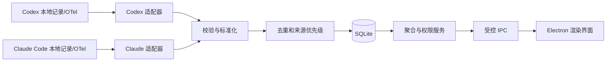

# Token 产品与技术设计

状态：第一版本机开发版已验收；M5 代码与自动测试已落地，完整验收边界见逐项用例；签名、公证和目标设备验收仍待完成
更新日期：2026-10-02

## 1. 目标与边界

Token 是一款 macOS 本机桌面应用，帮助用户查看当前电脑上 Codex 和 Claude Code 的 Token 消耗。第一版交付三个能力：

1. 本地用户登录、角色与数据归属管理。
2. Codex、Claude Code 的历史导入和持续用量采集。
3. 按日、周、月、年统计，并按用户、工具、模型筛选。

统计对象是**本机可观察到的 Token 消耗**，不是服务商账单、订阅剩余额度或跨设备总用量。没有采集到的数据应显示为“未知/未覆盖”，不能按零处理。第一版不采集提示词、回复正文、源码或凭证，也不把用量上传到自有服务器。

### 1.1 第一版范围

- 支持当前 macOS 登录用户可访问的 Codex 与 Claude Code 本地数据。
- 支持首次启动创建管理员、创建/禁用普通用户、修改密码、来源归属映射。
- 支持历史导入、后续增量采集、采集状态与错误提示。
- 支持概览、趋势、模型明细、CSV 导出。
- 支持本机离线使用和数据库备份/恢复。

### 1.2 暂不实现

- 跨设备同步、远程登录或组织级云端后台。
- 把本机应用账户直接用作 OpenAI 或 Anthropic 登录。
- 订阅余额、官方计费金额或准确费用结算。
- 读取其他 macOS 账户无权访问的文件。
- 自动修改已有的组织级遥测设置。

## 2. 产品使用流程

1. 首次启动：创建管理员，选择统计时区，查看本机工具检测结果。
2. 连接来源：选择只读本地记录导入；若工具版本支持且用户愿意，可选择启用官方遥测到本机接收器。
3. 查看采集状态：展示“正常、等待新数据、权限不足、格式不支持、采集间断”等状态，以及每个来源的最后成功时间。
4. 处理归属：管理员把工具来源标识绑定到应用用户；无法确定的历史记录保持“未归属”。
5. 查看报表：选择日/周/月/年、日期范围、用户、工具和模型，进入明细核对汇总，导出 CSV。

主界面包含：登录页、概览页、报表页、数据来源页、用户管理页、设置页。普通用户不显示用户管理入口，只能读取授权范围内的统计。

## 3. 总体架构

| 层 | 选型 | 职责 |
| --- | --- | --- |
| 桌面壳与主进程 | Electron + TypeScript | 窗口、后台采集、账户、数据库、导出 |
| 界面 | React + Vite + TypeScript | 登录、仪表盘、报表、设置 |
| 持久化 | SQLite | 用量事实、来源、游标、账户、映射、迁移版本 |
| 数据校验 | 运行时 schema 校验 | 限制 IPC 输入和外部数据格式 |
| 测试 | 单元/集成测试 + Playwright Electron | 计数规则、采集恢复、打包后主流程 |

目录建议：`src/main`、`src/preload`、`src/renderer`、`src/shared`、`src/collectors/codex`、`src/collectors/claude`、`tests/fixtures`、`tests/e2e`。实际依赖版本在实现阶段锁定，不在设计文档里指定浮动版本。

### 3.1 进程边界与 IPC

渲染进程启用沙箱和上下文隔离，关闭 Node 集成。`preload` 只暴露明确定义的方法，如 `auth.login`、`usage.query`、`sources.rescan` 和 `reports.exportCsv`；不暴露通用 `ipcRenderer`、文件读取或 SQL 执行。主进程对每个请求验证发送方、登录态、角色和参数范围，查询结果再按权限过滤。

例如 `usage.query({ granularity, from, to, userIds, providers, models, timeZone })`：主进程验证时间范围和筛选项；普通用户的 `userIds` 由登录态限定，不能通过传参扩大。

这遵循 Electron 对上下文隔离、沙箱和逐项暴露 IPC 方法的建议。[Electron Context Isolation](https://www.electronjs.org/docs/latest/tutorial/context-isolation)、[Electron Process Sandboxing](https://www.electronjs.org/docs/latest/tutorial/sandbox)

## 4. 数据采集设计

### 4.1 两种路径

| 路径 | 用途 | 特性 |
| --- | --- | --- |
| 只读本地记录 | 导入可访问的历史，并在新记录落盘后增量读取 | 无须更改工具配置；格式与保留期依赖工具版本 |
| 官方遥测 | 工具启用之后的持续采集 | 字段较明确；需要用户配置，无法补回启用前未保留的记录 |

Codex 官方文档说明可选择启用 OpenTelemetry 日志导出，`codex.sse_event` 的 `response.completed` 事件带 Token 数和模型元数据。[OpenAI Docs：Advanced Configuration](https://learn.chatgpt.com/docs/config-file/config-advanced)

Claude Code 官方文档提供 `claude_code.token.usage` 指标，带 `model` 和 `type`（`input`、`output`、`cacheRead`、`cacheCreation`）；本地会话转录记录也可用于版本验证后的历史导入。[Claude Code Monitoring](https://code.claude.com/docs/en/monitoring-usage)

Codex App Server 的 `thread/tokenUsage/updated` 可作为连接到该服务的活动线程的数据源，但它不作为覆盖所有独立 Codex 客户端的全机采集方案。[OpenAI Docs：Codex App Server](https://learn.chatgpt.com/docs/app-server)

### 4.2 适配器接口

每个工具适配器至少提供：`detect()`、`capabilities()`、`importHistory()`、`watch()`、`health()`。适配器输出统一的 `UsageObservation`，并附带原始工具版本、来源类型、解析器版本及可追溯标识。未知字段保留在受限的诊断元数据中，不保存会话正文。

开发先用真实但脱敏的本机样本验证本地记录格式。解析器根据格式版本显式分支；不识别格式时停止该来源并给出原因，不能静默按旧字段计算。

### 4.3 计量与去重

- 标准化事实包含：提供方、模型原始名、会话标识、请求/事件标识、发生时间 UTC、输入、输出、缓存读取、缓存写入、来源、所属系统用户与应用用户、采集状态。
- 原始 Token 分类保留。统一总量由提供方专属规则计算：Codex 缓存输入可能已经包含在输入总量中；Claude Code 的四类指标分别记录。未经确认不把缓存再加一次。
- 同一来源内优先用稳定请求或消息 ID 去重；文件偏移、时间戳和内容摘要只作为缺少稳定 ID 时的后备方案。
- 本地记录与遥测覆盖同一时间段时，以经过验证的主来源为准；无法可靠关联时不将两路结果相加，而是标记覆盖冲突待处理。
- 增量采集保存文件身份、偏移和遥测游标。启动后先补扫，再进入监听；处理文件截断、替换、轮转和未写完的末行。
- 遥测指标接收端明确处理 delta/cumulative temporality；重复批次按流标识和时间区间幂等写入。
- 模型切换按每次请求的实际模型归档；无法确定模型时归为“未知模型”，不强行归到会话初始模型。

## 5. 数据库与统计

核心表建议如下：

| 表 | 关键字段 |
| --- | --- |
| `users` | id、用户名、密码哈希、角色、状态、创建时间 |
| `source_identities` | 工具、系统用户、工具账户标识、设备标识、映射的应用用户 |
| `usage_facts` | 稳定去重键、来源、会话/请求标识、模型、UTC 时间、各类 Token、解析版本、归属状态 |
| `source_cursors` | 来源、文件身份/偏移或遥测游标、最近成功时间、状态 |
| `model_aliases` | 原始模型名、显示分组、有效时间 |
| `audit_events` | 账户与归属变更、导入/导出动作及时间；不记录敏感内容 |

索引以 `usage_facts(occurred_at_utc, provider, model, owner_user_id)` 和去重键唯一约束为主。报表起初直接从事实表聚合；数据量增长后增加可重建的日汇总表，事实表仍作为核对依据。

所有事件时间以 UTC 保存。报表按用户选择的 IANA 时区生成日、月、年边界；周采用 ISO 周（周一开始、ISO 周年）。界面显示“覆盖时间”和“最后采集时间”，避免把没有记录误读成零消耗。CSV 与页面使用相同的筛选和统计口径。

## 6. 用户与安全设计

- 首次启动创建本地管理员；普通用户由管理员创建或禁用。
- 密码使用带独立盐的强密码哈希，登录失败限速；会话只存在于应用进程中，退出后失效。
- 应用用户与工具来源做显式绑定；未知来源保持未归属，管理员可追溯地调整映射。仅凭当前登录用户不回填历史归属。
- 数据库位于应用用户数据目录，只授予当前 macOS 用户访问。读取来源文件时使用最小可行权限，不提权扫描其他账户。
- 不保存或导出提示词、回复、源码、API Key；诊断日志隐藏路径中的用户名及任何凭证。数据库导出需用户主动触发。
- CSV 导出对可能被表格软件识别为公式的文本字段做转义。
- 遥测配置向导先检查已有设置，不覆盖已配置的 OTLP 目标或组织管理设置；配置更改前展示差异并可恢复。

本地账户主要控制应用界面和 IPC 访问。**共用同一个 macOS 账户的人仍可能在应用之外读取该账户可访问的本地文件**；因此本地账户不提供操作系统级的数据隔离。若需要对多人提供强隔离，应使用各自的 macOS 账户，或在后续版本设计独立服务、身份认证与加密存储。跨 Mac 集中管理和完整人员归属也属于后续阶段。

## 7. 发布与测试边界

开发和端到端测试使用 Node/npm、Electron 自带 Chromium 与 macOS 图形会话。Playwright 的 Electron API 可直接指定打包应用的可执行文件并控制窗口。[Playwright Electron](https://playwright.dev/docs/api/class-electron)

测试目标 Mac 不需要完整 Xcode。面向其他用户分发的签名与公证是独立发布步骤，应在具备 Apple 开发者证书及所需开发工具的构建环境完成；不能把“测试无需 Xcode”推广为“签名发布无需 Xcode”。[Electron Code Signing](https://www.electronjs.org/docs/latest/tutorial/code-signing)

## 8. 待在验证阶段定案的事项

1. 当前 Codex 和 Claude Code 安装版本的本地记录路径、字段及历史保留时间。
2. Codex 不同运行入口（CLI、桌面端、IDE）在本机的覆盖差异。
3. 已有组织遥测配置是否阻止本机接收器接入。
4. 本地数据是否需要加密静态数据库，以及可接受的解锁方式。
5. 第一版目标是开发者自用安装包，还是立即面向外部分发并签名公证。

这些问题不阻止工程骨架开发，但采集完整率和发布时间必须在真实样本验证后确定。

## 9. M5 范围与验收边界

下表的“此前状态”指 M0–M4 已验收版本，不代表 M5 当前代码。M5 已有实现和按编号执行的自动测试；[逐项验收](test-case-acceptance.md#m5-用例绑定与覆盖tc-030tc-049)列出其实际断言与尚未覆盖的目标场景。对应编号和状态以[追溯工作簿](../outputs/20261002-token-docs/Token-需求开发测试追溯.xlsx)为准。

| 能力 | 需求 | 此前状态 | M5 验收边界 |
| --- | --- | --- | --- |
| 信任此设备 | REQ-019–020 | 退出应用即失去登录态 | 用户主动勾选后可自动登录；手动退出立即撤销，禁用账户或重置密码也撤销 |
| 独立更新服务和客户端 | REQ-021–023 | 无独立更新服务 | 服务监听与 App 连接地址均可配置、默认 `127.0.0.1`；客户端下载并打开安装包，由用户安装 |
| 十分钟扫描与聚合上报 | REQ-024–026 | 定时扫描约 30 秒；无上报 | 启动、每 10 分钟和手动扫描；每次完整扫描后向同一服务上报聚合快照 |
| 数字显示和分析界面 | REQ-027–029 | 原始整数展示及基础报表 | 1024 进位紧凑显示、精确原值、比较趋势、排行及覆盖状态 |
| 趋势图布局与日期 | REQ-030 | 当前柱顶数值可能与横轴日期重叠 | 窗口缩放自适应；周/月横轴使用明确日期格式 |

M5 仍以本机可观察的用量为统计口径。独立服务与 App 默认通过 `127.0.0.1` 连接，也可显式配置其他地址；这不引入远程登录或跨设备同步承诺。下述各节是验收目标；代码落地不代表真实非回环部署、安装或目标 Mac 已通过。

## 10. 登录与受信设备（REQ-019–020）

登录页增加默认未勾选的“信任此设备”。只有用户勾选且密码登录成功，主进程才签发不可预测的设备凭证，通过 Electron `safeStorage` 加密后存入当前 macOS 账户的应用数据目录；应用数据库只存凭证摘要、所属应用用户和撤销所需元数据。不得存密码明文或可逆密码。下次启动由主进程验证摘要和用户仍启用，然后恢复该用户会话；渲染进程不直接读取凭证。未勾选时沿用进程内会话。

受信状态**无固定到期时间**，保持自动登录直到用户手动退出登录。手动退出必须在返回登录页之前立即撤销本设备凭证；管理员停用账户或重置密码必须撤销该账户全部受信凭证。凭证缺失、损坏、被撤销、用户停用或安全存储不可用时回到登录页并给出可理解提示，不绕过现有 IPC 身份和角色检查。更换 macOS 账户不得复用凭证。共用同一 macOS 账户的系统级数据边界仍按第 6 节说明。

## 11. 独立本地服务与更新（REQ-021–023）

服务作为与 Electron 应用独立启动和停止的进程，默认监听 `127.0.0.1:47839`；`TOKEN_SERVER_HOST`、`TOKEN_SERVER_PORT` 和 `TOKEN_SERVER_DATA_DIR` 可配置监听地址、端口和数据目录，须与现有 OTLP 接收器 `127.0.0.1:43188` 区分。`npm run server` 可独立启动。App 默认连接 `http://127.0.0.1:47839`，也可显式配置其他服务地址及访问密钥；地址应与服务实际监听地址匹配。非回环地址必须使用 HTTPS；服务端非回环监听需配置 `TOKEN_SERVER_TLS_CERT`、`TOKEN_SERVER_TLS_KEY`。最低接口为版本清单、安装包下载、聚合上报和健康状态。清单包括版本、目标 macOS 架构、包大小、SHA-256、下载路径及发布时间；服务只发布管理员明确放入发布目录的包，阻止路径穿越与任意文件读取。更新清单、安装包和聚合上报均需 bearer 密钥，鉴权失败不返回受保护制品或写入聚合数据。地址默认值不能替代鉴权。服务停止时本机采集和报表继续可用。

发布安装包的命令为 `npm run publish:update -- <dmg> <version> <arch> <server-dir>`，其中 `<arch>` 为 `arm64` 或 `x64`，`<server-dir>` 应与服务的数据目录一致。命令复制包并生成带大小和 SHA-256 的 `releases/latest.json`；生成清单不代表包已签名、公证或在目标 Mac 验收。

客户端只接受用户或管理员明确配置的服务地址，默认 `127.0.0.1`；限制响应大小、下载目录和超时，避免把远程地址当作本机可信来源。比较语义版本与架构，只有较新且匹配的版本才提示。包先下载到临时文件，检查长度与清单 SHA-256，原子转为可打开文件；失败或中断清理临时文件并显示重试。哈希用于验证下载内容与清单一致；若后续面向外部分发，还需要独立可信的签名、公证与发布来源校验。

用户确认的当前交付方式是**发现更新、下载并打开安装包**，由用户按 macOS 流程完成安装。当前未签名应用不静默替换自身，不调用自动安装。用户取消打开或安装失败时旧版应用、账户和本机数据库仍可运行。Electron 官方 [autoUpdater 文档](https://www.electronjs.org/docs/latest/api/auto-updater/)指出 macOS 自动更新需要签名应用，因此这里将未签名包限定为用户引导式安装。版本回退、迁移失败和数据库备份仍需在实际发布流程验证。

## 12. 扫描触发与聚合上报（REQ-024–026）

应用启动后补扫，之后以**10 分钟**为间隔定时扫描；手动扫描不重置定时间隔。扫描请求串行化，避免同一批次并发计数。每次完整扫描结束后生成并上报一个聚合快照，包括启动、定时、手动扫描；扫描失败或覆盖不完整时保留真实状态，不发送伪装完整的零用量。若仅部分来源成功，快照逐来源携带覆盖状态和最后成功时间，接收端不能把未知当作零。

上报只取本机已归属的聚合结果：稳定设备标识、应用用户归属标识、UTC 统计区间、提供方、模型、Token 分类与总量、记录数、覆盖状态、数据修订号。**字段白名单**禁止会话正文、提示词、回复、源码、API Key、原始文件路径、原始事件和账户密码进入请求、服务数据库或日志。聚合口径沿用第 4–5 节的提供方规则和时区边界；服务端不得另算缓存 Token。普通用户只能上传其授权范围；管理员的多用户快照仍逐用户分区。

客户端为每个待传快照保存稳定键、内容摘要、尝试次数和状态。键由设备、归属用户、统计区间、提供方、模型及数据修订构成；服务以键做 upsert，同一快照重复发送不累加，后续修订替换旧快照。服务不可用时本机持久化待传队列，以有上限的退避重试；展示最近成功、最近失败和积压数量。恢复后补传，发送成功才移除待传项。队列设容量上限和压缩规则；超限时明确告警，不静默丢弃可追溯用量。服务端须隔离不同设备与用户，不能接受无凭证覆盖。

## 13. 数值和分析界面（REQ-027–029）

Token 只在显示层按项目自定义的 **K→M→P** 逐级 1024 进位：`1024 Token = 1 K`、`1024 K = 1 M`、`1024 M = 1 P`，所以 `1 P = 1024³ Token`。不引入 G/T 单位；`1023` 仍显示整数。统一小数与舍入规则，避免卡片、趋势和排行各自取值。计算、存储、CSV 使用精确原始 Token 整数；卡片与明细单元格通过悬浮 `title` 提供精确原值，CSV 直接导出原始整数。未知数据不显示为 `0`；超过安全整数范围时使用精确整数表示或明确报错，不能悄然损失精度。

概览按当前权限、日期和来源筛选展示总 Token、请求数、相对上一等长区间的变化、趋势、模型排行和来源覆盖。趋势按第 5 节时区边界分桶，点击数据点带原筛选下钻；模型按 Token 降序，未知模型保留独立行，同值排序稳定。比较基期缺失时显示“未知”，不用无穷百分比。来源卡片展示最后成功时间及正常、等待、权限不足、格式不支持、未覆盖等状态；**已覆盖且无记录**才显示真实零用量。

界面参考 [Plausible 的单页概览、时间筛选与下钻](https://plausible.io/docs/guided-tour)和[区间比较](https://plausible.io/docs/compare-stats)的信息组织方式；这些是交互借鉴。Token 的指标和覆盖含义以上述本机用量口径为准，不引入访客数等网站分析指标。

趋势图布局修复（REQ-030）的目标是：绘图区随应用窗口和容器宽度变化，按可用宽度调整柱宽、间距及标签密度；柱顶数值与横轴日期不得相交或被裁切，窄窗口可减少可见刻度但保留可访问的完整值。周粒度的横轴标签使用所选时区对应 **ISO 周周一 `YYYY-MM-DD`**，包括跨年周；月粒度显示 **`YYYY-MM`**。标签、悬浮提示和点击下钻必须指向同一时间桶，不能仅更换文本而保持错误区间。当前自动化已覆盖 1180/860 两种窗口宽度与跨年周示例，其他窗口和时区仍需验证。

## 14. M6 范围与状态

本节至第 19 节是 **REQ-031–039 的待开发方案**，不是现有功能说明。唯一编号及 DEV-034–046、TC-050–072 的对应关系见追溯工作簿；代码、数据库迁移、单用例入口和验收结果尚未落地。沿用 M5 的本机可观察口径、来源归属、主进程授权和聚合白名单。

## 15. 项目归属与项目模型分析（REQ-031–032）

Codex 与 Claude 的适配器从会话元数据中的工作目录提取项目建议；读取失败、空值、非绝对路径或无法确定归属时标记“未知项目”，绝不按最近项目猜测。子代理只在能证明继承关系时沿用父会话归属。以本机规范化的路径形成稳定本机项目标识；两个目录即使末级名称相同也必须分开，界面用父级提示或本机别名消歧。历史事实没有可靠目录时保持未知，迁移不得按同名批量回填。目录只用作元数据，不因此读取项目内容。

完整原始路径及其可逆形式只存当前 Mac 的应用数据目录。主进程通过最小 IPC 返回当前用户有权看到的展示名和本机项目标识；不把完整路径交给服务端。M5 聚合上报、M6 反馈及任何诊断外发均不得包含完整路径、项目标识、别名或由它们直接派生的值。日志与 CSV 默认也不输出完整路径。若未来需要跨设备项目报表，应先另定经用户确认的非路径身份协议。

分析查询按登录用户授权范围、项目、模型、提供方、时区和时间区间筛选；总量、输入/输出/缓存分类、请求数、日周月趋势与排行都从同一去重事实集计算。未知项目作为单独分组可见，不能合并到零。项目×模型排行点击后继承全部筛选进入明细，CSV 与页面使用同一查询和精确原值，文本字段仍防公式注入。服务端当前只接收不含项目信息的聚合快照，因此项目报表是本机能力。

## 16. 应用外壳、更新与设置（REQ-033–035）

侧栏固定在应用视口，右侧主内容是独立滚动容器。窄窗口须保留导航入口、主操作和焦点可见性；面包屑来自当前页面与下钻状态，点击上级恢复对应筛选。检查更新从概览深处移到清晰可见的导航或集中设置入口，普通授权用户能找到。状态区分检查中、已是最新、发现新版、下载中、校验中、可打开安装包、失败可重试；失败不能遗留坏包或阻断本机报表，未签名包仍只由用户打开安装。

集中设置展示服务连接、采集来源、更新和本机文件权限。每项设置的读取与修改在主进程再次校验登录态和角色，隐藏按钮不能代替 IPC 鉴权。来源不可读时展示具体来源、可操作的 macOS 文件访问授权指引和重试扫描入口；不得自动提权、改写系统权限或跨 macOS 账户读取文件。真实系统授权须在目标 Mac 人工验证，模拟权限异常只能证明错误路径。

## 17. 采集诊断与反馈（REQ-036–037）

诊断按来源呈现检测结果、解析错误、增量游标、最近覆盖区间、最后成功与失败、未归属原因和下一步建议。扫描成功且无事实才是零；缺失、权限拒绝、格式未知、游标停滞及未归属分别显示。仅授权用户可查看相应来源；日志和外发摘要必须脱敏，原始路径只允许在本机授权界面显示。

反馈由用户显式填写、预览并确认发送。上传白名单为反馈文字、类别、应用版本、平台、可选的脱敏诊断摘要与本机生成的幂等键；预览应清楚显示最终字段。反馈文字须提示用户避免输入秘密；客户端还需拦截已知敏感样式，不把提示词、回复、源码、凭证、完整项目路径、项目标识或别名自动附加。服务端鉴权、限制大小、按键幂等保存；停服和超时保留本机待发送状态，重试不会生成两条反馈。服务日志也执行同一字段边界。

## 18. 管理视图与固定超管（REQ-038–039）

管理员与超管可在授权范围内查看反馈清单、账号角色与启停状态、采集来源最近成功和错误；普通查看者不能调用管理 IPC。反馈查看是本轮目标，指派、回复、关闭的处理闭环未纳入本轮。账号操作继续遵守现有管理员权限，固定账号的保护由服务端和主进程执行。

全新数据库的首个账号用户名固定为精确的 `admin`。为兼容现有 SQLite 角色约束，数据库仍只存 `admin`/`viewer`；**仅用户名恰为 `admin` 且库内角色为 `admin`** 的账号对外显示 `superadmin`。既有库满足此条件的账号自动呈现超管，不重写账号 ID 或密码哈希；无该用户名的旧库保留原管理员，允许其按旧权限创建固定 `admin` 后成为超管。普通管理员仍可创建 `admin` 或 `viewer` 角色的其他账号，保留原有管理能力，但不能停用、重置或降级固定 `admin`。超管可创建普通管理员与查看者。用户名为 `admin` 但库角色为 `viewer` 属冲突，迁移必须报告并要求明确处置，不得静默升权、覆盖账户或锁住原管理员。迁移前备份，失败回退；受信设备恢复时从数据库重新派生角色，不信任缓存中的角色。若实现审计查看入口，仅超管可用；完整管理员审计功能仍属候选。

## 19. M6 异常和验收门槛

工作目录缺失或同名冲突、无权限来源、反馈服务停机、更新包损坏、旧库 `admin` 角色冲突必须有可解释且可重试的状态。每项新增 TC 先在 `scripts/test-cases.mjs` 注册独立入口，以专用临时数据库/用户数据运行，再记录提交、环境、命令、退出码和脱敏证据；TC-072 另用目标 Mac 手工验收。未注册、未执行和仅模拟系统行为均保持待验证。候选的覆盖率/未归属总览、预算提醒、项目别名合并、诊断包、反馈处理闭环、完整管理员审计及更新回滚不属于 REQ-031–039 的必做验收。
