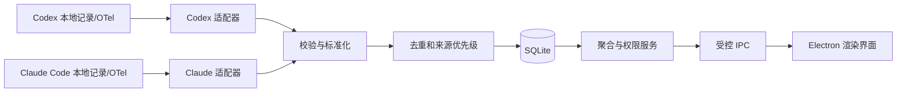

# Token 产品与技术设计

状态：第一版本机开发版已实现并验收；跨设备分发的签名、公证和目标设备验收按需另行完成
更新日期：2026-10-02

## 1. 目标与边界

Token 是一款 macOS 本机桌面应用，帮助用户查看当前电脑上 Codex 和 Claude Code 的 Token 消耗。第一版交付三个能力：

1. 本地用户登录、角色与数据归属管理。
2. Codex、Claude Code 的历史导入和持续用量采集。
3. 按日、周、月、年统计，并按用户、工具、模型筛选。

统计对象是**本机可观察到的 Token 消耗**，不是服务商账单、订阅剩余额度或跨设备总用量。没有采集到的数据应显示为“未知/未覆盖”，不能按零处理。第一版不采集提示词、回复正文、源码或凭证，也不把用量上传到自有服务器。

### 1.1 第一版范围

- 支持当前 macOS 登录用户可访问的 Codex 与 Claude Code 本地数据。
- 支持首次启动创建管理员、创建/禁用普通用户、修改密码、来源归属映射。
- 支持历史导入、后续增量采集、采集状态与错误提示。
- 支持概览、趋势、模型明细、CSV 导出。
- 支持本机离线使用和数据库备份/恢复。

### 1.2 暂不实现

- 跨设备同步、远程登录或组织级云端后台。
- 把本机应用账户直接用作 OpenAI 或 Anthropic 登录。
- 订阅余额、官方计费金额或准确费用结算。
- 读取其他 macOS 账户无权访问的文件。
- 自动修改已有的组织级遥测设置。

## 2. 产品使用流程

1. 首次启动：创建管理员，选择统计时区，查看本机工具检测结果。
2. 连接来源：选择只读本地记录导入；若工具版本支持且用户愿意，可选择启用官方遥测到本机接收器。
3. 查看采集状态：展示“正常、等待新数据、权限不足、格式不支持、采集间断”等状态，以及每个来源的最后成功时间。
4. 处理归属：管理员把工具来源标识绑定到应用用户；无法确定的历史记录保持“未归属”。
5. 查看报表：选择日/周/月/年、日期范围、用户、工具和模型，进入明细核对汇总，导出 CSV。

主界面包含：登录页、概览页、报表页、数据来源页、用户管理页、设置页。普通用户不显示用户管理入口，只能读取授权范围内的统计。

## 3. 总体架构

| 层 | 选型 | 职责 |
| --- | --- | --- |
| 桌面壳与主进程 | Electron + TypeScript | 窗口、后台采集、账户、数据库、导出 |
| 界面 | React + Vite + TypeScript | 登录、仪表盘、报表、设置 |
| 持久化 | SQLite | 用量事实、来源、游标、账户、映射、迁移版本 |
| 数据校验 | 运行时 schema 校验 | 限制 IPC 输入和外部数据格式 |
| 测试 | 单元/集成测试 + Playwright Electron | 计数规则、采集恢复、打包后主流程 |

目录建议：`src/main`、`src/preload`、`src/renderer`、`src/shared`、`src/collectors/codex`、`src/collectors/claude`、`tests/fixtures`、`tests/e2e`。实际依赖版本在实现阶段锁定，不在设计文档里指定浮动版本。

### 3.1 进程边界与 IPC

渲染进程启用沙箱和上下文隔离，关闭 Node 集成。`preload` 只暴露明确定义的方法，如 `auth.login`、`usage.query`、`sources.rescan` 和 `reports.exportCsv`；不暴露通用 `ipcRenderer`、文件读取或 SQL 执行。主进程对每个请求验证发送方、登录态、角色和参数范围，查询结果再按权限过滤。

例如 `usage.query({ granularity, from, to, userIds, providers, models, timeZone })`：主进程验证时间范围和筛选项；普通用户的 `userIds` 由登录态限定，不能通过传参扩大。

这遵循 Electron 对上下文隔离、沙箱和逐项暴露 IPC 方法的建议。[Electron Context Isolation](https://www.electronjs.org/docs/latest/tutorial/context-isolation)、[Electron Process Sandboxing](https://www.electronjs.org/docs/latest/tutorial/sandbox)

## 4. 数据采集设计

### 4.1 两种路径

| 路径 | 用途 | 特性 |
| --- | --- | --- |
| 只读本地记录 | 导入可访问的历史，并在新记录落盘后增量读取 | 无须更改工具配置；格式与保留期依赖工具版本 |
| 官方遥测 | 工具启用之后的持续采集 | 字段较明确；需要用户配置，无法补回启用前未保留的记录 |

Codex 官方文档说明可选择启用 OpenTelemetry 日志导出，`codex.sse_event` 的 `response.completed` 事件带 Token 数和模型元数据。[OpenAI Docs：Advanced Configuration](https://learn.chatgpt.com/docs/config-file/config-advanced)

Claude Code 官方文档提供 `claude_code.token.usage` 指标，带 `model` 和 `type`（`input`、`output`、`cacheRead`、`cacheCreation`）；本地会话转录记录也可用于版本验证后的历史导入。[Claude Code Monitoring](https://code.claude.com/docs/en/monitoring-usage)

Codex App Server 的 `thread/tokenUsage/updated` 可作为连接到该服务的活动线程的数据源，但它不作为覆盖所有独立 Codex 客户端的全机采集方案。[OpenAI Docs：Codex App Server](https://learn.chatgpt.com/docs/app-server)

### 4.2 适配器接口

每个工具适配器至少提供：`detect()`、`capabilities()`、`importHistory()`、`watch()`、`health()`。适配器输出统一的 `UsageObservation`，并附带原始工具版本、来源类型、解析器版本及可追溯标识。未知字段保留在受限的诊断元数据中，不保存会话正文。

开发先用真实但脱敏的本机样本验证本地记录格式。解析器根据格式版本显式分支；不识别格式时停止该来源并给出原因，不能静默按旧字段计算。

### 4.3 计量与去重

- 标准化事实包含：提供方、模型原始名、会话标识、请求/事件标识、发生时间 UTC、输入、输出、缓存读取、缓存写入、来源、所属系统用户与应用用户、采集状态。
- 原始 Token 分类保留。统一总量由提供方专属规则计算：Codex 缓存输入可能已经包含在输入总量中；Claude Code 的四类指标分别记录。未经确认不把缓存再加一次。
- 同一来源内优先用稳定请求或消息 ID 去重；文件偏移、时间戳和内容摘要只作为缺少稳定 ID 时的后备方案。
- 本地记录与遥测覆盖同一时间段时，以经过验证的主来源为准；无法可靠关联时不将两路结果相加，而是标记覆盖冲突待处理。
- 增量采集保存文件身份、偏移和遥测游标。启动后先补扫，再进入监听；处理文件截断、替换、轮转和未写完的末行。
- 遥测指标接收端明确处理 delta/cumulative temporality；重复批次按流标识和时间区间幂等写入。
- 模型切换按每次请求的实际模型归档；无法确定模型时归为“未知模型”，不强行归到会话初始模型。

## 5. 数据库与统计

核心表建议如下：

| 表 | 关键字段 |
| --- | --- |
| `users` | id、用户名、密码哈希、角色、状态、创建时间 |
| `source_identities` | 工具、系统用户、工具账户标识、设备标识、映射的应用用户 |
| `usage_facts` | 稳定去重键、来源、会话/请求标识、模型、UTC 时间、各类 Token、解析版本、归属状态 |
| `source_cursors` | 来源、文件身份/偏移或遥测游标、最近成功时间、状态 |
| `model_aliases` | 原始模型名、显示分组、有效时间 |
| `audit_events` | 账户与归属变更、导入/导出动作及时间；不记录敏感内容 |

索引以 `usage_facts(occurred_at_utc, provider, model, owner_user_id)` 和去重键唯一约束为主。报表起初直接从事实表聚合；数据量增长后增加可重建的日汇总表，事实表仍作为核对依据。

所有事件时间以 UTC 保存。报表按用户选择的 IANA 时区生成日、月、年边界；周采用 ISO 周（周一开始、ISO 周年）。界面显示“覆盖时间”和“最后采集时间”，避免把没有记录误读成零消耗。CSV 与页面使用相同的筛选和统计口径。

## 6. 用户与安全设计

- 首次启动创建本地管理员；普通用户由管理员创建或禁用。
- 密码使用带独立盐的强密码哈希，登录失败限速；会话只存在于应用进程中，退出后失效。
- 应用用户与工具来源做显式绑定；未知来源保持未归属，管理员可追溯地调整映射。仅凭当前登录用户不回填历史归属。
- 数据库位于应用用户数据目录，只授予当前 macOS 用户访问。读取来源文件时使用最小可行权限，不提权扫描其他账户。
- 不保存或导出提示词、回复、源码、API Key；诊断日志隐藏路径中的用户名及任何凭证。数据库导出需用户主动触发。
- CSV 导出对可能被表格软件识别为公式的文本字段做转义。
- 遥测配置向导先检查已有设置，不覆盖已配置的 OTLP 目标或组织管理设置；配置更改前展示差异并可恢复。

本地账户主要控制应用界面和 IPC 访问。**共用同一个 macOS 账户的人仍可能在应用之外读取该账户可访问的本地文件**；因此本地账户不提供操作系统级的数据隔离。若需要对多人提供强隔离，应使用各自的 macOS 账户，或在后续版本设计独立服务、身份认证与加密存储。跨 Mac 集中管理和完整人员归属也属于后续阶段。

## 7. 发布与测试边界

开发和端到端测试使用 Node/npm、Electron 自带 Chromium 与 macOS 图形会话。Playwright 的 Electron API 可直接指定打包应用的可执行文件并控制窗口。[Playwright Electron](https://playwright.dev/docs/api/class-electron)

测试目标 Mac 不需要完整 Xcode。面向其他用户分发的签名与公证是独立发布步骤，应在具备 Apple 开发者证书及所需开发工具的构建环境完成；不能把“测试无需 Xcode”推广为“签名发布无需 Xcode”。[Electron Code Signing](https://www.electronjs.org/docs/latest/tutorial/code-signing)

## 8. 待在验证阶段定案的事项

1. 当前 Codex 和 Claude Code 安装版本的本地记录路径、字段及历史保留时间。
2. Codex 不同运行入口（CLI、桌面端、IDE）在本机的覆盖差异。
3. 已有组织遥测配置是否阻止本机接收器接入。
4. 本地数据是否需要加密静态数据库，以及可接受的解锁方式。
5. 第一版目标是开发者自用安装包，还是立即面向外部分发并签名公证。

这些问题不阻止工程骨架开发，但采集完整率和发布时间必须在真实样本验证后确定。
