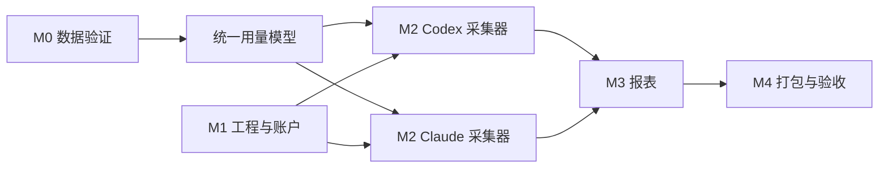

# Token 开发计划

**当前 0.3.6 临时候选范围（2026-10-04）**：需求会话从干净 `main 9af351a` 构建未签名 mac x64 `release/Token-0.3.6.dmg`，文档会话只读重算 SHA-256 `8773dd3865cda61709061916723c0ff607ed126649f32edaee451a3e2d1815a2` 且 `hdiutil verify` 为 VALID。需求会话以真实旧/新 DMG 固定 SHA 运行新包 TC-076，隔离成功升级、installer 模块/打包 helper 各五种故障回退及最后重试报告 exit 0；文档会话未独立复跑。需求会话另报告同一候选 TC-036 2/2 和打包 Electron 43/43，均 exit 0。旧 `80e7f10` 阶段同名包 `d99d7af9…` 为历史制品，旧包结果不充当当前新包证据；开发工作树未提交、未验收的安装中取消实验未纳入。用户将 REQ-023/DEV-025/TC-076 收敛为安装前可放弃、开始执行替换/安装后不可取消、失败自动恢复旧版；下文独立控制窗口与阶段取消为历史/备选计划。TC-079 日期回退在 `508851a` 目录包失败，新 DMG 尚未针对该反例复测；TC-028/072 仍待人工环境验收。没有新版本完成结论。

状态：M0–M6 本机代码已落地；M5/M6 已有自动测试证据，完整验收仍有缺口；TC-072 目标 Mac 权限流程、公开分发签名公证及其他目标设备验收待完成
更新日期：2026-10-04

**阶段进度（`508851a`）**：DEV-028 的发送中快照续传、DEV-054 的 Claude 证据校验/预览纠错与个人队列、DEV-057 的来源身份键/保守迁移和旧 owner 服务聚合清理均已编码并通过对应隔离自动用例 TC-040、TC-086/087、TC-092–094；完整源码门禁为 94 个入口、97/97 单元、43/43 Electron。下文相关“待开发”保留历史规划时态。真实受控登记、生产旧库、目标 Mac 与打包全量稳定性仍待验，见[验收记录](validation.md)。

**版本迭代视图**：版本号、主要功能、编号关联、阶段进度和完成状态以[追溯工作簿“版本规划”页](../outputs/20261002-token-docs/Token-需求开发测试追溯.xlsx)为准。历史 0.3.0–0.3.5 是各固定代码/制品的候选阶段，不自动等于公开分发完成。当前 `package.json` 为 0.3.6；固定代码 `508851a` 的源码门禁通过，但同一目录包打包全量 42/43、日期用例重复运行 3/5，故 0.3.6 仍在验证。下一版本号和日期尚未确定；优先处理该打包缺陷，再取得真实外部归属证据、生产迁移和发布环境证据。

**当前目标与下一轮边界**：版本页 VER-009 是三批产品打磨及当前发布门槛的**未完成收尾**，版号待定，完整关联 REQ-040–048、DEV-049–057、TC-077–094，并保留 REQ-023/DEV-025/TC-076 及 TC-021/028/072 发布和回归边界。已通过自动子范围的下钻、引导、扫描反馈和精确值仍属于当前目标，不能因外部或打包门槛未验而被移出范围；完整覆盖与真零/同比、空状态、真实服务状态、目标 Mac VoiceOver、来源外部归属、生产迁移、日期回退及安装/发布验证继续收尾。VER-010 仅记录 CodexBar 式菜单栏入口/速览为后续未立项方向；没有确定版本号、排期或 REQ/DEV/TC。

日期字段回退沿用 REQ-041/DEV-050/TC-079，先把双日期连续修改与同快照导出写入追溯和验收；开发修复后 TC-079 单编号、TC-021 管理员回归、打包重复及全量均需重跑。新打包反例当前为失败，不能用 `508851a` 源码门禁通过代替版本完成。

本计划对应[产品与技术设计](design.md)。估时按一名熟悉 TypeScript/Electron 的开发者计算，约 **5–7 周**；数据格式验证失败或需要外部分发签名时另计。

首版实际验收结果见[验收记录](validation.md)。

**外部分发流程原实施计划（REQ-018 / DEV-018，2026-10-03）**：先在 `scripts/package-dmg.mjs` 的现有未签名路径之外实现显式 `pack:signed` 与独立签名脚本，构建前检查 Developer ID Application 身份和一组完整公证凭据；任何缺项或错误身份须在构建前失败。签名路径使用 electron-builder v26 的 `forceCodeSigning: true`、`mac.notarize: true`，再逐项核对 App 的 `codesign`、Gatekeeper、stapler 票据以及 DMG 的 `hdiutil verify`、大小和 SHA-256。将制品和脱敏证据置于可区分的发布位置，不在命令、日志或仓库中保留私钥与凭据。`pack:dmg` 继续供本机未签名验证，不以其产物满足外部分发门槛。先为 TC-075 增加不接触真实签名材料的模拟预检、错误路径与命令构造回归，注册并执行 `npm run test:case -- TC-075`，再跑受影响门禁；具备有效身份和公证凭据后才执行真实 `npm run pack:signed`。最后在另一台目标 Mac 完成 TC-028 的人工签名、公证、安装和核心流程验收。当前缺少有效签名身份和异机证据，DEV-018、TC-075、TC-028 均不得标为通过；[设计第 7 节](design.md#7-发布与测试边界)与[逐项验收](test-case-acceptance.md)列出边界。

**`dc37b8b` 阶段实现与剩余任务**：`package.json` 已增加 `pack:signed`，独立脚本在构建前校验签名身份、公证凭据与环境，使用 electron-builder v26 强制签名、公证和 hardened runtime/JIT entitlement；核验同一临时目录下的 App/DMG 后才原子转入 `release/signed`，写脱敏 evidence JSON。TC-075 已注册并以合成 p12 与模拟配置运行 1/1；文档会话独立复跑该编号和 75 个入口检查均通过。无公证凭据的独立预检在构建前退出码 1，未生成签名制品。此阶段 DEV-018 **发布脚本部分落地**；TC-075 构建后核验失败注入尚未自动覆盖，实际签名/公证和另一台 Mac 的 TC-028 人工验收尚无证据。开发会话报告 `dc37b8b` 的完整门禁为 75 个编号入口、51 个单元、18 个 Electron 用例通过；文档会话未独立复跑完整门禁。`pack:dmg` 未签名本机通道保持。

**`2f43b00` 补齐自动失败分支**：签名发布脚本导出并在真实主流程调用 `verifySignedCandidate`、`withTemporaryReleaseDirectory`；TC-075 对四项制品核验及 Developer ID 身份核对共五个失败点逐项注入，断言抛错、临时目录清理、无 `signed` 目录。文档会话独立复跑 TC-075 1/1、75 个编号入口检查及 `npm run typecheck`，均退出码 0；开发会话报告完整门禁 75 编号、51 单元、18 Electron 通过。TC-075 的计划自动范围现有通过证据；DEV-018 仍仅部分落地，真实 Apple 签名/公证、成功制品核验和另一台 Mac 的 TC-028 人工验收未完成。模拟失败不能证明真实发布成功，现有未签名 `pack:dmg` 也未在本轮重跑。

## 1. 执行原则

- 每个阶段形成可运行、可检查的交付物，完成后提交并推送至仓库 `main`。
- 先验证真实数据的可采集性，再承诺历史覆盖范围和统计准确率。
- 事实数据优先，报表可由事实重算；缺失与未知单独标识。
- 使用脱敏样本做测试，真实会话记录、数据库和密钥不进入 Git。
- 不为了覆盖率增加与实现镜像相同的测试；测试聚焦去重、计量、权限和报表边界。

## 2. 里程碑

| 阶段 | 预计 | 任务 | 交付与完成条件 |
| --- | --- | --- | --- |
| M0 数据可行性 | 3–5 天 | 检测本机工具版本；采集脱敏样本；核对本地记录与遥测字段；确定 Token 口径和覆盖矩阵 | 有样本清单、字段映射、已知缺口；两家工具各至少一条样本能准确识别模型与 Token |
| M1 工程与账户 | 4–6 天 | Electron/Vite/React/TypeScript 骨架；SQLite 迁移；首次管理员、登录、用户管理；受控 IPC | 可启动和打包；普通用户无法越权查询；应用重启后账户仍有效 |
| M2 采集与标准化 | 8–12 天 | Codex/Claude 适配器；历史导入；增量扫描；采集状态；来源归属；幂等入库 | 两家工具均可导入可用样本；重复导入、重启、文件轮转后无重复统计 |
| M3 报表与导出 | 5–7 天 | 概览、趋势、模型明细；日/周/月/年聚合；筛选；CSV | 每个汇总能追溯到明细；页面与 CSV 数值一致 |
| M4 质量与发布 | 4–6 天 | 异常样本修复；数据库备份与恢复；Playwright 打包应用测试；macOS 安装包 | 全部验收场景通过；可在目标 Mac 安装、登录并采集 |

M0 后做一次范围校准：若某工具只能取得部分历史或某入口无可用数据，应在界面和发布说明中明确标记覆盖范围，再决定是否增加新的采集方式。

## 3. 工作项与依赖

### M0：数据可行性

1. 核对用户实际使用的 Codex/Claude Code 版本及运行入口，列出来源覆盖矩阵。
2. 用各工具各至少两段会话样本验证输入、输出、缓存、模型、时间、会话/请求 ID；包含一次模型切换或子代理活动。
3. 对比本地记录与官方遥测，确定首选来源和重叠期间的处理规则。
4. 确定“Token 总量”的提供方专属计算函数，记录示例与反例。

### M1：工程与账户

1. 初始化工程、锁定依赖和脚本：开发、类型检查、构建、测试、打包。
2. 创建主进程、预加载脚本、沙箱化渲染进程及类型化 IPC。
3. 建立 SQLite 迁移、首次管理员引导、登录失败限速和角色检查。
4. 配置不提交本机数据、构建产物和凭证的忽略规则。

### M2：采集与标准化

1. 实现统一观察记录和 `usage_facts` 幂等写入。
2. 分别开发 Codex/Claude 本地记录导入器，保存增量游标。
3. 增加官方遥测接收器与配置向导；如现有设置冲突，保留用户原设置并提示。
4. 实现来源状态、断点续采、未写完记录处理和错误诊断。
5. 加入来源与应用用户的绑定及未归属队列。

### M3：报表

1. 开发统一查询服务和 UTC 到所选时区的日期分桶。
2. 实现日、ISO 周、月、年趋势以及工具/模型/用户筛选。
3. 展示输入、输出、缓存分类和覆盖状态。
4. CSV 导出复用同一查询服务，避免两套统计逻辑。

2026-10-03 验收补证：既有 REQ-013 / DEV-013 / TC-021 未改产品行为或编号。`f7fcdee` 增加独立分页单元及 Electron 测试，验证跨页记录、报表合计、授权范围、筛选与页码重置；原共享测试继续运行。结果与合成样本边界见[TC-021 逐项验收](test-case-acceptance.md#tc-021-筛选与分页明细)。

### M4：验证与发布

1. 用脱敏固定样本验证重复记录、缓存口径、模型切换、跨年 ISO 周和时区边界。
2. 使用临时用户数据目录运行 Playwright；直接拉起构建后的 Electron 主进程完成登录、采集、筛选、导出流程。
3. 在目标 Mac 完成安装、首次启动、权限不足、工具缺失及备份恢复等手工验收。
4. 生成安装包；若要向外部分发，再执行签名与公证流程。

## 4. 验收清单

| 编号 | 场景 | 通过标准 |
| --- | --- | --- |
| A1 | 首次启动 | 可创建管理员，重新打开后仍可登录 |
| A2 | 用户权限 | 普通用户不能查看未授权用户数据或调用管理类 IPC |
| A3 | Codex 采集 | 真实样本的时间、实际模型及 Token 分类与来源记录一致 |
| A4 | Claude 采集 | 输入、输出、缓存读、缓存写分类与来源记录一致 |
| A5 | 幂等恢复 | 相同文件重复导入、应用重启、监听重复通知均不增加总量 |
| A6 | 异常数据 | 无权限、格式变更、文件截断时有可读状态；不以零掩盖未知 |
| A7 | 归属 | 未知来源进入未归属队列，绑定后权限和报表同步变化 |
| A8 | 统计 | 日/周/月/年汇总等于对应明细之和，ISO 跨年周和时区边界正确 |
| A9 | 导出 | CSV 与当前筛选结果和统计口径一致，不含会话正文 |
| A10 | 打包 | Playwright 能拉起构建后的应用；目标 Mac 不需完整 Xcode 即可运行测试版 |

## 5. 主要风险与应对

| 风险 | 影响 | 应对 |
| --- | --- | --- |
| 本地记录格式或保留期变化 | 历史数据缺失或解析失败 | M0 验证；适配器按版本分支；显示覆盖时间；保留官方遥测路径 |
| 双来源统计重叠 | Token 虚高 | 明确主来源时间段；稳定 ID 去重；冲突不自动求和 |
| 模型或缓存口径不统一 | 不同工具总量不可比 | 保留原始分类；提供方专属标准化；报表显示分类说明 |
| 应用账户与工具账户不能自动对应 | 错误归属 | 显式映射；未知保持未归属；记录管理员调整 |
| 组织设置已控制遥测目标 | 无法接入本机接收器 | 不覆盖配置；使用只读导入并提示覆盖范围 |
| macOS 签名与公证 | 外部分发延迟 | 把开发测试与公开分发分成两个发布门槛 |

## 6. 后续版本候选

- 多设备同步与组织登录。
- 预算、异常用量提醒与成本估算；成本必须区分估算与官方账单。
- 对更多本地 AI 编程工具增加适配器。
- 可选的团队报表和集中权限管理。

以上功能在第一版采集准确性验收后再排期。

## 7. M5：受信设备、本地更新、聚合上报与分析界面（实施与验收）

M5 已有代码和按编号执行的自动测试，但目标场景尚未全部验收。权威 REQ/DEV/TC 关系见[追溯工作簿](../outputs/20261002-token-docs/Token-需求开发测试追溯.xlsx)，接口与异常规则见[设计第 9–13 节](design.md#9-m5-范围与验收边界)，实际测试覆盖与限制见[逐项验收](test-case-acceptance.md#m5-用例绑定与覆盖tc-030tc-049)。现有 `TC-001`–`TC-028` 的历史状态不证明 M5 功能；TC-029 是同期修复的 CSV 缺陷。

| 顺序 | 开发任务 | 交付条件 | 已注册验证入口 |
| --- | --- | --- | --- |
| M5-A 登录 | DEV-020–021 | 默认不信任；勾选后跨重启恢复；信任无固定过期时间，手动退出立即撤销；停用账户、重置密码同步撤销 | TC-030–031 |
| M5-B 独立服务 | DEV-022–023 | 服务监听地址和 App 连接地址可配置、默认 `127.0.0.1`；提供受控清单/包和有鉴权的聚合 upsert；本机报表不依赖服务运行 | TC-032–033、TC-039、TC-047 |
| M5-C 更新客户端 | DEV-024–025 | 0.3.6 候选以真实 0.3.5 旧 App 的隔离可写副本通过成功升级和打包 helper 五故障注入回滚；系统安装、真实满盘/崩溃及外部分发待验 | TC-034–036；TC-076 已注册、部分验证 |
| M5-D 扫描与上报 | DEV-026–028 | 启动、每 10 分钟、手动扫描完成后上传最小化快照；持久队列、幂等、重试与状态 | TC-037–040 |
| M5-E 数字与界面 | DEV-029–032 | 1024 进位及原值；概览比较、趋势下钻、模型排行和覆盖状态一致 | TC-041–046 |
| M5-F 趋势图修复 | DEV-033 | 窗口缩放时柱顶数值和横轴标签不重叠；周显示 ISO 周周一日期，月显示年月 | TC-048–049 |

依赖顺序：服务清单和聚合协议先确定，再做更新客户端与上传队列；采集完成事件先定，再接上报。登录凭证和界面分析可在协议稳定后并行实现。新增数据库迁移必须保留旧账户、用量事实和备份恢复能力。发布前用临时用户数据目录验证重启、服务停启、损坏包和故障恢复；不得以本机未签名包测试替代签名公证或其他目标 Mac 验收。

`TC-030`–`TC-049` 已在 `scripts/test-cases.mjs` 注册；单编号命令、门禁和打包应用测试应记录提交、日期、环境、退出码、脱敏证据与失败项。单元和 Electron 断言只证明各自覆盖的条件，TC-032 已用临时自签证书验证 `0.0.0.0` HTTPS 监听，但可信证书与异机连接、TC-036 的实际 macOS 安装交接及更宽的窗口/时区组合仍需补证；TC-028 的签名、公证和目标 Mac 验收不能借用本机 DMG 结果。

**TC-032 / TC-047 可信 CA 原补证计划（2026-10-03，实施前）**：沿用 REQ-021、DEV-022/023、TC-032/047，不新增编号。先用一次性测试目录生成 CA 和包含本机连接地址 SAN 的服务端证书，启动非回环 HTTPS 测试服务；TC-032 在指定测试 CA 且严格验证证书与主机名的客户端上请求健康端点，并以不受信 CA、主机名不匹配分别验证失败。TC-047 复用严格 TLS 连接检查受保护清单、包、管理和上报接口的缺失、错误及合法凭据；继续使用合成包、人工设备/用户和隔离服务库。保留旧自签且关闭校验的历史断言作为对应版本证据；新断言须在各自 `npm run test:case -- TC-032`、`npm run test:case -- TC-047` 中有独立绑定，再复跑编号检查与门禁。此段为实施前状态；不修改系统信任设置、不用生产证书，不把本机严格 TLS 补证扩写为异机连接或真实部署验收。

**实施与验证（`57fd884`）**：新增 TC-032 严格 CA/主机名两类失败路径和真实 `ServerConnection` 子进程连接函数，TC-047 新增严格 TLS 下清单/包、管理员登记、设备令牌上传及 owner 越权函数；两项分别追加到 `scripts/test-cases.mjs` 现有编号入口。开发会话报告 TC-032 2/2、TC-047 3/3、门禁 74 编号、50 单元、18 Electron 通过；文档会话独立复跑两个单编号与注册检查均退出码 0。本次只改测试脚本，产品代码与 0.3.4 DMG 未变。测试使用临时 CA/隔离服务数据；生产证书、系统信任设置和另一台 Mac 仍待独立验收。

2026-10-02 补证：`44a96e8` 的独立升级脚本已验证 TC-036 在当前 Mac 的 0.2.0→0.3.0 下载打开、隔离安装路径替换、受信登录和合成报表；上段所述安装交接缺口收窄为取消/失败回退、Finder 人工安装、生产数据迁移与目标 Mac 场景。命令及详细边界见[逐项验收](test-case-acceptance.md)；签名公证与 TC-028 仍独立待验。

2026-10-03 补证：`b224dde` 又验证了隔离路径中打开安装包后取消替换，旧版及已采集数据仍可用；TC-036 单元断言覆盖打开操作失败时旧文件不变。实际 Finder 安装失败回退、拖拽 `/Applications`、生产数据库迁移、签名公证和目标 Mac 仍待验，见[验收记录](validation.md)。

2026-10-03 新实施计划：先在 DEV-024 保留现有版本、架构、大小与 SHA-256 判断，增加安装前的错误状态和可重试清理；TC-034/035 的既有单元通过仅作为旧范围历史证据，新增断言须覆盖坏包绝不进入安装、服务中断/空间不足后旧版仍可用。在 DEV-025 实作受约束更新辅助进程：校验后只接受已下载的包及允许的目标路径，等待旧 PID 退出，挂载 DMG、同卷暂存与备份、替换、启动新版、确认健康，失败回滚并卸载/清理。从只读 DMG 启动时，当前用户可写 `/Applications` 则自动复制并重启 `/Applications/Token.app`，否则自动复制并重启用户可写的 `~/Applications/Token.app`；已安装在不可写系统路径时须明确授权或报错，不得静默迁址。先重写 TC-036 的单元绑定与旧行为断言，再以独立 TC-076 在隔离可写安装路径运行实际旧/新打包 App，并补两条只读 DMG 目标选择；两条均需在 `scripts/test-cases.mjs` 注册且分别执行。TC-076 计划命令 `npm run test:case -- TC-076`，当前尚未注册或运行；测试使用独立临时数据库、无正文合成用量，核对自动退出/替换/重启、版本、受信登录、1280 Token 与取消/故障/回滚清理，不通过 Finder 拖拽。`safeStorage` 连续性需实测，若未签名构建不能延续须提供可理解的重新登录恢复。最后复跑 TC-034–036、TC-076 和受影响门禁，保存提交、环境、命令、退出码、脱敏证据。TC-028 的签名公证与目标 Mac 仍独立待验。

**0.3.5 阶段实施（`86a4b5b`）**：开发会话已编码 `update-launch.ts`、`update-helper.ts`、`update-install.ts` 及下载/界面/测试绑定；文档会话独立复跑 TC-034、TC-035、TC-059 各 1/1、TC-036 2/2、TC-076 1/1、76 入口检查，均退出码 0，并核对 0.3.5 DMG SHA-256 `ae1b8e80ec69c43f76e93d1e2312694cb4faab3521115fdaeec9e304d6e697fd` 与 `hdiutil verify` VALID。TC-036 用合成 Bundle/命令注入挂载、复制、替换、重启、健康超时与篡改失败；TC-076 用**当前 0.3.5 包复制并改版本元数据**模拟 0.3.4，验证新更新器隔离自动退出/替换/启动、受信登录和 1280 Token 延续，不能视为真实旧 0.3.4 二进制升级。开发会话报告完整门禁 76 编号、52 单元、18 Electron 通过，且备份生产 userData 后用新版 helper 对本机原 0.3.0 安装做一次性人工接管，0.3.5 自动启动、生产 DB 文件保留、只读 `integrity_check` 为 `ok`；这不是旧版 UI 一键升级，真实账号/报表人工验收仍待做。原 0.3.0/0.3.4 按钮没有新版 helper，无法由旧版直接一键升级；真实只读 DMG 及打包版失败回滚、无签名外部分发/目标 Mac 仍待补证。上段保留实施前计划时间点，不作为当前注册状态。

**DEV-025 本轮新增验证边界（代码 `80e7f10`，2026-10-04）**：安装健康检查须把 `/var` 与 `/private/var` 等父目录别名归一到真实路径，并继续拒绝叶子 App 符号链接；TC-036 保留合成单元。TC-076 新增真实旧/新 DMG 与生产 installer 模块直调的五种 hooks 故障、旧版恢复和再次重试，以及只读旧 DMG 直接启动初始界面。直调模块不等于打包 helper/UI 故障闭环；系统 `/Applications`/`~/Applications` 选择、安装中取消和目标 Mac 仍须另验。0.3.6 当前候选摘要见[验收记录](validation.md)，旧候选摘要留作 `1e70412` 历史证据。

**DEV-025 独立复验续记（`0eac84b`）**：文档会话在 `80e7f10` 复跑发现最后重试状态文件读取竞态，整条 TC-076 退出码 1；开发只修故障脚本，`0eac84b` 复跑同一真实 DMG 全命令退出码 0。五种模块 hooks 回退和再次安装属已测隔离自动子范围，打包 helper/UI 故障及真实系统安装位置仍列后续任务。详见[验收记录](validation.md)。

**0.3.6 真实旧版过渡子范围（`1e70412`）**：文档会话独立对账旧 0.3.5 与新 0.3.6 DMG，构建 0.3.6 x64 目录包，并在隔离临时安装和用户数据上执行真实旧 DMG→新候选 DMG 的 TC-076。脚本验证旧版 bundle 版本与身份，从只读挂载复制旧 App，经临时服务完成应用内下载、旧进程退出、自动替换/重启和健康状态，随后核 0.3.6 受信登录与 1280 Token。TC-034/035/036/059 回归及门禁/打包应用结果见[验收记录](validation.md)。这使“真实 0.3.5 二进制旧 UI 成功过渡”有证据，不扩展到原 0.3.0/0.3.4、只读 DMG 直接启动、系统安装位置、打包态故障回滚或生产数据；DEV-024/025 均仅登记已测子范围，TC-028 外部分发仍待验。

## 8. M6：项目、导航、诊断、反馈与固定超管（实现与剩余验收）

M6 的 REQ-031–039、DEV-034–046、TC-050–072 已在[追溯工作簿](../outputs/20261002-token-docs/Token-需求开发测试追溯.xlsx)建立唯一关联。v0.3.0 本机代码和逐编号入口已落地；产品、隐私、授权和迁移口径见[设计第 14–19 节](design.md)，实际断言与限制见[逐项验收](test-case-acceptance.md)。自动测试通过不等于全部目标环境验收完成。

| 顺序 | 需求与任务 | 已落地能力与剩余边界 | 用例入口 |
| --- | --- | --- | --- |
| A 项目标识 | REQ-031；DEV-034–035 | Codex/Claude cwd 自动识别；同名目录不误合；完整路径只留本机；未知归属可见 | TC-050–052 |
| B 项目模型报表 | REQ-032；DEV-036–037 | 授权聚合、筛选、趋势/排行/下钻与 CSV 同口径 | TC-053–055 |
| C 应用导航 | REQ-033；DEV-038 | 固定侧栏、右侧独立滚动、响应式与面包屑 | TC-056–057 |
| D 更新和设置 | REQ-034–035；DEV-039–040 | 更新入口显著且状态可恢复；设置集中、按角色保护；权限指引可执行 | TC-058–061、TC-072 |
| E 诊断与反馈 | REQ-036–037；DEV-041–043 | 漏采环节可定位，诊断脱敏；反馈预览、鉴权、失败重试及幂等 | TC-062–065 |
| F 管理与角色 | REQ-038–039；DEV-044–046 | 管理视图授权；固定 `admin` 派生超管；旧库兼容和冲突处理 | TC-066–071 |

最终代码提交 `6223c30` 已注册 TC-050–072：其中 TC-050–071 是自动入口，TC-072 是人工清单。22 条自动用例在该提交的 `npm run test:acceptance -- 50 71` 摘要中退出码均为 0；单编号命令为 `npm run test:case -- TC-###`，每项绑定独立测试函数及临时目录。`npm run test:gate`、打包应用 Electron、目录包与 DMG 的交接结果见[验收记录](validation.md)，须按固定提交和实际覆盖解释。TC-072 必须在真实目标 Mac 完成文件授权、撤销和重新扫描并保存脱敏证据；该项尚未验证。TC-070 已覆盖旧库已有 `admin`、无 `admin` 及占用冲突，真实生产库迁移演练仍需另留证据。

以下是 M6 交付时的历史候选清单：数据覆盖率总览、预算预警、项目别名合并、可导出的脱敏诊断包、反馈指派/回复闭环、完整管理员审计、更新失败回滚。2026-10-03 后续已把按范围可证覆盖和自动更新回滚分别纳入 REQ-040、REQ-023；其余仍未编号或纳入交付。当前已有未归属数量诊断和反馈待处理/已处理状态，不将它们误称为完整候选交付。

## 9. REQ-006 Codex fallback 跨扫描重复计数修复（2026-10-03，规划与实施）

这是现有增量幂等需求的缺陷修复，不新增 REQ。`DEV-047` 负责检查 `src/collectors/codex.ts` 的 fallback 与正式记录状态、`src/collectors/scanner.ts` 的跨批次入库和游标事务，以及 `src/main/database.ts` 的旧库启动修复。先用合成会话和临时 SQLite 库复现“首扫只有 fallback、次扫追加正式记录”的重复计数，再实现仅限同一 Codex 会话的安全回收；旧库修复必须保留其他会话、来源、身份及项目数据，并可重复执行。失败时不得损坏原库或把未知用量静默改成零；必要的迁移/恢复策略和回退步骤应在代码交付时记录。

新增 `TC-073` 作为独立回归：计划注册 `npm run test:case -- TC-073`，绑定专用 `tests/collector-fallback.test.ts` 测试函数；首次仅 fallback、后续正式记录替换、旧库双事实启动修复、重扫及重启幂等分别用独立临时 `token.sqlite` 场景验证事实键、报表总量与其他来源/项目保留。开发顺序为先写失败复现，再实现扫描/旧库修复，最后单编号复验、受影响的 TC-010 和门禁。本段为 2026-10-03 开发前规划，实施与实际断言见下段及[逐项验收](test-case-acceptance.md#tc-073-当前实现与验收2026-10-03)。

2026-10-03 实施：`aa6d91b` 在 `src/collectors/scanner.ts` 增加同会话正式事实入库后的 fallback/项目关联事务清理，以及扫描器启动时的旧库幂等清理；`src/main/database.ts` 未改。`scripts/test-cases.mjs` 注册 TC-073 独立函数。开发会话报告先以 12+12 Token 复现失败，再修复并通过 TC-073 1/1、TC-010 单元与 Electron、73 编号入口和 41 单元/17 Electron 门禁；文档会话独立复跑前两条单编号命令和入口检查，均通过。仍须以新代码重建并验收安装包，不能把现有 0.3.0 DMG 写成已含修复。

同日 0.3.1 候选补证：`867a03a` 已生成含修复的未签名 x64 DMG；隔离 0.3.0→0.3.1 同库升级中，旧包复现 1280→2560 Token，新包恢复 1280，受信登录保持。0.3.1 目录包 17/17 及本机更新服务目录清单/包一致性见[验收记录](validation.md)。实际生产账户 App 连接/安装、真实生产库迁移、Finder `/Applications`、签名公证和目标 Mac 继续待验；上段是打包前的历史状态。

## 10. REQ-021 聚合上报归属授权修复（2026-10-03；SOP-001 原规划）

以下两段保留修复前的缺陷与开发计划；当前实现见本节末的 0.3.2、0.3.3 记录。

当前 `DEV-023` 实现了全局 bearer 与聚合 upsert，但 `TC-047` 的历史自动断言没有覆盖跨用户写入。开发会话已在隔离服务库复现同一 bearer 可将同设备 owner A 的 12 Token 用较高修订的 owner B 99 Token 覆盖。此缺陷阻断“合法凭证仅能访问授权范围”的服务交付结论；本机离线报表不依赖服务，仍按既有证据判定。

新增 `DEV-048` 承接可信上传身份与设备/用户范围校验，`TC-074` 承接独立回归；两者均未实现或注册。[设计第 12.2 节](design.md)已选定 SOP-002 方案：保留全局密钥供更新/反馈，管理密钥登记设备并签发仅用于上报的令牌，服务端保存令牌哈希和设备/用户授权集合；全局 bearer 单独上报拒绝。先在一次性服务库写失败复现，再实施服务端登记/撤销与写库前校验、主进程加密保存和待传恢复；保留旧聚合、修订和队列，已有设备须由管理凭据确认授权，换服务重新登记。修复后逐项验证无权跨设备/跨用户上报返回 403 且 `aggregates`、`device_revisions`、`source_coverage` 不变，合法同范围修订和重传仍正常，并复跑 TC-047、TC-074 和门禁。只有独立命令 `npm run test:case -- TC-074` 注册并通过后才能更新状态；不能沿用 TC-047 的历史通过结果。

**0.3.2 阶段实施记录（`ca0f37f`；当前候选已发现后续问题）**：服务增加设备令牌哈希、设备/用户授权集合与简要审计；管理员用管理密钥显式登记或撤销，上报只接受设备令牌。服务在修订检查和写库前拒绝设备或 owner 越权，合法修订、重传幂等和旧数据保留有合成库断言。客户端通过安全存储接口加密保存设备凭据，更换服务地址清除旧凭据；失败待传、管理员显式保存后重试有独立绑定。`TC-074` 已注册三项测试，`TC-047` 追加本机自签 TLS 的非回环鉴权测试。文档会话独立复跑 TC-074、TC-047 及受影响的 TC-038/039/040/060；开发会话在 `ca0f37f` 报告完整门禁 74 个编号入口、46 个单元、18 个 Electron 用例及目录包 18/18。`533992e` 只补 TC-047 临时 TLS 资源清理，不改变产品实现。**随后发现服务切换竞态，0.3.2 不作为最终交付结论；后续修复和复验应另行追加，不覆盖本段历史证据。**

**0.3.3 阶段实施（`3d60b5e`）**：客户端增加配置代次核对，在设备令牌登记响应和使用令牌上传前拒绝已切换的连接；同 URL 重新保存配置也会使在途登记失效。TC-074 增加第四项竞态测试，文档会话独立复跑四项通过。开发会话报告此提交门禁 74 个编号入口、47 个单元、18 个 Electron 及目录包 18/18；0.3.2→0.3.3 隔离升级、包和本机发布目录另见[验收记录](validation.md)。DEV-048 的本机合成授权与竞态回归已有证据；实际生产账户/数据库、可信证书异机连接、签名公证和目标 Mac 仍按各自门槛待验。

## 11. REQ-006 大会话启动性能修复（2026-10-03；0.3.4）

沿用 REQ-006、DEV-047、TC-073，不增加编号。开发会话在只读备份的生产库临时副本上复现 0.3.3 启动 180 秒超时，定位到 `UsageScanner` 旧 fallback 修复对无 fallback 大会话的重复相关查询。`7abd640` 改为先枚举真实 fallback 会话、再检查正式事实；原跨扫描归并和旧库幂等规则不变。TC-073 追加独立临时库的 6000 条正式事实、无 fallback 场景，核对启动修复耗时与事实数。再以 `npm run test:production-copy -- /绝对路径/token.sqlite /绝对路径/Token.app` 在隔离副本启动打包 App，核对路径与数据库完整性/数量；该命令不扫描真实来源，不修改原库。0.3.4 单编号、门禁、打包、升级和发布目录证据见[验收记录](validation.md)。实际生产账户安装、目标 Mac、签名公证仍待独立验收。

## 12. 三批产品打磨实施顺序（REQ-040–047；2026-10-03 计划）

本节为 SOP-001/002 前置方案；[工作簿](../outputs/20261002-token-docs/Token-需求开发测试追溯.xlsx)已为八个需求、八个开发任务和十五个独立用例分配 REQ-040–047、DEV-049–056、TC-077–091。`78b3a3b` 已实现 DEV-050/REQ-041 的同事实集合查询与导出子范围，`d18bb47` 已实现 DEV-051/REQ-042 的多维下钻子范围，并分别注册通过 TC-079、TC-080–081；其余六条需求、六项任务与十二个用例仍为计划。每个自动用例以 `npm run test:case -- TC-###` 为目标入口，注册前不能作为可执行结果。按[设计第 20 节](design.md#20-下一轮三批产品打磨req-0400472026-10-03-计划)的规则实施；现有 TC-017/019/021/023/029/042–046/056–057/061–062 结果保留历史，实施后按受影响功能回归。

| 批次与顺序 | 开发任务 | 交付与先验验证 | 新用例 |
| --- | --- | --- | --- |
| 一 A 覆盖和比较 | DEV-049 / REQ-040 | 先用跨历史缺口、权限拒绝、成功空扫描的独立库推翻“当前 ready=完整历史”；建立可证来源时间窗与 as-of，今天进行中/扫描滞后可见；两期同范围、同截止口径且可证覆盖才给增减 | TC-077–078 |
| 一 B 查询与导出 | DEV-050 / REQ-041 | 建立筛选请求代次及可核对的数据库 revision/快照身份；延迟旧响应、快速切换及查询完成后再扫描，页面与 CSV 同一事实集合 | TC-079 |
| 一 C 下钻 | DEV-051 / REQ-042 | 从概览趋势、模型排行传 7/30/90 天与工具/模型/用户/时区/桶；提供方+模型复合键；返回保留筛选与焦点 | TC-080–081 |
| 二 A 首次引导 | DEV-052 / REQ-043 | 四步只读真实状态；按当前用户保存跳过与重开；viewer 不得绑定来源 | TC-082–083 |
| 二 B 空状态和进展 | DEV-053 / REQ-044 | 六类状态各有行动；长扫描真实阶段/心跳，不伪造百分比；诊断重试恢复 | TC-084–085 |
| 二 C 来源重绑 | DEV-054 / REQ-045 | 先预览数量/可见范围再确认，主进程复验；成功变更与最小审计同事务，失败归属不变；业务拒绝可另记结果，数据库不可写时不承诺持久审计 | TC-086–087 |
| 二 D 本地/服务分离 | DEV-055 / REQ-046 | 未配置服务与离线/积压分开，本地扫描/报表独立；上传仍按设备令牌范围 | TC-088 |
| 三 访问性与文案 | DEV-056 / REQ-047 | 窄窗口键盘/焦点、精确值非悬浮、文案与动作走查；目标 Mac VoiceOver 人工证据独立 | TC-089–091 |

**DEV-054 实施前门槛（SOP-001/002）**：先把来源归属下拉改为仅选择草稿，主进程提供授权预览：原/新 owner、来源全部受影响事实数，以及相同筛选下两侧报表可见事实集合/待核对状态。预览基线应覆盖来源归属和事实集合，确认时在事务中复验角色、来源、目标活跃性及基线；重扫或用户状态变化令预览失效并提示重取。取消/Escape 无写入；成功将归属与最小审计原子提交，刷新来源/报表；失败恢复下拉原值并给可操作错误。审计引用应为持久化的随机不透明 ID，不能写原始来源 key/标签、路径、账号或正文，旧审计若展示/导出须脱敏。TC-086 独立测试草稿/预览、双用户可见范围、取消/Escape、过期预览与越权 IPC；TC-087 独立测试业务拒绝、事务/审计写失败、数据库不可写、回滚与审计白名单。使用专用临时库、无正文合成事实和权限/故障注入，两个编号各有独立命令；无实际执行前状态保持待注册/待验证。当前 `sources:bind` 不显式生成新上报快照，重绑可能使服务保留旧 owner 聚合。预览提示本地范围立即改变而服务可能待传；确认后产生持久版本 2 新 revision/待传义务，替换旧 owner 的服务聚合或清除，离线时保留新授权快照并明确重试，不发送旧队列。TC-086 验在线本地/服务一致及旧 owner 清除，TC-087 验离线队列/失败；并以 TC-088 交叉回归 REQ-046 状态分离和 DEV-057 v2 口径。

**DEV-054 阶段证据（代码 `01a7095`）**：文档会话独立复跑 TC-086/087，各 1 单元+1 Electron，TC-074/080/093 回归及完整门禁（90 入口、66 单元、30 Electron），退出码均为 0。主进程预览/确认 IPC 限管理员；来源/事实/用户变化拒绝过期基线，成功归属、随机不透明引用审计、v2 outbox 同耐久事务；审计/磁盘失败回滚。在线服务清旧 owner 已授权聚合，历史未授权服务行保留；离线新 revision 覆盖旧队列且可恢复。旧审计原始 key 在扫描器初始化迁移；仅隔离合成旧行验证，生产库迁移与打包应用未验。TC-089 的完整弹窗键盘/VoiceOver，TC-088 的服务状态分离仍各自待验；DEV-054 登记已实现的隔离自动子范围，不能据此宣称生产发布验收完成。

**DEV-055/056 前置修正（SOP-001/002）**：当前服务连接会自动启动默认内置回环服务，`status()` 没有显式“远端已配置”字段，不能用 `hasToken` 或在线布尔量推断用户远端配置。DEV-055 先让主进程明确配置来源/服务类型，再将内置本地、未配置远端、远端在线/离线/授权失败/旧协议与待传分开展示；设置页“未连接”和页头“本机运行”须随真实状态修正，TC-088 分别测每条路径及本机报表不受服务故障影响。DEV-056 修正设置页“同一天有本地记录时，报表采用本地记录”的过时说明，按 DEV-057 已实现的 owner/会话调和表达独立事实保留、疑似重叠待核对；TC-091 逐项核文案和对应动作。两项当前仅排计划，TC-088/091 待注册/待验。

**DEV-056 第三批交付口径**：在标准与窄窗口逐屏走键盘主路径，先使 Tab 顺序、可见焦点和固定栏遮挡可测；来源重绑弹窗的背景须实际禁用键盘进入，进入弹窗时聚焦，Tab 留在弹窗，取消/Escape 无归属写入且焦点回触发控件，失败错误可读并回焦，成功且原控件消失时回来源列表稳定标题。为概览、趋势、排行、报表及明细的每个 Token 字段提供非 hover 精确整数入口，保留缩写仅作视觉摘要；未知/待核对时不能把 0 写成已确认真零。建立引导、空状态、诊断取消/重试、重绑、服务、更新失败的状态/角色/文案/按钮矩阵，逐项核按钮确实可到达；真零正例等待 REQ-040。TC-089/090/091 各自注册独立自动绑定；TC-089 目标 Mac VoiceOver 另登记系统版本、应用构建、朗读名称/状态/动作和脱敏证据，不能用 Electron 布局通过代替。无执行证据前状态均待注册/待验。

**DEV-055/056 组合缺口（基线 `4b3ff02`）**：DEV-055 先从主进程给可核的服务类型/显式远端配置、当前 revision 确认与故障原因；UI 同时展示连接/认证/协议、待传、待核对和本地扫描/覆盖，不能用旧 `lastSuccess` 或 `pending=0` 单独推“当前已同步”。TC-088 至少交叉测在线+待核对、离线+待传+待核对、拒权/旧协议+待传、恢复后当前 revision 已确认但仍待核对、本地覆盖未知与服务在线、服务正常但本地扫描失败。DEV-056 为各 Token 精确值提供可聚焦可读且可键盘复制的十进制整数，复制反馈和焦点可验证；TC-090 实际粘贴比对，不把 `title`、CSV 或缩写当可复制入口。TC-089 增重绑弹窗背景辅助技术导航隔离，TC-091 核组合状态文案与动作。此项仅补计划，TC-088–091 仍待注册/验证。

**DEV-055 与 DEV-056 文案子范围进度（代码 `41838d8`）**：上述“待开发/待注册”段落均为实施前基线。DEV-055 已实现主进程显式服务类型/配置来源、连接授权协议状态、当前 revision 确认、积压/待核对与本地覆盖的独立显示；配置、重试、切回内置及失败不切换由 TC-088 的 6 单元+2 Electron 隔离自动用例覆盖。DEV-056 已修设置页同日覆盖旧句，TC-091 的 1 单元+1 Electron 验遥测说明、冲突报表与 CSV v2。两项均未做生产库/打包应用/真实远端验收；DEV-056 的键盘/VoiceOver、所有 Token 精确值复制和完整文案动作矩阵仍待 TC-089/090/091 后续覆盖。TC-089/090 尚未注册。

**DEV-055/056 后续进度（代码 `6a194ea`）**：TC-089 已绑定标准/760px/真实 700px 的弹窗焦点与背景 `inert`/可访问树隔离 Electron；TC-090 已绑定两项 Electron，按实际剪贴板核概览/趋势/排行/报表/明细原始整数、待核对小计与未知无假零；TC-091 另增重绑提示 `pending=0` 且 `currentConfirmed=false` 的单元与 Electron，结合既有引导、空状态、取消、重绑、服务、权限引导、更新和冲突断言运行。文档会话独立逐编号与门禁复验通过；但完整目标 Mac VoiceOver、可证真零及生产/打包发布验收仍待。`41838d8` 段落的“未注册/误报待修”是当时状态。

**DEV-052 阶段证据（代码 `3bbaf15`）**：主进程新增授权 `onboarding:status`，四步用来源状态、成功扫描、已归属来源和已确认正 Token 事实判定；viewer 不读取跨 owner 事实或全局扫描成功，扫描步保持未知且提供管理员指引。零 Token、同会话本地/遥测待核对事实不完成首笔；已有成功扫描进入重扫不倒退。UI 可按当前应用用户跳过提示、侧栏重开，viewer 已绑定且有正用量时不常驻催促；状态仅在登录、进入相关页或手动动作后重算。TC-082 含 2 个单元绑定和 1 个 Electron 绑定，TC-083 含 1 个单元和 1 个 Electron 绑定，均由文档会话独立复跑通过；TC-077/017/019/061/093 回归和完整门禁也通过。真实生产数据、打包安装及不同工具版本未验；DEV-052 按隔离自动子范围登记。

**DEV-053 实施前范围（SOP-001/002）**：先交付未扫描、权限不足、格式不支持、筛选无匹配、覆盖未知/有已观测记录但完整性未知的分型原因与下一步；TC-084 以独立库和 Electron UI 检查文案、角色/范围及行动可达，不把无事实或单条事实称为真零/部分覆盖。TC-085 用慢速合成扫描、阶段停顿、解析失败与修复重试验证真实阶段/处理量或心跳、无伪百分比和状态刷新。当前 REQ-040 不能提供完整空窗证据，TC-084 真零正例不纳入本批可执行范围；未来仅在同一授权筛选范围 `coverage.complete` 且事实为空时进入受控分支，待覆盖证据方案确定后另验。两条 TC 须各自注册独立命令并使用专用临时库/用户目录；即使保守断言通过，REQ-044/DEV-053/TC-084 整项保持待验。

**DEV-053 阶段证据与剩余任务（代码 `000372b`）**：文档会话独立复跑 TC-084/085 各 1 单元+1 Electron，TC-017/045/046/061/077/093 回归以及完整门禁（88 个入口、64 单元、28 Electron）均通过。当前实现提供保守分型、诊断行动、真实阶段与处理文件数、错误修复重试；没有用户取消扫描的主进程入口、扫描器状态或 UI。补齐取消时以“停止新文件、当前文件事务结束、已处理事实仍为已观测、覆盖未知、可续扫”为默认验收语义；连续点击不并发，取消不得伪装成功完成或触发完整快照。TC-085 补独立取消用例后才可整项通过。TC-084 真零正例继续等待 REQ-040 的同范围完整覆盖证据，不能因此将 REQ-044/DEV-053 整项标完成。

**DEV-053 取消子范围验收（代码 `90338f4`）**：文档会话独立复跑 TC-085 的 5 单元+2 Electron、TC-087 回归及完整门禁（90 入口、70 单元、31 Electron），均退出码 0。取消在目录发现、当前文件、第二工具三个时点阻止后续读取；当前文件事实/游标耐久提交或同时回滚，已完成事实保持已观测，整轮不发完整快照，续扫不重复，viewer 无取消 IPC。诊断区分正在取消/已取消/错误并可重扫。TC-085 的隔离自动目标通过；真实生产历史库、打包应用和外部强制终止未验。TC-084 真零仍待 REQ-040 完整覆盖证据，REQ-044/DEV-053 整项继续为部分实现/待完整验收。

DEV-049 的管理员范围门槛：用户筛选为特定用户或“未归属”时，按该范围与所选工具、IANA 时区、区间生成覆盖证据并传给概览、报表及授权查询 API；来源卡、最近扫描时间与真零/同比判定不得复用全局 `ready`、计数或采集时间。可保留单独标“全局”的扫描诊断，与当前筛选覆盖并列区分。用双 owner 加未归属的隔离样本做 TC-077/078 失败回归：全局 ready 且所选用户无事实时，UI/API 应为未知或部分覆盖，不得是真零；只有该筛选范围完整且空才真零，比较需两期同口径且完整。`src/renderer/overview.tsx` 与 `src/main/report.ts` 当前仍取全局状态，此处仅静态核对；DEV-057 的管理员全局返回不能替代 DEV-049。TC-077/078 尚未注册或验证。

**DEV-049 下一笔交付只做保守子范围**：静态检查 `src/collectors/scanner.ts` 的 `source_status`、`source_cursors` 和事实表，目前只有当前状态、文件偏移/更新时间与已观察事实，没有可证明的历史留存起点或连续采集窗。先使主进程覆盖 API 按 owner（含“未归属”）+工具+时区+区间返回未知/可证部分，并让概览来源卡、报表覆盖、空结果和比较沿用同一结果；全局诊断另标“全局”。仅 pending 事实时显示已确认小计 0，同时标完整总量未知，不得写真零。TC-077/078 先注册独立隔离合成库和 Electron/UI 或授权 API 反例断言，验证全局 ready、成功空扫描、最早事实都不能使所选范围变完整或两期可比。**可证完整空窗真零、同 as-of 同口径同比正例暂不进入本批通过标准**；需求会话须先决定留存/连续采集证据来源与迁移策略，随后再设计正例。这个部分交付不能把 REQ-040/DEV-049 或 TC-077/078 整项标通过。

**DEV-049 后续实现门槛（2026-10-03）**：沿用 REQ-040/DEV-049/TC-077–078，先设计并落盘针对所选 owner+provider+时间窗及筛选的监测来源边界、留存起点、连续采集/重放水位、缺口/丢弃/权限/格式错误、身份归属和维度可解析证据；每个 `source-complete` 均能回溯到这些正向证据。现有状态、游标和事实只证已观察；`ready`、空扫描、最早事实或单次缓存盘点不能补证。范围外执行模式显式为未知。关闭窗口、同一事实集为空且完整才允许限定“已确认零（所选已监测来源）”；比较还需双窗等长、同范围/时区/as-of 与双方完整。受控合成正例只验规则，不提升真实 Codex/Claude 历史状态；真实来源完整性机制和独立证据未交付前整项待验。DEV-053/TC-084 的真零分支以此为前置。

**DEV-049/053 2026-10-04 分期实现决议**：按[来源完整性设计](coverage-evidence-decision.md)先由用户主动启用本机受管会话，构建启动/结束账本、用量事件和守护服务持久水位，异常恢复时记录缺口并使跨缺口窗失效；再在授权 API 中按 owner/provider/模型/项目/时区/窗口求证并给 UI 显示范围、起点、水位和范围外未知。固定文件快照可重放，不升级为使用窗口完整；普通本机全部使用量仍未知。随后给 TC-077/078/084 增受控正反例及真实 Codex/Claude CLI 端到端，真实字段/结束协议逐 provider 确认后才放行。阶段 1–2 不把 REQ-040/044、DEV-049/053 或三条 TC 置为完成。

**`ef7a3de` 保守子范围与 `c10bbf3` 语义修正**：`src/main/report.ts` 用已授权且按 owner、工具、模型、项目、时区和区间筛选的事实生成来源 `windowCoverage`；有事实和无事实均为未知；有事实保留范围计数与最近观察时间，`asOf`/来源级 `lastScan` 为空，尚无完整覆盖证明。`src/renderer/overview.tsx` 和 `report.tsx` 使用当前查询覆盖状态，空事实不显示已确认零，pending 冲突仅显示已确认小计 0 和完整总量不可确认；同比维持不可比较。TC-077/078 在 `scripts/test-cases.mjs` 各注册单元+Electron 独立绑定，文档会话在最终代码 `c10bbf3` 逐编号复验以及 TC-045/046/080/093 回归、完整门禁均退出码 0。无事实原因文案在“未归属”筛选下仍使用“已归属”，措辞待修。完整历史起点/连续采集、真零和同 as-of 双完整窗口正例仍需证据方案；DEV-049 整项待验。上文“待开发/尚未注册”为实施前阶段记录。

阶段证据：在 `78b3a3b`，DEV-050 已加入基于授权查询与选中事实的 SHA-256 `snapshotId`、明细/CSV 重算拒绝旧 ID、React A→B 请求代次和加载期间禁用导出，界面展示导出范围摘要，原 CSV 10 列顺序保留。文档会话独立运行 TC-079（单元 1/1、Electron 1/1）、TC-029、TC-023 和 77 入口检查，均退出码 0；完整门禁记录见[验收记录](validation.md)。此为 REQ-041 已测子范围，尚未覆盖 REQ-040/042–048 或打包安装。

后续阶段证据：`d18bb47` 的 DEV-051 通过概览状态保存 7/30/90 天、工具、管理员用户与 IANA 时区，趋势桶/提供方+模型排行向报表传完整查询与明细条件；面包屑返回基础筛选并在已测路径回焦。今日单列进行中及各来源采集时间，比较保持不可比较，筛选切换加载不写零。文档会话独立复跑 TC-080、TC-081、TC-054 各 1/1、TC-021 三个绑定及完整门禁（79 入口、53 单元、21 Electron），均退出码 0。扫描延迟量化、夏令时边界、所有键盘/VoiceOver 路径及目标 Mac 仍缺单独证据；REQ-040/043–048 保持待开发或待验。

依赖顺序：DEV-049 的覆盖状态先提供给 DEV-053 空状态与 DEV-052 引导；DEV-050 的查询快照先用于 DEV-051 下钻/CSV；DEV-057 的本地/遥测身份去重须先于 DEV-049 的完整覆盖判定。DEV-054 的预览和事务不依赖服务上报，但 DEV-055 须保留其授权结果。每条用例用自己的临时 SQLite、用户数据和人工无正文 Codex/Claude 记录；权限与失败注入不得触碰生产来源/库。先运行最小新用例，再跑受影响旧编号与 `npm run test:gate`；保存固定提交、环境、单编号命令/退出码和脱敏证据后才更新状态。真实签名/公证及异机 TC-028、目标 Mac 授权 TC-072 仍各自独立待验；TC-076 当前有真实 0.3.5→0.3.6 隔离成功子范围证据，但缺只读 DMG 直接启动、真实安装位置、打包故障回滚与外部分发验收。

**`1961de3` 打包 helper 隔离故障补证（2026-10-04）**：TC-076 新增 `scripts/verify-packaged-helper-faults.mjs` 和隔离进程预加载 `scripts/tc076-helper-fault.cjs`。脚本从真实 0.3.5 DMG 复制旧 App 到专用临时可写安装目录，经旧 UI 下载真实 0.3.6 DMG；故障注入只在该目录中的实际打包 `update-helper.cjs` 生效。mount、space、replace、launch、health 五种注入各核 helper 命中、旧版自动回退、受信登录/合成 1280 Token、挂载/备份/下载残留清理；随后旧 UI 重试成功到新版。文档会话在固定代码与两包已知 SHA-256 下独立运行完整 `npm run test:case -- TC-076`，三段集成脚本和最后重试均完成、退出码 0；`npm run test:case -- TC-036` 两项单元退出码 0。此结果提升隔离打包 helper/UI 故障子范围；故障是预加载模拟，未制造真实满盘、进程崩溃或系统目录安装，也未执行安装中取消、生产库或签名公证异机验收。REQ-023/DEV-025/TC-076 整项继续按剩余边界待验。

**REQ-023/DEV-025/TC-076 安装中取消决议（2026-10-04；待实现）**：详见[安装中取消设计](install-cancellation-decision.md)。旧 App 在启动 Node 模式 helper 后退出，现行 `update:download` 没有退出后可见的取消通道；不点击确认不算安装中取消。最小方案需独立控制窗口、按请求 ID/一次性能力授权的取消协议、helper 耐久阶段 journal 与安全检查点。下载/校验可立即取消；挂载/暂存需等当前阻塞步骤结束；旧版移动后至成功持久提交前为“取消并恢复旧版”；成功提交后迟到取消必须拒绝。当前新版在健康标记前打开真实 userData，因此替换后取消须先加隔离健康探测或可证备份/恢复，不能直接宣称回滚无数据风险。TC-076 须从打包版 UI 真点取消、核旧版/受信登录/1280 Token/userData/清理、竞态与崩溃恢复；真实断电、系统目录及 TC-028 签名异机另验。`1961de3` 已通过的成功和五故障子范围保留，取消目标仍待开发/验收。

## 13. 本地/遥测跨用户误排除修复（REQ-048、DEV-057、TC-092–094；实施与剩余验收）

**TC-092 同键跨 owner 数值污染风险（2026-10-04 静态核对）**：`scanner.ts` 对同 `source_key` 仅在新事实 `totalTokens` 不小于旧值时更新模型/时间/数值，却不更新原 `source_identity_key`；扫描器内存合并也按 `sourceKey` 选较大值。不同来源/owner 同键时，B 值较小可能丢失，B 值较大可能被计到 A 的身份下；`fact_projects` 还可能跟随相同键被覆盖。TC-092 待补两种大小关系及不同项目、授权隔离、重复扫描和旧库迁移反例。既有污染不能凭现存记录确证恢复，历史覆盖未知；未改代码、未执行新用例。

**REQ-048/DEV-057/TC-092 缺账户 ID 的遥测归属边界（2026-10-04；待动态复现与修复）**：Codex OTel 的 `user.account_id` 缺失时，当前 `telemetry.ts` 退回 `hash(os.username)`，生成可列出、可由管理员绑定的来源；`source-binding.ts` 按来源键批量改 `owner_user_id`，viewer 报表再按该 owner 筛选。仅 macOS 用户名不能证明 provider 账户身份，同机多账户可能被误归属；“待核对用量”只说明计量冲突，**不证明身份归属**。REQ-048 要求缺可证账户身份的遥测事实保持“未归属／身份未知”，管理员可在隔离诊断中看到待核对事实，普通用户的来源状态、报表、明细、CSV、可选诊断附件和上报不得因旧 fallback 绑定而获得这些事实；主进程预览/确认绑定均须拒绝该未知来源。DEV-057 新写入应把缺身份事件放入独立 unknown 命名空间、禁止绑定；旧库迁移先审计可得来源证据：真实 `account_id` 若恰等于 macOS username，会与旧 fallback 共用同一键，不能仅凭键判断每条是否已验证或简单保留原绑定。无法逐条拆分时将混合键及事实保守转为未归属/未知，撤销旧 owner 可见性并记录可能影响，再刷新本地查询与 v2 待传/服务旧 owner 聚合；不得外露原始账户/会话 ID，历史无法重建、覆盖与总量继续未知。迁移后管理员诊断/绑定页须显示“账户身份无法验证，历史归属已暂停”及“重新启用包含 `account_id` 的遥测并核对新来源”的动作；旧未知来源不能直接重绑。受影响 viewer 仅见不含来源/账户细节的通用说明，不能默默丢失数据或看到其他 owner 信息。写入最小脱敏审计（时间、原因码、不透明来源引用、受影响应用用户 ID/结果），不记原始 account/session；同时提示真实 `account_id == username` 的旧事实可能被保守暂停。TC-092 需用同机两 provider 账户、缺 ID/有 ID 对照、真实 `account_id` 恰等于 macOS username 与缺 ID 共键、既有 fallback 已绑定旧库，核迁移幂等、viewer A/B 全路径隔离、管理员未归属可见、绑定 IPC 拒绝、离线上报待传与在线旧 owner 聚合清理；TC-093/094 回归报表/CSV/来源状态和服务白名单。当前仅静态路径与待测要求，未取得动态复现或修复证据，整项状态不升。

**DEV-057 旧本地来源迁移补充（2026-10-04；待实现）**：若把旧 `codex:/claude:` 事实先迁入 `*:legacy-unverified:*`，应在迁移状态中保存可恢复性与受影响范围，让 viewer 在历史暂不可见时得到不含来源细节的“历史归属正在核对”，重扫不可完成时得到“无法完成重扫/历史仍待核对”；不可显示误导性的零。管理员按目录/文件缺失、权限拒绝、不可读、解析失败、取消等原因获得明确的重扫或文件访问权限授权后重试操作。只在重扫给出可证身份并完成授权归属后恢复事实；无法证明则继续未归属并保留诊断。成功重归属后清理无事实的临时来源及绑定候选，保留最小脱敏审计/不透明引用，迁移和重扫重试幂等；服务旧 owner 聚合随授权变化重算或待传。主进程启动中任何影响授权或已确认小计/状态的迁移，均须先持久替换旧 v1/v2 outbox 为重算的 v2 快照，再调用或允许任何首次 `flush`；解绑旧 owner 时清其聚合，旧 OTel 有 `account_id`、owner 不变但 `migrateCodexKeys()` 将旧键标 `legacy_otel_identity_unknown` 时，旧 confirmed 也须降 uncertain。替换失败则阻断旧包发送，在线服务按新快照删除或降级旧聚合。按 TC-092–094 的真实启动/首次上传验收，不以单独调用 `queueSnapshot()` 代替，不把草稿当作实现。

**DEV-057 Claude OTel 归属补充（2026-10-04；待实现）**：验证 `user.id` 的实际身份语义：普通 CLI 的安装级匿名 ID 不可代替账户；可用认证账户属性或网关 OIDC subject 也须核导出来源/版本。缺失、空白、非字符串、超长及仅安装 ID 的输入写 provider 独立 unknown，绑定预览/确认拒绝；迁移旧 username、`hash('')` 与安装 ID 来源时检查可得证据，无法逐条拆分的混合键撤销 owner，按授权刷新报表/CSV/来源状态/诊断附件、v2 outbox 和服务旧聚合，脱敏审计并提示影响。Claude 累计 `stream`/`otel_metric_cursors`、事实键必须避免不同账户同 stream/time 的静默合并或跨账户差分；无可证事件身份的多个观测标计量不确定，旧已丢事实不可重建。TC-092 造缺/空/无效/超长 ID 与两账户同 stream/time、不同累计值、重发；TC-093/094 验 viewer 隔离、首次 `flush` 前持久重建和服务清理。Codex unknown 键也须避免两账户无 `user.account_id`、两次 POST 同 session/原始时间/模型/Token 因同 `unknown:hash(mac username)` 而静默去掉第二观测；与真正重送区分不明时保留观测、标计量不确定。

**DEV-028/057 发送中更新快照续传（2026-10-04；失败待修）**：保留单发送器与持久 outbox。发送完成时比较刚发 revision 与当前 outbox，若旧包成功且存在更新 revision，则立即按序继续 drain 最新快照；失败时记录 lastError/attempts 并保持有限退避和待传状态，不能用持续空转绕过退避。`pending=1`、`localRevision>confirmedRevision` 时即使 `lastError=null` 也不能报当前已同步。TC-040 以延迟响应期间排入新快照验证自动续传和失败退避；TC-094 在真实 Electron 启动里交错迁移首包与扫描新 revision，核最新 revision 最终服务确认和旧 owner 聚合清理，不依赖 60 秒定时器或手动重试。开发会话诊断已有失败，文档会话未改代码或独立复跑。

**`81c271b` 真实隔离链路补证（2026-10-04）**：新增 `tests/e2e/real-overlap.spec.ts` 并作为 TC-093 的第二个 Electron 绑定；独立临时库及无正文 Codex JSONL 经真实扫描、归属预览/确认 IPC，本机回环 OTel 经实际接收入口写事实。A 的同会话本地 12 与遥测 14 保持两条待核对，独立会话本地 5 为已确认小计；页面/报表/明细/CSV v2 沿相同事实集合显示总量不可确认、5、原始 [5,12,14]、14 列与分组小计/冲突数，切换 B 后仅见 99。文档会话在该提交独立运行 `npm run test:case -- TC-093`，单元 1/1、Electron 2/2，退出码 0；原注入响应/隐私测试仍是不同层级证据。此测试以测试生成的真实输入路径验证端到端调和，但没有真实第三方历史会话、共同稳定事件 ID 正向去重、生产库迁移或旧服务互操作。 关联 REQ-048/DEV-057/TC-093 的自动子范围，不提升 REQ-040/044 覆盖状态。

**REQ-048/DEV-057/TC-092 跨账户同键碰撞待修（2026-10-04 静态核对）**：`src/main/telemetry.ts` 的 Codex OTel `identity` 包含 `user.account_id` 的哈希，但事实 `source_key` 仅由 session、时间、模型、输入、输出、缓存构成；`usage_facts.source_key` 为主键，`INSERT OR IGNORE` 会使不同账户在这些字段完全相同时第二条被静默丢弃。DEV-057 应将可证账户身份的不可逆本机哈希纳入遥测事实幂等键，并以幂等迁移/新旧键别名保证历史同一 OTel 事件重送不双计、项目关联及授权归属不丢；旧键碰撞已静默丢失的跨账户事实无法重建，涉及历史覆盖保持未知，空数据不是真零。仍不得外露原始账户或会话 ID。TC-092 新增同会话 ID、同 UTC 时间、模型与 Token、不同账户 ID 的双事件：两条均入库，各自绑定 owner 后 viewer 仅见本人一条；重复发送同一账户事件仍幂等。另检匿名/缺账户身份不能误合并或越权，并核回归本地/遥测调和。当前仅发现并定义断言，未修代码、未运行该新正例；旧 TC-092 结果不能证明此场景。

**同一账户事件身份边界（2026-10-04；REQ-048/DEV-057/TC-092 待修）**：Codex OTel 的 `time(log.timeUnixNano)` 将纳秒值截为毫秒 ISO，现有事实键再以 session、该毫秒、model 和 Token 分类哈希。即使把账户哈希加入键，同账户两条不同真实事件若落在同一毫秒且用量相同，仍可能被 `INSERT OR IGNORE` 静默合并。保留原始纳秒精度可减少碰撞，但相同纳秒/内容也不能证明重复。DEV-057 须优先使用可证稳定事件 ID；若上游不给可验证身份，则为两条相同 payload 的不同 `logRecord` 留下可追溯观测及“计量不确定”，不得静默丢弃或把单条当确定总量。TC-092 应同时造同账户、同会话、同毫秒/相同用量但不同纳秒及完全相同 payload 的两个 `logRecord`：前者核精度保留，后者只有稳定 ID 可区分时才确认两条，否则核显式不确定；同一稳定 ID 重送仍幂等。既有跨账户场景、旧键迁移和隐私边界继续保留；没有新代码或测试结果，整项待验。

**本地来源键空间边界（2026-10-04；REQ-048/DEV-057/TC-092 待评估）**：`src/collectors/codex.ts` 的事实键为 `codex:${sessionId}:${responseId}`，`claude.ts` 为 `claude:${sessionId}:${requestId}`，均未包含 `sourceIdentityKey`；扫描器还先按 `sourceKey` 合并事实，库中 `usage_facts.source_key` 为全局主键并按冲突更新。因此不同来源/owner 若给出同值 ID，可能在扫描或入库时合并、覆盖身份和项目关联。不能仅凭 ID 通常是 UUID 推断跨来源绝无碰撞。DEV-057 须评估 provider+可证来源身份+事件身份的键空间、原事实与 `fact_projects` 关联及授权归属的幂等迁移；若认为文件级身份已保证不碰撞，应提供动态或协议证据。TC-092 应造 Codex 同 session/response ID 和 Claude 同 session/request ID 的无正文同键事实；跨 owner 正例只在来源身份与 owner 均有独立证据的隔离上下文（如不同合成 UID）验两条保留、各自授权可见、重扫不增量、迁移/重放与项目关联不串户。同一 macOS UID 的两个 Claude 账号或 JSONL 文件不能仅凭当前本地记录造两个 owner 正例，须保持未归属/身份未知并标覆盖限制。当前仅静态风险，未把该场景标通过。

**DEV-057 Claude 文件来源实现边界（2026-10-04；待实现）**：将本地 Claude 来源从 `claude:macos:<uid>` 改为每 JSONL 独立且不透明的哈希文件来源，并把该来源身份纳入事实幂等键；保留可验证的移动/轮转别名与跨文件同事件重放判定，无法证重复则记录观测及 uncertain。文件来源默认未归属，不能从 UID/文件名推出 Claude 账号；管理员逐文件预览、依据额外可证证据确认绑定，UI 称“文件来源”并显示待归属数量、项目/最近时间/状态组合筛选及分页、逐项可证上下文预览、“暂不归属”和绑定成本，不透出原始路径/内容/ID。旧 UID 绑定与同键事实保守幂等迁移，无法逐条证明则撤销旧 owner；重扫恢复、零事实临时来源清理、审计脱敏及 v2 服务旧聚合刷新沿既有门槛。TC-092 的跨 owner 正例先用不同合成 UID/上下文，另造同 UID 多账号两文件同 session/request 核事实均保留但身份未知；TC-086 回归逐来源绑定/预览，TC-094 回归服务。

**DEV-054/057 Claude 绑定证据门槛（2026-10-04；待实现）**：逐文件候选不能仅凭管理员选择 owner、项目/时间或同 UID 完成绑定。`confirmSourceBinding` 须接收并在主进程校验独立证据类别、受控出处的不透明引用和明确人工确认，与预览基线/角色/目标复验及归属审计同事务；无证据或格式无效返回可操作原因并保持未归属。审计用白名单持久记录类别/原因码与不透明引用，不写原始路径、账号、会话 ID、正文或证据内容；UI 称“管理员依据外部证据确认”，不称提供方验证。TC-086 做 UI+IPC 正反例与审计/授权检查，TC-087 回归失败事务，TC-092/094 回归来源隔离和旧聚合。当前代码草稿仅有提示语不足以验收。

**DEV-054 证据字段契约（2026-10-04）**：起始白名单为 `evidenceCategory=controlled_account_file_mapping`、`evidenceSource=external_managed_registry`、`evidenceRef=evr_` 后接 32 位小写十六进制字符，`evidenceReviewed=true` 由管理员单独勾选。主进程对非白名单类别/来源、空引用、路径式或长度不符引用拒绝；不能把合法字符串或点击本身当真实账号证明，外部受控登记负责可复核的账号-文件映射。TC-086 按编号覆盖这些反例和有效格式，审计仅存代码与不透明引用。

**DEV-054/057 受控出处可用性门槛（2026-10-04）**：`external_managed_registry` 暂为契约枚举，主进程只校验声明格式与预览基线，不验证外部记录真实性；合法声明可完成标为“管理员人工确认”的事务，不能称提供方验证。无真实可复核记录时，管理员按流程选择未归属/“暂不归属”。合成登记测试只验字段、事务与审计；真实账号-文件映射及 TC-086/REQ-048 整项验收待外部证据。若需程序强制核实登记，须新增查询能力和对应 DEV/TC。

**DEV-054 Claude 证据纠错交互（2026-10-04；待实现）**：确认入口先核预览有效期与角色/基线，再校验 `evidenceCategory/evidenceSource/evidenceRef/evidenceReviewed`；字段通过后才消费预览并执行提交事务。字段非法时返回可定位字段的错误，保持 pending、归属、审计和同步队列/服务状态不变。renderer 留在弹窗，保留已填值并聚焦首个错误字段；修正后同 `previewId` 可重试。预览过期、基线变化、取消/Escape 和成功提交仍失效，过期/变更应提示重新预览。TC-086 以 UI 与主进程直调分别验错误→纠正成功，以及过期/基线变化拒绝。

**DEV-054 暂缓状态分区（2026-10-04；待实现）**：将 Claude 文件暂缓偏好按已认证管理员稳定内部 ID 持久隔离，禁止使用设备全局 `token-deferred-source-keys` 集合；切换/退出时丢弃旧身份内存视图，登录时加载当前身份并重算待办数、项目/时间/状态筛选和分页。应用级未归属总数与当前管理员待办数分列，B 不受 A 的暂缓影响；解除暂缓仅恢复 A 的待办。只持久化不透明来源引用，陈旧/已归属来源不计数。暂缓和解除均不得调用绑定、写审计、排队 v2 快照或改 viewer/服务聚合。TC-086 做双管理员切换、重启持久化和无副作用断言。

**DEV-054 Claude 队列控件（2026-10-04；待验）**：落实状态筛选、按脱敏项目展示名精确匹配、最近事实的本机日期起止闭区间和分页的组合查询；同名项目一起匹配。未知最近时间保留独立标识，无日期筛选时可见，有日期范围时从匹配结果排除但显示未知条数/清除条件操作；日期倒置拒绝且保留输入。筛选、当前管理员或其暂缓状态变化时重置页码，计数区分全局未归属、本人待办与当前筛选命中。TC-086 用 25+ 文件验证第二页、组合筛选、空结果及管理员 A/B 不串扰；不能以项目/时间只展示、或仅状态+分页替代本轮要求。

**DEV-057 文件代次保护（2026-10-04；待验）**：文件来源键不能仅由 UID/dev/ino 决定。需用可验证的连续性或代次证据保留同一文件改名身份，同时在旧文件删除、同元组被新文件复用时生成新的未归属来源；证据不足时不得沿用 owner。旧事实、项目关联、审计不透明引用和 v2 outbox/服务旧聚合须按授权边界迁移且幂等。现有 `scanFile()` 在同 dev:ino、size 和 tailHash 时可能走 `stat.size===start` 提前返回；先核代次再短路，F2 同路径/大小/尾哈希而 birthtime 不同须重置游标。TC-092 加可控 inode 复用元数据注入与真实改名/轮转，TC-093/094 回归 viewer 与服务不串户。开发中的 `sha256(uid:dev:ino)` 仅为待评估实现，不能据此判验收。

**DEV-057 单文件多 session 迁移（2026-10-04；待验）**：旧 UID 绑定 JSONL 含 S1/S2 两条事实而游标仅记 S2 时，逐事实进入未归属迁移集合，重扫按可证事件身份一一调和，不可只按末 session 处理。对已证同一观测移除有效计量中的临时副本，保留最小脱敏审计；无法唯一匹配时保留待核对原因和未知总量，不能重复计量或自动恢复旧 owner。项目关联、viewer/CSV、v2 outbox 和服务旧 owner 聚合与此结果一致，重启/重扫幂等。TC-092 验两条事实各自去向，TC-093/094 回归授权与服务。

**DEV-057 旧游标代次保护（2026-10-04；待验）**：迁移采证不得只核当前 `stat.dev:ino` 与旧 `file_id` 后将当前 `stat.birthtimeMs` 填回旧证据。旧 `birthtime_ms=0` 或旧游标无可信代次时，以不足证明连续性处理：F1 旧事实维持未归属/待核对，F2 同路径/同 inode/同 payload 也新建未归属来源，不清掉 F1 临时事实，不恢复旧 owner 确认总量。首次 `UsageSync.flush()` 前持久重算 v2 outbox，在线清理旧 owner 聚合。只有迁移前已持久证据与逐事实映射都充分时才归档旧事实；TC-092 核实。

实施前的 2026-10-03，文档会话以一次性内存 SQLite 按当时代码 `src/main/report.ts` 第 111–114 行的 `selectFacts` 条件复现：同日同提供方，本地 owner A 12 Token 与遥测 owner B 99 Token 只返回 A。没有使用真实会话或生产库。当前 REQ-009 的“同 UTC 日有本地即全局优先”是修复前历史，不能当作符合[设计第 4.3 节](design.md#43-计量与去重)的身份证明。先用待注册 TC-092 在独立库建立失败回归，按授权 owner 过滤后区分不同用户/明确不同会话独立与疑似同会话重叠；再在 DEV-057 仅按共同稳定事件身份等可证关系去重。现有本地/遥测没有通用事件 ID，单有相同会话 ID 不能证明逐事件重复或会话完整；无法可靠关联的候选须标冲突，不能盲目相加或整日删除。统一调和函数输出已确认小计、授权范围内冲突来源/条数和“总量不可确认”状态；TC-093 核对汇总、分页明细、CSV 和覆盖状态使用相同结果，普通用户无跨用户或原始身份数据。实现不得修改原始用量事实；兼容旧库并保留回退路径。随后复跑 TC-016、TC-021–023、TC-038、TC-092–093 与门禁。在该实施前阶段仅有缺陷复现；后续 `8157e2d` 实施结果见本节末。

同日代码路径审查还确认 `src/main/usage-sync.ts` 的 `aggregate()` 独立使用同提供方、同 UTC 日排除遥测的 SQL。DEV-057 须同时修改聚合上报与服务端 `UsageSnapshot`/`aggregates` 语义：共用报表调和函数及版本，按 owner/设备令牌授权，在冲突时明确上报已确认小计与不可确认状态，不能将小计写入旧“完整总量”字段后仍作为总量展示。新增独立 TC-094 检查服务快照、服务端持久化与查询、跨用户隔离、隐私白名单、旧协议/旧 outbox 的安全迁移或阻断及 revision 幂等。旧服务器不支持新口径时保持待传并报明确错误；不得静默降级。补跑 TC-038–040、TC-047、TC-074 和门禁。此句记录实施前状态；`8157e2d` 的隔离服务测试已注册并通过，真实生产迁移仍待验。

服务端旧数据迁移另设状态门槛：旧 v1 `aggregates` 与覆盖记录先标 `legacy/unverified`，保留原值但不可宣称完整；旧客户端在设备尚未接收 v2 前继续上报也只能维持未核实。设备成功接收 v2 后拒绝该设备所有后续 v1 快照，包括更高 revision；拒绝不改聚合、覆盖、状态或 revision。只在授权 v2 当前事实重算并原子替换后，将可证范围标 `confirmed`，其余为 `uncertain`。TC-094 在隔离服务库预置历史 v1，验证迁移→旧 v1 追加→v2 重算→v1 回滚以及跨 owner 权限。该规则尚未实现或验收，不能从旧 200 响应或历史聚合推导完整覆盖。

CSV 迁移顺序：保留 REQ-014/TC-029 当前已通过的 v1 十列表头与精确整数；DEV-057 只有在授权查询包含冲突时才以显式名称生成 v2 十四列 CSV，前十列原顺序、后四列为计量状态/已确认小计 Token/待核对来源/待核对条数。v2 冲突行的原数值列留空，不得把小计填成总 Token；未解决冲突不能退回 v1。TC-093 验 v2 结构、状态、权限与空值，TC-029 继续验 v1，TC-023 与 TC-079 扩到两版；旧 CSV 消费者须按表头或文件名识别版本。在实施前 v2 仅为设计；`8157e2d` 已实现并通过 TC-093 自动子范围，v2 公式/旧快照补验仍待做。现有两路没有共同稳定事件 ID，TC-092 的正向“同事件去重”只在将来真实取得双方共同稳定 ID 并证明来源后才可作为断言；本次先以跨 owner、同 owner 不同会话应保留及同会话疑似重叠应标冲突建立红测，不以时间/Token 近似伪造身份。

**实施后记录（`8157e2d`）**：上述“待实现”文字是当时计划。DEV-057 已把报表/明细/CSV 与上传接到授权 owner 事实调和：已知不同用户或不同会话保留，疑似重叠标待核对，已确认小计与总量不可确认分开；查询范围外候选也参与冲突判定。`TC-092` 绑定 `tests/reconciliation.test.ts` 独立单元，`TC-093` 绑定同文件单元及 `tests/e2e/overlap-privacy.spec.ts` Electron，`TC-094` 绑定 `tests/sync-reconciliation.test.ts` 独立单元；均已注册。CSV v1 十列不变，v2 十四列显式命名并逐组小计，导出仍验同一快照。服务端 v1 迁移实际用 `legacy_unknown` 状态与 `confirmedSubtotal=null`，v2 后拒绝旧 v1；旧 outbox 重算并在协议不兼容时保留待传。viewer 状态/诊断/反馈附件改为本人归属或未知，管理员全局视图仍存在。文档会话在隔离合成数据独立完成 `npm run test:gate`：82 个入口、56 单元、22 Electron 均通过；单编号与回归明细见[逐项验收](test-case-acceptance.md)及[验收记录](validation.md)。真实生产库迁移、真实旧服务互操作、共同稳定事件 ID 正向去重以及 REQ-040/043–047 仍缺证据。

**`47b03d5` 补强**：TC-093 Electron 增 viewer 直调 `sources:scan` 拒绝及概览同提供方其他 owner 的记录数/时间不出现；TC-023 增 v2 冲突行项目/模型公式转义第二绑定；TC-079 原单元覆盖 v1→v2 扫描后旧快照拒绝、刷新后小计。文档会话独立复跑 TC-023/079/093 均退出码 0。上述补强只扩大这些断言，真实生产库迁移和 REQ-040 管理员筛选范围完整覆盖仍待独立验收。

DEV-057 同时封闭普通用户来源状态侧信道：修复前 `sources:statuses` 与 `ReportService.query().coverage` 均返回全局 `scanner.statuses()`，概览/报表据此显示跨 owner 记录数和采集时间。先用双 owner 合成样本为 TC-093 建立 IPC 直调和 UI 失败用例；主进程按登录态/授权查询范围生成状态，不能把全局计数、时间、`detail` 或由全局状态推导的真零发给 viewer。无法证明 owner 归属的来源级扫描证据以未知/空值表示，不能显示 0 或借其他 owner 的 `ready` 推断覆盖。同步检查概览来源卡、最近采集时间、报表覆盖条与来源状态 IPC；管理员全局视图须明确标明范围。`sources:scan` 已限管理员，保留直调拒绝回归。此段记录实施前静态审查；`8157e2d` 已修复，`47b03d5` 补齐概览和 `sources:scan` 断言。

同批检查 `sources:diagnostics`、诊断页面和 `feedback:submit` 的可选诊断附件：目前仅按提供方筛选全局诊断，仍可带出跨 owner 的文件/事实/未归属/异常计数、扫描/成功时间及原因。给 viewer 保留通用修复指引和本人可证状态；其余字段在主进程按授权范围计算，不能归属则未知/省略。反馈附件采用同一已过滤视图，用户勾选附件不增加可读取范围。TC-093 用 B 独有计数/时间标记核对诊断 IPC、页面和提交载荷；不提交真实反馈或生产数据。
