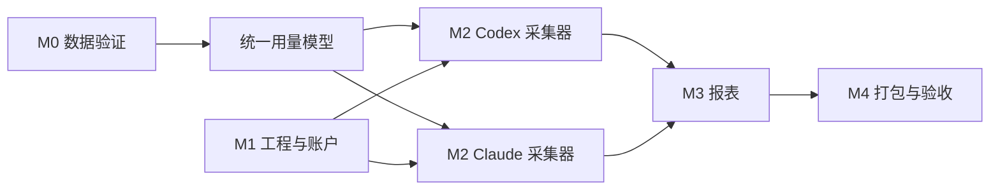

# Token 开发计划

状态：M0–M6 本机代码已落地；M5/M6 已有自动测试证据，完整验收仍有缺口；TC-072 目标 Mac 权限流程、公开分发签名公证及其他目标设备验收待完成
更新日期：2026-10-02

本计划对应[产品与技术设计](design.md)。估时按一名熟悉 TypeScript/Electron 的开发者计算，约 **5–7 周**；数据格式验证失败或需要外部分发签名时另计。

首版实际验收结果见[验收记录](validation.md)。

## 1. 执行原则

- 每个阶段形成可运行、可检查的交付物，完成后提交并推送至仓库 `main`。
- 先验证真实数据的可采集性，再承诺历史覆盖范围和统计准确率。
- 事实数据优先，报表可由事实重算；缺失与未知单独标识。
- 使用脱敏样本做测试，真实会话记录、数据库和密钥不进入 Git。
- 不为了覆盖率增加与实现镜像相同的测试；测试聚焦去重、计量、权限和报表边界。

## 2. 里程碑

| 阶段 | 预计 | 任务 | 交付与完成条件 |
| --- | --- | --- | --- |
| M0 数据可行性 | 3–5 天 | 检测本机工具版本；采集脱敏样本；核对本地记录与遥测字段；确定 Token 口径和覆盖矩阵 | 有样本清单、字段映射、已知缺口；两家工具各至少一条样本能准确识别模型与 Token |
| M1 工程与账户 | 4–6 天 | Electron/Vite/React/TypeScript 骨架；SQLite 迁移；首次管理员、登录、用户管理；受控 IPC | 可启动和打包；普通用户无法越权查询；应用重启后账户仍有效 |
| M2 采集与标准化 | 8–12 天 | Codex/Claude 适配器；历史导入；增量扫描；采集状态；来源归属；幂等入库 | 两家工具均可导入可用样本；重复导入、重启、文件轮转后无重复统计 |
| M3 报表与导出 | 5–7 天 | 概览、趋势、模型明细；日/周/月/年聚合；筛选；CSV | 每个汇总能追溯到明细；页面与 CSV 数值一致 |
| M4 质量与发布 | 4–6 天 | 异常样本修复；数据库备份与恢复；Playwright 打包应用测试；macOS 安装包 | 全部验收场景通过；可在目标 Mac 安装、登录并采集 |

M0 后做一次范围校准：若某工具只能取得部分历史或某入口无可用数据，应在界面和发布说明中明确标记覆盖范围，再决定是否增加新的采集方式。

## 3. 工作项与依赖

### M0：数据可行性

1. 核对用户实际使用的 Codex/Claude Code 版本及运行入口，列出来源覆盖矩阵。
2. 用各工具各至少两段会话样本验证输入、输出、缓存、模型、时间、会话/请求 ID；包含一次模型切换或子代理活动。
3. 对比本地记录与官方遥测，确定首选来源和重叠期间的处理规则。
4. 确定“Token 总量”的提供方专属计算函数，记录示例与反例。

### M1：工程与账户

1. 初始化工程、锁定依赖和脚本：开发、类型检查、构建、测试、打包。
2. 创建主进程、预加载脚本、沙箱化渲染进程及类型化 IPC。
3. 建立 SQLite 迁移、首次管理员引导、登录失败限速和角色检查。
4. 配置不提交本机数据、构建产物和凭证的忽略规则。

### M2：采集与标准化

1. 实现统一观察记录和 `usage_facts` 幂等写入。
2. 分别开发 Codex/Claude 本地记录导入器，保存增量游标。
3. 增加官方遥测接收器与配置向导；如现有设置冲突，保留用户原设置并提示。
4. 实现来源状态、断点续采、未写完记录处理和错误诊断。
5. 加入来源与应用用户的绑定及未归属队列。

### M3：报表

1. 开发统一查询服务和 UTC 到所选时区的日期分桶。
2. 实现日、ISO 周、月、年趋势以及工具/模型/用户筛选。
3. 展示输入、输出、缓存分类和覆盖状态。
4. CSV 导出复用同一查询服务，避免两套统计逻辑。

2026-10-03 验收补证：既有 REQ-013 / DEV-013 / TC-021 未改产品行为或编号。`f7fcdee` 增加独立分页单元及 Electron 测试，验证跨页记录、报表合计、授权范围、筛选与页码重置；原共享测试继续运行。结果与合成样本边界见[TC-021 逐项验收](test-case-acceptance.md#tc-021-筛选与分页明细)。

### M4：验证与发布

1. 用脱敏固定样本验证重复记录、缓存口径、模型切换、跨年 ISO 周和时区边界。
2. 使用临时用户数据目录运行 Playwright；直接拉起构建后的 Electron 主进程完成登录、采集、筛选、导出流程。
3. 在目标 Mac 完成安装、首次启动、权限不足、工具缺失及备份恢复等手工验收。
4. 生成安装包；若要向外部分发，再执行签名与公证流程。

## 4. 验收清单

| 编号 | 场景 | 通过标准 |
| --- | --- | --- |
| A1 | 首次启动 | 可创建管理员，重新打开后仍可登录 |
| A2 | 用户权限 | 普通用户不能查看未授权用户数据或调用管理类 IPC |
| A3 | Codex 采集 | 真实样本的时间、实际模型及 Token 分类与来源记录一致 |
| A4 | Claude 采集 | 输入、输出、缓存读、缓存写分类与来源记录一致 |
| A5 | 幂等恢复 | 相同文件重复导入、应用重启、监听重复通知均不增加总量 |
| A6 | 异常数据 | 无权限、格式变更、文件截断时有可读状态；不以零掩盖未知 |
| A7 | 归属 | 未知来源进入未归属队列，绑定后权限和报表同步变化 |
| A8 | 统计 | 日/周/月/年汇总等于对应明细之和，ISO 跨年周和时区边界正确 |
| A9 | 导出 | CSV 与当前筛选结果和统计口径一致，不含会话正文 |
| A10 | 打包 | Playwright 能拉起构建后的应用；目标 Mac 不需完整 Xcode 即可运行测试版 |

## 5. 主要风险与应对

| 风险 | 影响 | 应对 |
| --- | --- | --- |
| 本地记录格式或保留期变化 | 历史数据缺失或解析失败 | M0 验证；适配器按版本分支；显示覆盖时间；保留官方遥测路径 |
| 双来源统计重叠 | Token 虚高 | 明确主来源时间段；稳定 ID 去重；冲突不自动求和 |
| 模型或缓存口径不统一 | 不同工具总量不可比 | 保留原始分类；提供方专属标准化；报表显示分类说明 |
| 应用账户与工具账户不能自动对应 | 错误归属 | 显式映射；未知保持未归属；记录管理员调整 |
| 组织设置已控制遥测目标 | 无法接入本机接收器 | 不覆盖配置；使用只读导入并提示覆盖范围 |
| macOS 签名与公证 | 外部分发延迟 | 把开发测试与公开分发分成两个发布门槛 |

## 6. 后续版本候选

- 多设备同步与组织登录。
- 预算、异常用量提醒与成本估算；成本必须区分估算与官方账单。
- 对更多本地 AI 编程工具增加适配器。
- 可选的团队报表和集中权限管理。

以上功能在第一版采集准确性验收后再排期。

## 7. M5：受信设备、本地更新、聚合上报与分析界面（实施与验收）

M5 已有代码和按编号执行的自动测试，但目标场景尚未全部验收。权威 REQ/DEV/TC 关系见[追溯工作簿](../outputs/20261002-token-docs/Token-需求开发测试追溯.xlsx)，接口与异常规则见[设计第 9–13 节](design.md#9-m5-范围与验收边界)，实际测试覆盖与限制见[逐项验收](test-case-acceptance.md#m5-用例绑定与覆盖tc-030tc-049)。现有 `TC-001`–`TC-028` 的历史状态不证明 M5 功能；TC-029 是同期修复的 CSV 缺陷。

| 顺序 | 开发任务 | 交付条件 | 已注册验证入口 |
| --- | --- | --- | --- |
| M5-A 登录 | DEV-020–021 | 默认不信任；勾选后跨重启恢复；信任无固定过期时间，手动退出立即撤销；停用账户、重置密码同步撤销 | TC-030–031 |
| M5-B 独立服务 | DEV-022–023 | 服务监听地址和 App 连接地址可配置、默认 `127.0.0.1`；提供受控清单/包和有鉴权的聚合 upsert；本机报表不依赖服务运行 | TC-032–033、TC-039、TC-047 |
| M5-C 更新客户端 | DEV-024–025 | 版本判断、下载完整性检查、失败恢复；未签名包只下载并打开供用户安装 | TC-034–036 |
| M5-D 扫描与上报 | DEV-026–028 | 启动、每 10 分钟、手动扫描完成后上传最小化快照；持久队列、幂等、重试与状态 | TC-037–040 |
| M5-E 数字与界面 | DEV-029–032 | 1024 进位及原值；概览比较、趋势下钻、模型排行和覆盖状态一致 | TC-041–046 |
| M5-F 趋势图修复 | DEV-033 | 窗口缩放时柱顶数值和横轴标签不重叠；周显示 ISO 周周一日期，月显示年月 | TC-048–049 |

依赖顺序：服务清单和聚合协议先确定，再做更新客户端与上传队列；采集完成事件先定，再接上报。登录凭证和界面分析可在协议稳定后并行实现。新增数据库迁移必须保留旧账户、用量事实和备份恢复能力。发布前用临时用户数据目录验证重启、服务停启、损坏包和故障恢复；不得以本机未签名包测试替代签名公证或其他目标 Mac 验收。

`TC-030`–`TC-049` 已在 `scripts/test-cases.mjs` 注册；单编号命令、门禁和打包应用测试应记录提交、日期、环境、退出码、脱敏证据与失败项。单元和 Electron 断言只证明各自覆盖的条件，TC-032 已用临时自签证书验证 `0.0.0.0` HTTPS 监听，但可信证书与异机连接、TC-036 的实际 macOS 安装交接及更宽的窗口/时区组合仍需补证；TC-028 的签名、公证和目标 Mac 验收不能借用本机 DMG 结果。

**TC-032 / TC-047 可信 CA 原补证计划（2026-10-03，实施前）**：沿用 REQ-021、DEV-022/023、TC-032/047，不新增编号。先用一次性测试目录生成 CA 和包含本机连接地址 SAN 的服务端证书，启动非回环 HTTPS 测试服务；TC-032 在指定测试 CA 且严格验证证书与主机名的客户端上请求健康端点，并以不受信 CA、主机名不匹配分别验证失败。TC-047 复用严格 TLS 连接检查受保护清单、包、管理和上报接口的缺失、错误及合法凭据；继续使用合成包、人工设备/用户和隔离服务库。保留旧自签且关闭校验的历史断言作为对应版本证据；新断言须在各自 `npm run test:case -- TC-032`、`npm run test:case -- TC-047` 中有独立绑定，再复跑编号检查与门禁。此段为实施前状态；不修改系统信任设置、不用生产证书，不把本机严格 TLS 补证扩写为异机连接或真实部署验收。

**实施与验证（`57fd884`）**：新增 TC-032 严格 CA/主机名两类失败路径和真实 `ServerConnection` 子进程连接函数，TC-047 新增严格 TLS 下清单/包、管理员登记、设备令牌上传及 owner 越权函数；两项分别追加到 `scripts/test-cases.mjs` 现有编号入口。开发会话报告 TC-032 2/2、TC-047 3/3、门禁 74 编号、50 单元、18 Electron 通过；文档会话独立复跑两个单编号与注册检查均退出码 0。本次只改测试脚本，产品代码与 0.3.4 DMG 未变。测试使用临时 CA/隔离服务数据；生产证书、系统信任设置和另一台 Mac 仍待独立验收。

2026-10-02 补证：`44a96e8` 的独立升级脚本已验证 TC-036 在当前 Mac 的 0.2.0→0.3.0 下载打开、隔离安装路径替换、受信登录和合成报表；上段所述安装交接缺口收窄为取消/失败回退、Finder 人工安装、生产数据迁移与目标 Mac 场景。命令及详细边界见[逐项验收](test-case-acceptance.md)；签名公证与 TC-028 仍独立待验。

2026-10-03 补证：`b224dde` 又验证了隔离路径中打开安装包后取消替换，旧版及已采集数据仍可用；TC-036 单元断言覆盖打开操作失败时旧文件不变。实际 Finder 安装失败回退、拖拽 `/Applications`、生产数据库迁移、签名公证和目标 Mac 仍待验，见[验收记录](validation.md)。

## 8. M6：项目、导航、诊断、反馈与固定超管（实现与剩余验收）

M6 的 REQ-031–039、DEV-034–046、TC-050–072 已在[追溯工作簿](../outputs/20261002-token-docs/Token-需求开发测试追溯.xlsx)建立唯一关联。v0.3.0 本机代码和逐编号入口已落地；产品、隐私、授权和迁移口径见[设计第 14–19 节](design.md)，实际断言与限制见[逐项验收](test-case-acceptance.md)。自动测试通过不等于全部目标环境验收完成。

| 顺序 | 需求与任务 | 已落地能力与剩余边界 | 用例入口 |
| --- | --- | --- | --- |
| A 项目标识 | REQ-031；DEV-034–035 | Codex/Claude cwd 自动识别；同名目录不误合；完整路径只留本机；未知归属可见 | TC-050–052 |
| B 项目模型报表 | REQ-032；DEV-036–037 | 授权聚合、筛选、趋势/排行/下钻与 CSV 同口径 | TC-053–055 |
| C 应用导航 | REQ-033；DEV-038 | 固定侧栏、右侧独立滚动、响应式与面包屑 | TC-056–057 |
| D 更新和设置 | REQ-034–035；DEV-039–040 | 更新入口显著且状态可恢复；设置集中、按角色保护；权限指引可执行 | TC-058–061、TC-072 |
| E 诊断与反馈 | REQ-036–037；DEV-041–043 | 漏采环节可定位，诊断脱敏；反馈预览、鉴权、失败重试及幂等 | TC-062–065 |
| F 管理与角色 | REQ-038–039；DEV-044–046 | 管理视图授权；固定 `admin` 派生超管；旧库兼容和冲突处理 | TC-066–071 |

最终代码提交 `6223c30` 已注册 TC-050–072：其中 TC-050–071 是自动入口，TC-072 是人工清单。22 条自动用例在该提交的 `npm run test:acceptance -- 50 71` 摘要中退出码均为 0；单编号命令为 `npm run test:case -- TC-###`，每项绑定独立测试函数及临时目录。`npm run test:gate`、打包应用 Electron、目录包与 DMG 的交接结果见[验收记录](validation.md)，须按固定提交和实际覆盖解释。TC-072 必须在真实目标 Mac 完成文件授权、撤销和重新扫描并保存脱敏证据；该项尚未验证。TC-070 已覆盖旧库已有 `admin`、无 `admin` 及占用冲突，真实生产库迁移演练仍需另留证据。

以下仅是下一轮候选，**未纳入 M6 必做范围、未分配 REQ/DEV/TC**：数据覆盖率总览、预算预警、项目别名合并、可导出的脱敏诊断包、反馈指派/回复闭环、完整管理员审计、更新失败回滚。当前已有未归属数量诊断和反馈待处理/已处理状态，不将它们误称为完整候选交付。若采纳候选，先明确独立验收边界再编号。

## 9. REQ-006 Codex fallback 跨扫描重复计数修复（2026-10-03，规划与实施）

这是现有增量幂等需求的缺陷修复，不新增 REQ。`DEV-047` 负责检查 `src/collectors/codex.ts` 的 fallback 与正式记录状态、`src/collectors/scanner.ts` 的跨批次入库和游标事务，以及 `src/main/database.ts` 的旧库启动修复。先用合成会话和临时 SQLite 库复现“首扫只有 fallback、次扫追加正式记录”的重复计数，再实现仅限同一 Codex 会话的安全回收；旧库修复必须保留其他会话、来源、身份及项目数据，并可重复执行。失败时不得损坏原库或把未知用量静默改成零；必要的迁移/恢复策略和回退步骤应在代码交付时记录。

新增 `TC-073` 作为独立回归：计划注册 `npm run test:case -- TC-073`，绑定专用 `tests/collector-fallback.test.ts` 测试函数；首次仅 fallback、后续正式记录替换、旧库双事实启动修复、重扫及重启幂等分别用独立临时 `token.sqlite` 场景验证事实键、报表总量与其他来源/项目保留。开发顺序为先写失败复现，再实现扫描/旧库修复，最后单编号复验、受影响的 TC-010 和门禁。本段为 2026-10-03 开发前规划，实施与实际断言见下段及[逐项验收](test-case-acceptance.md#tc-073-当前实现与验收2026-10-03)。

2026-10-03 实施：`aa6d91b` 在 `src/collectors/scanner.ts` 增加同会话正式事实入库后的 fallback/项目关联事务清理，以及扫描器启动时的旧库幂等清理；`src/main/database.ts` 未改。`scripts/test-cases.mjs` 注册 TC-073 独立函数。开发会话报告先以 12+12 Token 复现失败，再修复并通过 TC-073 1/1、TC-010 单元与 Electron、73 编号入口和 41 单元/17 Electron 门禁；文档会话独立复跑前两条单编号命令和入口检查，均通过。仍须以新代码重建并验收安装包，不能把现有 0.3.0 DMG 写成已含修复。

同日 0.3.1 候选补证：`867a03a` 已生成含修复的未签名 x64 DMG；隔离 0.3.0→0.3.1 同库升级中，旧包复现 1280→2560 Token，新包恢复 1280，受信登录保持。0.3.1 目录包 17/17 及本机更新服务目录清单/包一致性见[验收记录](validation.md)。实际生产账户 App 连接/安装、真实生产库迁移、Finder `/Applications`、签名公证和目标 Mac 继续待验；上段是打包前的历史状态。

## 10. REQ-021 聚合上报归属授权修复（2026-10-03；SOP-001 原规划）

以下两段保留修复前的缺陷与开发计划；当前实现见本节末的 0.3.2、0.3.3 记录。

当前 `DEV-023` 实现了全局 bearer 与聚合 upsert，但 `TC-047` 的历史自动断言没有覆盖跨用户写入。开发会话已在隔离服务库复现同一 bearer 可将同设备 owner A 的 12 Token 用较高修订的 owner B 99 Token 覆盖。此缺陷阻断“合法凭证仅能访问授权范围”的服务交付结论；本机离线报表不依赖服务，仍按既有证据判定。

新增 `DEV-048` 承接可信上传身份与设备/用户范围校验，`TC-074` 承接独立回归；两者均未实现或注册。[设计第 12.2 节](design.md)已选定 SOP-002 方案：保留全局密钥供更新/反馈，管理密钥登记设备并签发仅用于上报的令牌，服务端保存令牌哈希和设备/用户授权集合；全局 bearer 单独上报拒绝。先在一次性服务库写失败复现，再实施服务端登记/撤销与写库前校验、主进程加密保存和待传恢复；保留旧聚合、修订和队列，已有设备须由管理凭据确认授权，换服务重新登记。修复后逐项验证无权跨设备/跨用户上报返回 403 且 `aggregates`、`device_revisions`、`source_coverage` 不变，合法同范围修订和重传仍正常，并复跑 TC-047、TC-074 和门禁。只有独立命令 `npm run test:case -- TC-074` 注册并通过后才能更新状态；不能沿用 TC-047 的历史通过结果。

**0.3.2 阶段实施记录（`ca0f37f`；当前候选已发现后续问题）**：服务增加设备令牌哈希、设备/用户授权集合与简要审计；管理员用管理密钥显式登记或撤销，上报只接受设备令牌。服务在修订检查和写库前拒绝设备或 owner 越权，合法修订、重传幂等和旧数据保留有合成库断言。客户端通过安全存储接口加密保存设备凭据，更换服务地址清除旧凭据；失败待传、管理员显式保存后重试有独立绑定。`TC-074` 已注册三项测试，`TC-047` 追加本机自签 TLS 的非回环鉴权测试。文档会话独立复跑 TC-074、TC-047 及受影响的 TC-038/039/040/060；开发会话在 `ca0f37f` 报告完整门禁 74 个编号入口、46 个单元、18 个 Electron 用例及目录包 18/18。`533992e` 只补 TC-047 临时 TLS 资源清理，不改变产品实现。**随后发现服务切换竞态，0.3.2 不作为最终交付结论；后续修复和复验应另行追加，不覆盖本段历史证据。**

**0.3.3 阶段实施（`3d60b5e`）**：客户端增加配置代次核对，在设备令牌登记响应和使用令牌上传前拒绝已切换的连接；同 URL 重新保存配置也会使在途登记失效。TC-074 增加第四项竞态测试，文档会话独立复跑四项通过。开发会话报告此提交门禁 74 个编号入口、47 个单元、18 个 Electron 及目录包 18/18；0.3.2→0.3.3 隔离升级、包和本机发布目录另见[验收记录](validation.md)。DEV-048 的本机合成授权与竞态回归已有证据；实际生产账户/数据库、可信证书异机连接、签名公证和目标 Mac 仍按各自门槛待验。

## 11. REQ-006 大会话启动性能修复（2026-10-03；0.3.4）

沿用 REQ-006、DEV-047、TC-073，不增加编号。开发会话在只读备份的生产库临时副本上复现 0.3.3 启动 180 秒超时，定位到 `UsageScanner` 旧 fallback 修复对无 fallback 大会话的重复相关查询。`7abd640` 改为先枚举真实 fallback 会话、再检查正式事实；原跨扫描归并和旧库幂等规则不变。TC-073 追加独立临时库的 6000 条正式事实、无 fallback 场景，核对启动修复耗时与事实数。再以 `npm run test:production-copy -- /绝对路径/token.sqlite /绝对路径/Token.app` 在隔离副本启动打包 App，核对路径与数据库完整性/数量；该命令不扫描真实来源，不修改原库。0.3.4 单编号、门禁、打包、升级和发布目录证据见[验收记录](validation.md)。实际生产账户安装、目标 Mac、签名公证仍待独立验收。
