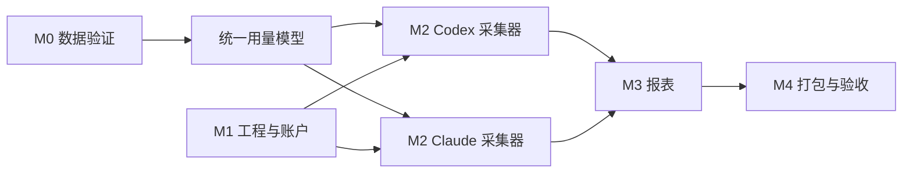

# Token 开发计划

状态：M0–M4 本机开发版已验收；公开分发签名、公证和其他目标设备验收按需另行完成
更新日期：2026-10-02

本计划对应[产品与技术设计](design.md)。估时按一名熟悉 TypeScript/Electron 的开发者计算，约 **5–7 周**；数据格式验证失败或需要外部分发签名时另计。

首版实际验收结果见[验收记录](validation.md)。

## 1. 执行原则

- 每个阶段形成可运行、可检查的交付物，完成后提交并推送至仓库 `main`。
- 先验证真实数据的可采集性，再承诺历史覆盖范围和统计准确率。
- 事实数据优先，报表可由事实重算；缺失与未知单独标识。
- 使用脱敏样本做测试，真实会话记录、数据库和密钥不进入 Git。
- 不为了覆盖率增加与实现镜像相同的测试；测试聚焦去重、计量、权限和报表边界。

## 2. 里程碑

| 阶段 | 预计 | 任务 | 交付与完成条件 |
| --- | --- | --- | --- |
| M0 数据可行性 | 3–5 天 | 检测本机工具版本；采集脱敏样本；核对本地记录与遥测字段；确定 Token 口径和覆盖矩阵 | 有样本清单、字段映射、已知缺口；两家工具各至少一条样本能准确识别模型与 Token |
| M1 工程与账户 | 4–6 天 | Electron/Vite/React/TypeScript 骨架；SQLite 迁移；首次管理员、登录、用户管理；受控 IPC | 可启动和打包；普通用户无法越权查询；应用重启后账户仍有效 |
| M2 采集与标准化 | 8–12 天 | Codex/Claude 适配器；历史导入；增量扫描；采集状态；来源归属；幂等入库 | 两家工具均可导入可用样本；重复导入、重启、文件轮转后无重复统计 |
| M3 报表与导出 | 5–7 天 | 概览、趋势、模型明细；日/周/月/年聚合；筛选；CSV | 每个汇总能追溯到明细；页面与 CSV 数值一致 |
| M4 质量与发布 | 4–6 天 | 异常样本修复；数据库备份与恢复；Playwright 打包应用测试；macOS 安装包 | 全部验收场景通过；可在目标 Mac 安装、登录并采集 |

M0 后做一次范围校准：若某工具只能取得部分历史或某入口无可用数据，应在界面和发布说明中明确标记覆盖范围，再决定是否增加新的采集方式。

## 3. 工作项与依赖

### M0：数据可行性

1. 核对用户实际使用的 Codex/Claude Code 版本及运行入口，列出来源覆盖矩阵。
2. 用各工具各至少两段会话样本验证输入、输出、缓存、模型、时间、会话/请求 ID；包含一次模型切换或子代理活动。
3. 对比本地记录与官方遥测，确定首选来源和重叠期间的处理规则。
4. 确定“Token 总量”的提供方专属计算函数，记录示例与反例。

### M1：工程与账户

1. 初始化工程、锁定依赖和脚本：开发、类型检查、构建、测试、打包。
2. 创建主进程、预加载脚本、沙箱化渲染进程及类型化 IPC。
3. 建立 SQLite 迁移、首次管理员引导、登录失败限速和角色检查。
4. 配置不提交本机数据、构建产物和凭证的忽略规则。

### M2：采集与标准化

1. 实现统一观察记录和 `usage_facts` 幂等写入。
2. 分别开发 Codex/Claude 本地记录导入器，保存增量游标。
3. 增加官方遥测接收器与配置向导；如现有设置冲突，保留用户原设置并提示。
4. 实现来源状态、断点续采、未写完记录处理和错误诊断。
5. 加入来源与应用用户的绑定及未归属队列。

### M3：报表

1. 开发统一查询服务和 UTC 到所选时区的日期分桶。
2. 实现日、ISO 周、月、年趋势以及工具/模型/用户筛选。
3. 展示输入、输出、缓存分类和覆盖状态。
4. CSV 导出复用同一查询服务，避免两套统计逻辑。

### M4：验证与发布

1. 用脱敏固定样本验证重复记录、缓存口径、模型切换、跨年 ISO 周和时区边界。
2. 使用临时用户数据目录运行 Playwright；直接拉起构建后的 Electron 主进程完成登录、采集、筛选、导出流程。
3. 在目标 Mac 完成安装、首次启动、权限不足、工具缺失及备份恢复等手工验收。
4. 生成安装包；若要向外部分发，再执行签名与公证流程。

## 4. 验收清单

| 编号 | 场景 | 通过标准 |
| --- | --- | --- |
| A1 | 首次启动 | 可创建管理员，重新打开后仍可登录 |
| A2 | 用户权限 | 普通用户不能查看未授权用户数据或调用管理类 IPC |
| A3 | Codex 采集 | 真实样本的时间、实际模型及 Token 分类与来源记录一致 |
| A4 | Claude 采集 | 输入、输出、缓存读、缓存写分类与来源记录一致 |
| A5 | 幂等恢复 | 相同文件重复导入、应用重启、监听重复通知均不增加总量 |
| A6 | 异常数据 | 无权限、格式变更、文件截断时有可读状态；不以零掩盖未知 |
| A7 | 归属 | 未知来源进入未归属队列，绑定后权限和报表同步变化 |
| A8 | 统计 | 日/周/月/年汇总等于对应明细之和，ISO 跨年周和时区边界正确 |
| A9 | 导出 | CSV 与当前筛选结果和统计口径一致，不含会话正文 |
| A10 | 打包 | Playwright 能拉起构建后的应用；目标 Mac 不需完整 Xcode 即可运行测试版 |

## 5. 主要风险与应对

| 风险 | 影响 | 应对 |
| --- | --- | --- |
| 本地记录格式或保留期变化 | 历史数据缺失或解析失败 | M0 验证；适配器按版本分支；显示覆盖时间；保留官方遥测路径 |
| 双来源统计重叠 | Token 虚高 | 明确主来源时间段；稳定 ID 去重；冲突不自动求和 |
| 模型或缓存口径不统一 | 不同工具总量不可比 | 保留原始分类；提供方专属标准化；报表显示分类说明 |
| 应用账户与工具账户不能自动对应 | 错误归属 | 显式映射；未知保持未归属；记录管理员调整 |
| 组织设置已控制遥测目标 | 无法接入本机接收器 | 不覆盖配置；使用只读导入并提示覆盖范围 |
| macOS 签名与公证 | 外部分发延迟 | 把开发测试与公开分发分成两个发布门槛 |

## 6. 后续版本候选

- 多设备同步与组织登录。
- 预算、异常用量提醒与成本估算；成本必须区分估算与官方账单。
- 对更多本地 AI 编程工具增加适配器。
- 可选的团队报表和集中权限管理。

以上功能在第一版采集准确性验收后再排期。
